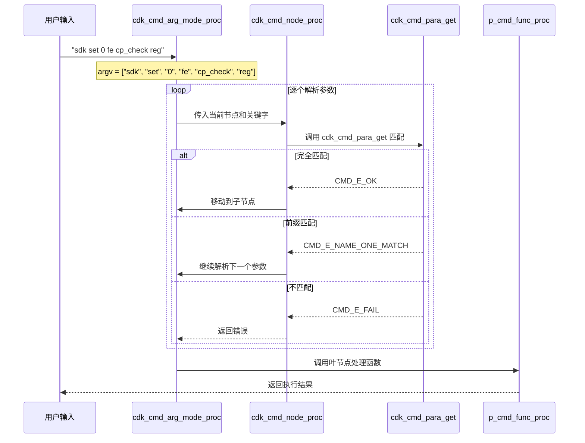
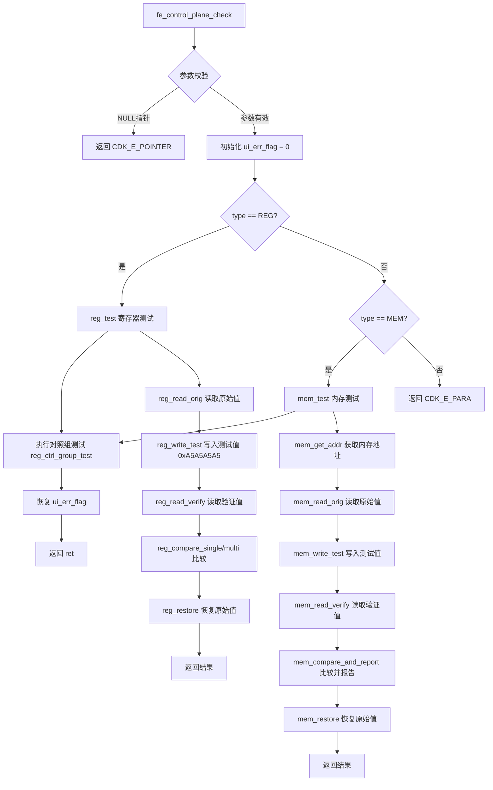
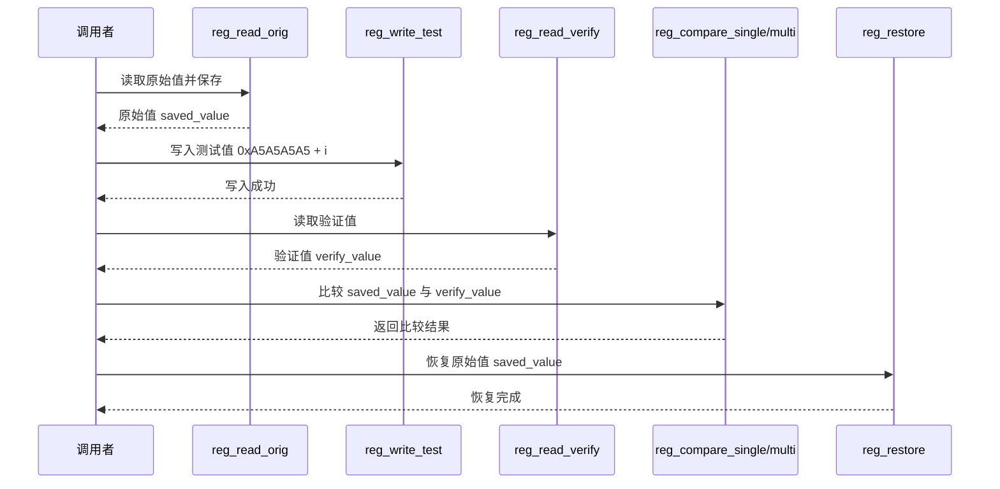

# CodeAgent 协助开发经验分享

> 基于 OpenCode 配置与架构分析

---

## 一、OpenCode 核心概念解析

### 1.1 skills / plugins / extensions 的区别

```
opencode/
├── skills/          ← 技能定义（Markdown 文档）
├── plugins/         ← 运行时扩展（JavaScript 插件）
└── extensions/      ← 打包分发单元
```

| 维度 | plugins | skills | extensions |
|------|---------|--------|------------|
| **格式** | JavaScript (.js) | Markdown (.md) | 目录结构 |
| **本质** | 运行时代码 | 知识/工作流定义 | 打包分发单元 |
| **作用** | 扩展核心功能 | 指导 AI 行为 | 组织+分发 |
| **触发** | 配置文件引用 | AI 自动识别/手动加载 | 配置文件引用 |
| **关系** | 可注册 skills | 被 plugins 注入 | 包含 plugins + skills |

#### plugins — 运行时扩展

- 用 JavaScript 编写，通过钩子函数注入功能
- 在 `opencode.json` 的 `plugin` 数组中声明
- 例子：`superpowers.js` 注入 bootstrap 内容到用户消息，并自动注册 skills 目录

#### skills — 技能定义

- 用 Markdown 编写，包含 `name`、`description`、工作流程
- YAML frontmatter 元数据 + Markdown 内容（工作流程）
- 告诉 AI 何时、如何使用某个技能

#### extensions — 打包分发单元

- 将 plugins + skills + 其他资源打包成独立分发单元
- 方便分享和复用一整套解决方案

---

### 1.2 Datacom Extensions 功能概述

四个 `datacom-*` extension 共同构成**数据通信产品线的 AI 开发工具链**：

#### 1.2.1 datacom-sdd — 规格驱动开发（SDD）工作流

**定位**：软件设计文档（HLD）生成的完整解决方案

**核心 Skills**：

| Skill | 用途 |
|-------|------|
| `design-state-machine` | SDD HLD 流程状态机，管理工作流状态转换 |
| `sdd-track-manager` | track 状态跟踪管理 |
| `knowledge-trace` | 追溯设计文档的知识来源 |
| `plantuml-builder` | 生成 PlantUML 图表 |
| `docx-to-markdown` | Word/Markdown 文档转换 |
| `cpp-api-comment-generator` | 生成 C++ API Doxygen 注释 |
| `datacom-design-asset-search` | 查询 AR 详情、组件规格 |

#### 1.2.2 datacom-sdd-build — CICD 构建集成

**定位**：编译构建、DT 测试执行、集成打包、仿真验证

**核心 Skills**（31个）：

| 类别 | Skills |
|------|--------|
| **STEM 构建** | `datacom-stem-*` (orchestration, build-execute, dt-execute, project-create 等) |
| **本地编译** | `datacom-rse-c-build`, `datacom-rse-cmake-c-build-*` |
| **流水线** | `datacom-cicd-pipeline-creator`, `datacom-yunshan-integration` |
| **问题定位** | `datacom-yunshan-pipeline-fix`, `datacom-stem-pipeline-debug` |

#### 1.2.3 datacom-sdd-dt — 开发者测试（DT）

**定位**：单元测试（UT）、集成测试（IT）、系统测试（ST）的设计与执行

**核心功能**：测试策略生成、UT 设计与代码生成、ASan 内存问题修复、MockCpp 打桩

#### 1.2.4 datacom-code-reviewer — AI 代码检视

**定位**：C 代码的自动化审查

**核心 Rules**：覆盖内存安全（memory-leak, double-free）、并发/死锁（deadlock, concurrency）、资源管理（resource-pairing）、代码质量（dead-code, unused-variable）等 40+ 规则

---

## 二、上下文机制与优化

### 2.1 Context 的组织结构

```
用户消息
    ↓
┌─────────────────────────────────────────────────────────┐
│                    System Prompt                         │
│  ┌─────────────┐  ┌──────────────┐  ┌───────────────┐  │
│  │ Base System │  │ Extension    │  │ Active Skill  │  │
│  │ (角色/规则)  │  │ Context      │  │ Content       │  │
│  └─────────────┘  └──────────────┘  └───────────────┘  │
└─────────────────────────────────────────────────────────┘
    ↓
│  ┌──────────────────────────────────────────────────┐  │
│  │              Conversation History                 │  │
│  └──────────────────────────────────────────────────┘  │
    ↓
│  ┌──────────────────────────────────────────────────┐  │
│  │              Tools / MCP Results                  │  │
│  └──────────────────────────────────────────────────┘  │
```

**关键点**：
- Extension/Skill **不是**每次全部加载
- 只有 **当前激活的 skill** 才会注入
- Extension 的 plugins 通过**钩子函数**注入增量内容

### 2.2 上下文长度计算方式

```
1 Token ≈ 0.75 英文单词 ≈ 0.5 中文汉字

1M Context = ~1,000,000 Tokens
≈ 750,000 英文单词
≈ 130万 中文字符
```

**实际 context 组成**：

| 部分 | Token 范围 | 说明 |
|------|-----------|------|
| System Prompt | ~2,000-10,000 | 角色定义 + 规则 + skill |
| Conversation History | 动态 | 取决于对话长度 |
| Tool Results | ~8K-32K | 按需加载 |
| Available for Generation | = Limit - 以上总和 | 用于当前生成 |

### 2.3 1M 上下文如何实现

#### 技术演进路线

```
传统 Transformer (O(n²) 注意力)
    ↓
稀疏注意力 (Sparse Attention) — Longformer, BigBird
    ↓
Flash Attention — IO-Aware 分块计算，显存 O(N)
    ↓
Transformer + KV Cache 量化 — FP16 → INT8 → INT4
    ↓
综合实现: Flash Attention + 稀疏模式 + 量化 + 工程优化
```

#### 核心机制

**Flash Attention**：
- 将 Q, K, V 分成小块按块计算
- 边算边更新，保留梯度
- 将 O(N²) 显存降为 O(N)

**稀疏注意力模式（Longformer）**：
- 每个 token 只关注：局部窗口 + 全局 tokens
- 计算量：O(N × w) 而不是 O(N²)

**位置编码扩展**：
- RoPE 插值 + 外推
- 位置编码通过三角函数周期性 + 外推处理超长序列

### 2.4 缓存命中率计算

#### KV Cache 机制

```
第一次处理: 全部重新计算
第二次相同前缀: 复用 KV Cache，只计算新增 token
```

**命中率类型**：

| 类型 | 说明 |
|------|------|
| **KV Cache (Intra-request)** | 同一次生成中，前缀重复使用 |
| **Semantic Cache (Cross-request)** | 历史消息压缩，相似语义结构复用 |
| **Disk/Memory Cache** | 读取过的文件内容缓存 |

#### 影响命中率的要素

1. **固定前缀比例大** → System prompt 占比高 → 命中率高
2. **对话结构相似** → 压缩后结构复用
3. **检索增强 (RAG)** → 只检索最相关片段，减少 token 数
4. **缓存粒度** → Token-level 精确但开销大，Block-level 更实用

---

## 三、Hook 机制详解

### 3.1 Plugin 架构

```
opencode.json 中的 plugin 配置
         ↓
    加载 .js 文件
         ↓
   export 一个 async 函数 ({ client, directory }) => { ... }
         ↓
    返回 Hook 对象 { hookName: handler, ... }
```

### 3.2 Hook 类型

#### 1. config Hook — 动态修改配置

```javascript
config: async (config) => {
  // 添加 skills 搜索路径
  config.skills = config.skills || {};
  config.skills.paths = config.skills.paths || [];
  config.skills.paths.push('/path/to/custom-skills');
  
  // 修改 mcp 配置
  config.mcp = config.mcp || {};
  config.mcp['custom-mcp'] = { enabled: true };
}
```

**场景**：
- 自动注册 skill 目录（无需手动配置 symlink）
- 根据环境动态启用/禁用功能
- 注入自定义 MCP 工具

#### 2. 消息转换 Hook — 注入上下文

```javascript
'experimental.chat.messages.transform': async (_input, output) => {
  // _input: 原始输入（未使用）
  // output: 即将发送给模型的输出消息数组
  
  const firstUser = output.messages.find(m => m.info.role === 'user');
  
  // 防止重复注入
  if (firstUser.parts.some(p => p.text.includes('EXTREMELY_IMPORTANT'))) {
    return;
  }
  
  // 注入到消息开头
  firstUser.parts.unshift({ type: 'text', text: bootstrap });
}
```

**为什么注入用户消息而不是 system prompt？**
1. System prompt 会每轮重复加载 → token 浪费
2. 模型可能产生多个 system message 冲突

### 3.3 Hook 开发模板

```javascript
// my-plugin.js
export const MyPlugin = async ({ client, directory }) => {
  return {
    // Hook 1: 配置修改
    config: async (config) => {
      // 添加 skills 路径
      // 修改 provider
      // 启用/禁用 MCP
    },

    // Hook 2: 消息转换
    'experimental.chat.messages.transform': async (input, output) => {
      const target = output.messages.find(m => m.info.role === 'user');
      
      if (target) {
        target.parts.unshift({
          type: 'text',
          text: '注入的上下文内容'
        });
      }
    }
  };
};
```

### 3.4 其他可能的 Hook 类型

| Hook | 说明 |
|------|------|
| `config` | 配置修改 |
| `experimental.chat.messages.transform` | 消息转换 |
| `experimental.chat.response.transform` | 回复转换 |
| `experimental.tools.before` | 工具调用前 |
| `experimental.tools.after` | 工具调用后 |
| `session.create` | 会话创建 |
| `session.end` | 会话结束 |

---

## 四、长上下文质量下降的原因

### 4.1 Attention 的 Softmax Sink 问题

```
Token 位置:  [0    1    2    ...  1000]
注意力分布:  [0.01 0.01 0.01 ...  0.92]
              ← 前面大部分被稀释    ↑ 聚焦到最后
```

**原因**：Softmax 的指数特性导致注意力分数两极分化，远处 token 贡献被"淹没"。

### 4.2 位置编码的外推失败

```
训练阶段: 见过最长的序列 = 32K tokens
推理阶段: 输入序列 = 100K tokens
          位置编码 [65536, ...] 已超出训练分布
          → 远处位置的区分度下降
```

### 4.3 中间信息被"桥接"掉

```
Query: 今天北京的天气？
               ↓ 需要跨越 1000 tokens
Key:   昨天北京的天气是...（答案在这里）

实际注意力分配：模型可能"看不到"正确答案
```

### 4.4 训练-推理分布偏移

```
预训练语料分布：
- 句子平均长度：~50 tokens
- 段落平均长度：~200 tokens
- 文档平均长度：~2000 tokens
- 超过 32K 的超长上下文：在训练数据中占比 < 0.1%

推理时 95% 是模型"不熟悉"的分布
```

### 4.5 硬件资源争抢

```
70% 利用率 = 35G KV Cache
90% 利用率 = 45G KV Cache（接近 80G GPU 极限）

当显存不足时，系统会：
1. 降低精度（FP16 → INT8 → INT4）→ 质量下降
2. 丢弃部分 KV Cache → 远程依赖丢失
```

### 4.6 质量-利用率曲线

```
利用率:   0%  10%  30%  50%  70%  85%  95%  100%
质量:     低   中高  高   高   中   低   很低  极低
          ↑                                  ↑
       任务太简单                  上下文太长，远处信息难以到达
```

**最佳实践**：将上下文保持在 50% 利用率以下，或使用 RAG 等技术将真正相关的内容压缩到模型"擅长处理"的长度范围内。

---

## 五、定时任务

### 5.1 Plugin Hook vs Cron Job

```
┌─────────────────────────────────────────────────────────┐
│              Plugin Hook（事件驱动）                      │
│  • 消息转换时触发                                         │
│  • 配置加载时触发                                         │
│  • 工具调用前后触发                                       │
│  → 被动响应，无法主动定时执行                              │
├─────────────────────────────────────────────────────────┤
│              Cron Job（定时执行）                         │
│  • 按 cron 表达式定时触发                                 │
│  • 可以是 agent、skill 或 webhook                        │
│  → 主动定时，可以执行任意逻辑                              │
└─────────────────────────────────────────────────────────┘
```

### 5.2 定时 Hook 的实现方式

#### 方式 1：使用 Cron Job 调用 Agent

```javascript
cronjob({
  action: 'create',
  name: 'daily-code-review',
  prompt: '请执行代码检视任务...',
  schedule: '0 9 * * *',       // 每天 9 点执行
  timezone: 'Asia/Shanghai',
  agent: 'general',
  skills: ['crs-code-intent', '...']
})
```

#### 方式 2：Plugin 内置定时逻辑（不推荐）

```javascript
let timer = null;
export const MyPlugin = async ({ client }) => {
  return {
    config: async (config) => {
      timer = setInterval(() => {
        checkAndNotify();
      }, 60 * 60 * 1000); // 每小时
    }
  };
};
```

### 5.3 典型场景

| 场景 | 实现方式 |
|------|----------|
| 每天早上自动检视代码变更 | Cron Job → agent + code-reviewer skills |
| 定时检查构建状态并通知 | Cron Job → agent + build skills + webhook |
| 消息变换时注入内容 | **Plugin Hook**（事件驱动，非定时）|

### 5.4 结论

**Plugin Hook 本身无法定时**，但可以通过 **Cron Job + Agent** 实现"定时 hook"效果：
1. 创建一个执行任务的 agent（包含你想要的逻辑）
2. 用 cronjob 工具定时触发这个 agent
3. 通过 webhook 将结果推送出去

---

## 六、最佳实践总结

### 6.1 配置优化

1. **Skills 按需加载**：不要一次性加载所有 skill，只在需要时激活
2. **Plugin 顺序合理**：有依赖关系的 plugin，放在前面的先加载
3. **Context 精简**：使用 RAG 检索最相关内容，而非穷举上下文

### 6.2 性能优化

1. **KV Cache 复用**：相似任务复用 session，减少重复计算
2. **消息压缩**：长对话后考虑压缩历史消息
3. **利用率控制**：保持 context 利用率在 50% 以下

### 6.3 开发建议

1. **Hook 开发**：使用 `superpowers.js` 作为参考模板
2. **Skill 编写**：遵循 SKILL.md 格式，YAML frontmatter + Markdown 工作流
3. **Extension 打包**：将相关的 plugins + skills 组织在一起

---

## 附录：文件路径参考

```
~/.config/opencode/
├── opencode.json           ← 主配置文件
├── plugins/
│   └── superpowers.js      ← superpowers 插件示例
├── skills/
│   ├── lingxi-miner/       ← 代码分析 skill
│   └── superpowers/        ← superpowers 技能定义
└── extensions/
    ├── datacom-sdd/        ← SDD 工作流
    ├── datacom-sdd-build/  ← CICD 构建
    ├── datacom-sdd-dt/     ← 开发者测试
    └── datacom-code-reviewer/  ← 代码检视
```

# CDK 虚拟项目 - PCIE访问通路巡检功能实现总结

## 1. 项目概述

**项目名称**: CDK_VIRTUAL_PROJ - 芯片内部PCIE访问通路巡检虚拟项目  
**目的**: 实现芯片内部PCIE访问通路的巡检功能（用于新员工入门培训）  
**结构**: SDK + Test + LLT + Platform，使用CMake构建系统

### 1.1 需求描述

支持芯片内部各模块PCIE访问通路的在线巡检，命令行格式：
```bash
sdk set <chip_id> fe cp_check {reg|mem}
```

- `set`：类型为字符串，表示配置命令
- `<chip_id>`：类型为整型，表示芯片号，一般默认编号为0
- `{reg|mem}`：类型为字符串，可选值为"reg"和"mem"

---

## 2. 模块功能

### 2.1 命令树注册

#### 2.1.1 命令树结构

命令树为**多级嵌套结构**，从根节点到叶节点逐级展开：

```
ROOT → sdk → set → <chip_id> → fe → cp_check → {reg|mem}
```

#### 2.1.2 关键数据结构

定义于 `sdk/cmd/comm/cdk_cmd_pub.h`：

```c
// 命令节点
typedef struct tagCMD_NODE {
    uint32 para_type;           // 参数类型：CMD_FIX_PARA_TYPE=固定, CMD_REAL_INTEGER_PARA_TYPE=整型
    char *cmd_node_name;        // 命令关键字
    char *node_describe;        // 描述
    uint32 real_para_min;       // 整型参数最小值
    uint32 real_para_max;       // 整型参数最大值
    uint32 node_child_num;      // 子节点数量
    struct tagCMD_NODE_CHILD *p_child_arr;  // 子节点数组
    CMD_FUNC_PROC p_cmd_func_proc;          // 命令处理函数指针
    uint32 field_id;            // 参数ID
    uint32 field_value;         // 参数值
} CMD_NODE_S;

// 子节点数组
typedef struct tagCMD_NODE_CHILD {
    uint32 child_node_arr_num;  // 子节点数组大小
    CMD_NODE_S *child_node_arr; // 子节点数组
    uint32 cmd_level;           // 命令级别：CMD_LEVEL_NORMAL=正常, CMD_LEVEL_DEBUG=调试
} CMD_NODE_CHILD_S;
```

#### 2.1.3 命令节点定义

定义于 `test/testcode/func_tu/np/cmd/cmd_tree/fe_cmd_mem_diag_clitree.c`：

```c
// cp_check reg 子命令
CMD_NODE_S g_cmd_cp_check_reg_node[] = {
    {CMD_FIX_PARA_TYPE, "reg", "reg", 0, 0, 0, NULL, cdk_cmd_fe_cp_check_reg_set, 
     CDK_CMD_PARA_MEM_CP_CHECK_TYPE, 0, NULL, NULL},
};

// cp_check mem 子命令
CMD_NODE_S g_cmd_cp_check_mem_node[] = {
    {CMD_FIX_PARA_TYPE, "mem", "mem", 0, 0, 0, NULL, cdk_cmd_fe_cp_check_memory_set, 
     CDK_CMD_PARA_MEM_CP_CHECK_TYPE, 0, NULL, NULL},
};

// cp_check 父节点（包含 reg/mem 两个子节点）
CMD_NODE_CHILD_S g_cmd_cp_check_child[] = {
    CMD_NODE_CHILD(g_cmd_cp_check_reg_node, CMD_LEVEL_NORMAL),
    CMD_NODE_CHILD(g_cmd_cp_check_mem_node, CMD_LEVEL_NORMAL),
};
```

#### 2.1.4 模块注册函数

```c
// 注册命令模块
uint32 cdk_cmd_np_mem_register(void)
{
    uint32 ret = 0;
    ret |= cdk_cmd_module_register(CMD_MODULE_NP, CDK_CMD_OP_SET, g_cmd_cp_check_set_child,
                                   CMD_ARRAY_SIZE(g_cmd_cp_check_set_child));
    return ret;
}

// 注册处理函数
uint32 cdk_cmd_np_mem_proc_init(void)
{
    g_cdk_cmd_mem_diag_proc.pfn_cp_check_memory_set = cdk_cmd_proc_cp_check_memory_set;
    return 0;
}
```

---

### 2.2 命令行挂接与解析流程

#### 2.2.1 完整命令树结构

命令树采用**多级嵌套**结构，分为**静态定义**和**动态注册**两部分：

**静态定义部分**（根节点，定义于 `sdk/cmd/comm/cdk_cmd_root_clitree.c`）：
```
ROOT (g_cmd_root_node)
└── SDK (g_cmd_sdk_node)
    ├── SET (g_cmd_set_node) 
    │   └── CHIP_ID (g_cmd_set_id_node) [动态挂接模块]
    │       ├── fe (CMD_MODULE_NP) → cp_check, memory, reg 等
    │       ├── tm (CMD_MODULE_TM)
    │       └── ... (其他模块)
    └── DISPLAY (g_cmd_get_node)
        └── CHIP_ID (g_cmd_get_id_node) [动态挂接模块]
            ├── fe (CMD_MODULE_NP)
            └── ... (其他模块)
```

**动态注册部分**（cp_check 命令，定义于 `test/testcode/func_tu/np/cmd/cmd_tree/fe_cmd_mem_diag_clitree.c`）：
```
sdk set <chip_id> fe cp_check {reg|mem}
                              └── g_cmd_mem_cp_check_set_test_memory_node
                                  └── g_cmd_cp_check_child[]
                                      ├── g_cmd_cp_check_reg_node → cdk_cmd_fe_cp_check_reg_set()
                                      └── g_cmd_cp_check_mem_node → cdk_cmd_fe_cp_check_memory_set()
```

#### 2.2.2 模块注册函数 cdk_cmd_module_register()

定义于 `sdk/cmd/comm/cdk_cmd_root_clitree.c:187-250`：

**核心逻辑**：
1. 根据 `op_type`（SET/GET）选择对应的 chip_id 节点
2. 在 chip_id 节点下查找或创建模块节点（如 "fe"）
3. 将子命令数组挂接到模块节点下

```c
uint32 cdk_cmd_module_register(uint32 module_type, uint32 op_type, 
                               CMD_NODE_CHILD_S *p_node_child, uint32 child_num)
{
    // 1. 选择SET或GET的chip_id节点
    p_id_node = (op_type == CDK_CMD_OP_SET) ? &g_cmd_set_id_node : &g_cmd_get_id_node;
    
    // 2. 按需分配子节点数组
    if (p_id_node->p_child_arr == NULL) {
        p_id_node->p_child_arr = cmd_malloc(sizeof(CMD_NODE_CHILD_S) * CMD_MODULE_MAX);
    }
    
    // 3. 查找或创建模块节点
    for (idx = 0; idx < CMD_MODULE_MAX; idx++) {
        p_module_node = p_id_node->p_child_arr[idx].child_node_arr;
        if (p_module_node == NULL) break;
        if (cmd_stricmp(p_module_node->cmd_node_name, g_cmd_modules_name[module_type]) == 0) {
            break;  // 找到已存在的模块节点
        }
    }
    
    // 4. 将模块节点挂接到chip_id下
    if (p_module_node == NULL) {
        p_module_node = cmd_malloc(sizeof(CMD_NODE_S));
        p_module_node->cmd_node_name = g_cmd_modules_name[module_type];  // "fe", "tm"等
        p_id_node->p_child_arr[idx].child_node_arr = p_module_node;
    }
    
    // 5. 将子命令添加到模块节点下
    ret = cdk_cmd_node_add_childs(p_module_node, CMD_MODULE_CHILD_MAX, p_node_child, child_num);
}
```

**cp_check 命令注册调用**：
```c
uint32 cdk_cmd_np_mem_register(void)
{
    ret = cdk_cmd_module_register(CMD_MODULE_NP, CDK_CMD_OP_SET, g_cmd_cp_check_set_child,
                                  CMD_ARRAY_SIZE(g_cmd_cp_check_set_child));
    return ret;
}
```

#### 2.2.3 命令解析流程

命令解析入口为 `cdk_cmd_arg_mode_proc()` (`sdk/cmd/comm/cdk_cmd.c:777`)：



**核心解析函数** (`cdk_cmd_node_proc()`, `cdk_cmd.c:680-775`)：
```c
uint32 cdk_cmd_node_proc(CMD_TREE_S *p_cmd_tree, char *p_buf, uint32 buf_len)
{
    // 1. 获取当前节点的子节点数组
    p_cmd_child_arr = p_cmd_tree->p_cmd_node->p_child_arr;
    cmd_child_node_num = p_cmd_tree->p_cmd_node->node_child_num;
    
    // 2. 检查是否有冲突（前缀匹配多个节点）
    confict_num = cdk_cmd_check_conflict(...);
    if (confict_num > 1) return CMD_E_NAME_MISMATCH;
    
    // 3. 遍历子节点查找匹配
    for (loop = 0; loop < cmd_child_node_num; loop++) {
        p_cmd_node_tmp = p_cmd_child_arr[loop].child_node_arr;
        ret = cdk_cmd_para_get(...);  // 参数类型匹配
        if (ret == CMD_E_OK) {
            *p_cmd_tree->pp_cmd_prev_node = p_cmd_node_tmp;  // 移动到匹配节点
            return CMD_E_OK;
        }
    }
    return CMD_E_FAIL;
}
```

**参数类型匹配** (`cdk_cmd_para_get()`, `cdk_cmd.c:405-506`)：
| para_type | 匹配方式 | 示例 |
|-----------|----------|------|
| `CMD_FIX_PARA_TYPE` | 精确/前缀字符串匹配 | "reg", "mem" |
| `CMD_REAL_INTEGER_PARA_TYPE` | 解析整数值 | `<chip_id>` |
| `CMD_REAL_HEX_PARA_TYPE` | 解析十六进制值 | 0xFF00 |
| `CMD_REAL_STRING_PARA_TYPE` | 字符串匹配 | 任意字符串 |

#### 2.2.4 cp_check 命令处理链路

```
用户输入: "sdk set 0 fe cp_check reg"
          ↓
cdk_cmd_str_parse() → argv = ["sdk", "set", "0", "fe", "cp_check", "reg"]
          ↓
cdk_cmd_arg_mode_proc() [入口]
          ↓
cdk_cmd_node_proc() 逐层匹配:
  "sdk"   → g_cmd_sdk_node
  "set"   → g_cmd_set_node
  "0"     → g_cmd_set_id_node (INTEGER类型，解析chip_id=0)
  "fe"    → 模块节点 (通过cdk_cmd_module_register动态挂接)
  "cp_check" → g_cmd_mem_cp_check_set_test_memory_node
  "reg"   → g_cmd_cp_check_reg_node → cdk_cmd_fe_cp_check_reg_set()
          ↓
cdk_cmd_fe_cp_check_reg_set() [fe_cmd_reg_diag_para.c:1357]
          ↓ 解析chip_id参数，设置check_type=0
cdk_cmd_fe_cp_check_memory_set() [fe_cmd_mem_diag_para.c:301]
          ↓ 调用函数指针
cdk_cmd_proc_cp_check_memory_set() [fe_cmd_mem_diag_proc.c:166]
          ↓
NP_CMD_CP_Check_Test() [fe_mem.c:202]
          ↓
fe_control_plane_check() [topc_pcie_check.c:619]
```

#### 2.2.5 命令挂接点详解

| 文件 | 函数 | 作用 |
|------|------|------|
| `fe_cmd_mem_diag_clitree.c` | `cdk_cmd_fe_cp_check_reg_set()` | 命令叶节点处理函数，处理reg子命令 |
| `fe_cmd_mem_diag_clitree.c` | `cdk_cmd_fe_cp_check_memory_set()` | 命令叶节点处理函数，处理mem子命令 |
| `fe_cmd_mem_diag_para.c` | `cdk_cmd_fe_cp_check_memory_set()` | reg/mem统一的处理逻辑 |
| `fe_cmd_mem_diag_proc.c` | `cdk_cmd_proc_cp_check_memory_set()` | 中间处理层，调用NP_CMD_CP_Check_Test |
| `fe_mem.c` | `NP_CMD_CP_Check_Test()` | 组装KEY/DATA结构，调用fe_control_plane_check |
| `topc_pcie_check.c` | `fe_control_plane_check()` | 实际PCIE检测实现 |

#### 2.2.6 参数传递数据结构

```c
// Key结构 - 选择检测类型
typedef struct tagFE_API_KEY_CONTRO_PLANE_CHECK {
    uint32 chip_id;  // chip id
    uint32 type;     // 0=寄存器测试, 1=mem测试
} FE_API_KEY_CONTRO_PLANE_CHECK_KEY_S;

// Data结构 - 记录错误信息
typedef struct tagFE_API_KEY_CONTRO_PLANE_CHECK_DATA {
    uint32  ui_err_flag;    // 出错标志
    uint32  ui_buf_size;    // 出错信息buffer长度
    char    *pc_info_buf;   // 出错信息buffer指针
} FE_API_KEY_CONTRO_PLANE_CHECK_DATA_S;
```

#### 2.2.7 函数指针挂接机制

```c
// 定义函数指针结构体 (fe_cmd_mem_diag_para.h:63-77)
typedef struct tagCDK_CMD_MEM_DIAG_PROC {
    uint32(*pfn_cp_check_memory_set)(CDK_CMD_MEM_DIAG_PARAM_S* para, char* buf, uint32 buf_len);
    // ... 其他函数指针
} CDK_CMD_MEM_DIAG_PROC_S;

// 全局变量 (fe_cmd_mem_diag_para.c:25)
CDK_CMD_MEM_DIAG_PROC_S g_cdk_cmd_mem_diag_proc = {NULL};

// 函数指针初始化 (fe_cmd_mem_diag_clitree.c:679-694)
uint32 cdk_cmd_np_mem_proc_init(void)
{
    g_cdk_cmd_mem_diag_proc.pfn_cp_check_memory_set = cdk_cmd_proc_cp_check_memory_set;
    return 0;
}
```

---

### 2.3 测试功能实现

#### 2.3.1 LLT（Low Level Test）测试框架

**框架入口**: `llt/testsrc/np/dcp/sdk_np/llt_main.cpp`

**核心组件**:
- **测试基类**: `DcpTest` (继承自 `::testing::Test`)
- **测试宏**: `#define TEST(test_case_name, test_name) GTEST_TEST_(test_case_name, test_name, DcpTest, ...)`
- **框架库**: Google Test (gtest) + Google Mock (gmock) + mockcpp

**内存模拟**:
- `g_chip_mem_space[]` — 128MB模拟芯片内存空间
- `g_chip_reg_space[]` — 64MB模拟寄存器空间
- 桩函数: `fe_pcie_read_stub()`, `fe_pcie_write_stub()`, `fe_pcie_burst_read_stub()`, `fe_pcie_burst_write_stub()`

#### 2.3.2 LLT测试用例示例（四步规范）

文件: `llt/testsrc/np/dcp/testcase/cp/TC_topc_chip_info.cpp`

**测试规范**：每组测试按四步组织：
1. **校验入参**：边界值、NULL检查、非法输入
2. **构造预置条件**：如需要特殊的初始状态
3. **正常测试用例**：验证核心功能
4. **异常测试用例**：错误注入、边界条件

```c
#include "llt.h"
#include "np.h"
#include "npdrv.h"

/* ============================================================================
 * 第一步：校验入参
 * ============================================================================ */

/* 1.1 入参校验：key == NULL */
TEST(DCP_LLT_Param, key_null)
{
    ret = fe_control_plane_check(NULL, &data);
    EXPECT_EQ(ret, CDK_E_POINTER);  /* 期望返回空指针错误 */
}

/* 1.2 入参校验：非法type值 */
TEST(DCP_LLT_Param, type_invalid)
{
    key.type = 99;  /* 非法type值 */
    ret = fe_control_plane_check(&key, &data);
    EXPECT_EQ(ret, CDK_E_PARA);
    EXPECT_EQ(data.ui_err_flag, 1);
}

/* ============================================================================
 * 第二步：构造预置条件（如需要）
 * ============================================================================ */
/* fe_control_plane_check 不需要特殊预置条件，模拟器已初始化完成 */

/* ============================================================================
 * 第三步：正常测试用例
 * ============================================================================ */

/* 3.1 正常用例：寄存器测试成功 */
TEST(DCP_LLT_Normal, reg_test_success)
{
    key.chip_id = 0;
    key.type = FE_KEY_CONTRO_PLANE_CHECK_REG;
    ret = fe_control_plane_check(&key, &data);
    EXPECT_EQ(ret, CDK_OK);
    EXPECT_EQ(data.ui_err_flag, 0);
}

/* 3.2 正常用例：内存测试成功 */
TEST(DCP_LLT_Normal, mem_test_success)
{
    key.chip_id = 0;
    key.type = FE_KEY_CONTRO_PLANE_CHECK_MEM;
    ret = fe_control_plane_check(&key, &data);
    EXPECT_EQ(ret, CDK_OK);
    EXPECT_EQ(data.ui_err_flag, 0);
}

/* ============================================================================
 * 第四步：异常测试用例
 * ============================================================================ */

/* 4.1 异常用例：type值为负数 */
TEST(DCP_LLT_Exception, type_negative)
{
    key.type = (uint32)(-1);  /* 负数转换为大值 */
    ret = fe_control_plane_check(&key, &data);
    EXPECT_EQ(ret, CDK_E_PARA);
    EXPECT_EQ(data.ui_err_flag, 1);
}

/* 4.2 异常用例：连续快速调用（压力测试） */
TEST(DCP_LLT_Exception, repeated_calls)
{
    for (i = 0; i < 10; i++) {
        key.type = (i % 2 == 0) ? REG : MEM;
        ret = fe_control_plane_check(&key, &data);
        EXPECT_EQ(ret, CDK_OK);
    }
}
```

**测试用例分类**：
| 测试组 | 前缀 | 用途 |
|--------|------|------|
| 入参校验 | `DCP_LLT_Param` | 验证参数边界和合法性 |
| 正常用例 | `DCP_LLT_Normal` | 验证核心功能正确性 |
| 异常用例 | `DCP_LLT_Exception` | 验证错误处理能力 |

#### 2.3.3 func_tu 功能测试

文件: `test/testcode/func_tu/np/fe/reg_mem/comm_v01/fe_mem.c`

```c
uint32 NP_CMD_CP_Check_Test(CDK_CMD_MEM_DIAG_PARAM_S *param, char *buf, uint32 buf_len, uint32 *use_len)
{
    uint32 ret;
    FE_API_KEY_CONTRO_PLANE_CHECK_KEY_S key = {0};
    FE_API_KEY_CONTRO_PLANE_CHECK_DATA_S data = {0};

    key.chip_id = param->chip_id;
    key.type = param->check_type;  /* 0=REG, 1=MEM */
    data.pc_info_buf = buf;
    data.ui_buf_size = buf_len;
    data.ui_err_flag = 0;

    ret = fe_control_plane_check(&key, &data);

    if (data.ui_err_flag != 0) {
        *use_len = strlen(buf);
        ret = CDK_E_FAIL;
    }

    return ret;
}
```

#### 2.3.4 测试用例编写规范

1. **继承DcpTest基类**: 使用 `TEST(DcpTest, test_name)` 宏
2. **内存清理**: 每个用例前后调用 `fe_chip_memory_zero_set(0)`
3. **Buffer大小**: 使用8192字节避免溢出
4. **断言方式**: 使用Google Test断言 `EXPECT_EQ`, `EXPECT_NE`, `ASSERT_EQ` 等
5. **API调用方式**: 
   - LLT直接调用: `fe_control_plane_check(&key, &data)`
   - func_tu通过命令行: `set 0 fe cp_check reg` 或 `set 0 fe cp_check mem`

---

## 3. 核心实现逻辑

### 3.1 fe_control_plane_check 主流程



### 3.2 寄存器读写测试流程



### 3.3 待测寄存器/内存列表

#### 3.3.1 寄存器

| 寄存器名 | 模块 | 位宽 | Mask |
|----------|------|------|------|
| MASTER_SPARE0r | MASTER | 32bit | 0xFFFFFFFF |
| RB_ICG_TO_ISD_MAPPING_CFGr | RB | 数组(12) | bit0-3 RW: 0x0000000F |
| OE_OEXB0_OEE1_REQ_WFQ_WEIGHTSr | OE | 64bit | word0: 0xFF000000, word1: 0x00000000 |

#### 3.3.2 内存

| 内存名 | Word数 | RW Mask |
|--------|--------|---------|
| ELE_GP_CMDP1_CE_LPT_TBL1_INDEX_128BITm | 4 | 全32bit RW |
| ELE_GP_CMDP1_CE_LPT_TBL1_INDEX_137BITm | 8 | word0-3: 0xFFFFFFFF, word4: 0xFF800000 |

---

## 4. 关键文件清单

### 4.1 核心实现

| 文件路径 | 描述 |
|----------|------|
| `sdk/drv/np/cp/topc/debug/topc_pcie_check.c` | fe_control_plane_check 核心实现（665行） |
| `sdk/include/np/comm/sal_check_pub.h` | 接口数据结构定义 |
| `sdk/comm/debug/cdk_string.h` | APPEND_STR_BUF 宏定义 |

### 4.2 命令行注册

| 文件路径 | 描述 |
|----------|------|
| `sdk/cmd/comm/cdk_cmd_pub.h` | 命令行核心数据结构定义 |
| `sdk/cmd/comm/cdk_cmd_root_clitree.c` | 根命令树定义和模块注册函数 |
| `test/testcode/func_tu/np/cmd/cmd_tree/fe_cmd_mem_diag_clitree.c` | cp_check 命令树定义 |
| `test/testcode/func_tu/np/cmd/cmd_proc/fe_cmd_mem_diag_proc.c` | 命令处理中间层 |

### 4.3 测试代码

| 文件路径 | 描述 |
|----------|------|
| `llt/testsrc/np/dcp/sdk_np/llt_main.cpp` | LLT测试框架入口 |
| `llt/testsrc/np/dcp/sdk_np/llt.h` | LLT测试框架核心头文件 |
| `llt/testsrc/np/dcp/sdk_np/llt_stub.cpp` | PCIE读写桩函数实现 |
| `llt/testsrc/np/dcp/testcase/cp/TC_topc_chip_info.cpp` | fe_control_plane_check LLT测试用例 |
| `test/testcode/func_tu/np/fe/reg_mem/comm_v01/fe_mem.c` | func_tu功能测试实现 |

---

## 5. 构建命令

### 5.1 标准构建

```bash
cd virtual
mkdir -p build && cd build
cmake -DCHIP_TYPE=np70 ..
make
```

### 5.2 LLT构建

```bash
cd llt/testsrc/np/dcp/build
mkdir -p build && cd build
cmake -DONETRACK_DIR=<path> -DCHIP_TYPE=np70 ..
make
```

### 5.3 运行测试

```bash
# LLT测试
./LLT --gtest_filter=DCP_LLT.*

# Func TU命令行
set 0 fe cp_check reg    # 寄存器测试
set 0 fe cp_check mem    # 内存测试
```

---

## 6. 数据结构定义

### 6.1 检测类型枚举

```c
typedef enum tagFE_API_KEY_CONTRO_PLANE_CHECK_E {
    FE_KEY_CONTRO_PLANE_CHECK_REG = 0,    // 寄存器测试
    FE_KEY_CONTRO_PLANE_CHECK_MEM,        // 内存测试
    FE_KEY_CONTRO_PLANE_CHECK_TABLE,      // 表项测试
    FE_KEY_CONTRO_PLANE_CHECK_MAX         // 枚举数目
} FE_API_KEY_CONTRO_PLANE_CHECK_E;
```

### 6.2 Key结构体

```c
typedef struct tagFE_API_KEY_CONTRO_PLANE_CHECK {
    uint32 chip_id;  // chip id，多芯片场景下的片选标记
    uint32 type;     // 0=寄存器测试, 1=mem测试
} FE_API_KEY_CONTRO_PLANE_CHECK_KEY_S;
```

### 6.3 Data结构体

```c
typedef struct tagFE_API_KEY_CONTRO_PLANE_CHECK_DATA {
    uint32  ui_err_flag;    // 出错标志
    uint32  ui_buf_size;    // 出错信息buffer长度
    char    *pc_info_buf;   // 出错信息buffer指针
} FE_API_KEY_CONTRO_PLANE_CHECK_DATA_S;
```

---

## 7. 关键常量

```c
#define PCIE_CHECK_TEST_VALUE 0xA5A5A5A5  // 测试值
#define PCIE_CHECK_REG_MAX_WORD_NUM 4     // 最大寄存器word数
#define PCIE_CHECK_MEM_MAX_WORD_NUM 8     // 最大内存word数
```

# PCIE访问通路巡检功能 - 改动分析与架构文档

## 1. 概述

本文档描述芯片内部PCIE访问通路的静默检测功能的代码改动、模块划分及数据流向。

**功能入口命令**：
```bash
set <chip_id> fe cp_check {reg|mem}
```

---

## 2. 文件分类

### 2.1 TOPC核心文件（核心检测逻辑）

| 文件路径 | 说明 |
|----------|------|
| `sdk/drv/np/cp/topc/debug/topc_pcie_check.c` | PCIE检测核心实现：寄存器/内存读写测试 |
| `sdk/include/np/comm/sal_check_pub.h` | 接口定义与数据结构：入口函数、数据结构、检测类型枚举 |

### 2.2 LLT测试相关

| 文件路径 | 说明 |
|----------|------|
| `llt/testsrc/np/dcp/testcase/cp/TC_topc_chip_info.cpp` | LLT测试用例：寄存器/内存测试用例 |
| `llt/testsrc/np/dcp/sdk_np/llt.h` | LLT测试框架头文件 |
| `llt/testsrc/np/dcp/sdk_np/llt_main.cpp` | LLT测试入口main函数 |
| `llt/testsrc/np/dcp/build/build.sh` | LLT构建脚本 |
| `llt/testsrc/np/dcp/build/mk/n680/c_file.cmake` | LLT CMake配置 |

### 2.3 命令行挂接相关

| 文件路径 | 说明 |
|----------|------|
| `test/testcode/func_tu/np/cmd/cmd_tree/fe_cmd_mem_diag_para.c` | cp_check命令实现(mem分支) |
| `test/testcode/func_tu/np/cmd/cmd_tree/fe_cmd_reg_diag_para.c` | cp_check命令实现(reg分支) |
| `test/testcode/func_tu/np/cmd/cmd_tree/fe_cmd_mem_diag_clitree.c` | 命令行树挂接：将cp_check命令挂到fe命令树下 |
| `test/testcode/func_tu/np/cmd/cmd_tree/fe_cmd_mem_diag_para.h` | 命令行参数结构体`CDK_CMD_MEM_DIAG_PARAM_S`定义 |
| `test/testcode/func_tu/np/cmd/cmd_tree/fe_cmd_mem_diag_pub.h` | 命令行发布头文件 |
| `test/testcode/func_tu/np/cmd/cmd_tree/fe_cmd_reg_diag_para.h` | reg命令参数头文件 |

### 2.4 SIMU测试相关

| 文件路径 | 说明 |
|----------|------|
| `test/testcode/func_tu/np/fe/reg_mem/comm_v01/fe_mem.c` | SIMU模式下的内存读写实现 |
| `sdk/drv/np/cop/cop_soft_stub.c` | COP组件stub初始化 |
| `sdk/drv/np/dp/dp_soft_stub.c` | DP组件stub初始化 |

---

## 3. 核心接口定义

### 3.1 入口函数（sal_check_pub.h）

```c
// 检测类型枚举
typedef enum tagFE_API_KEY_CONTRO_PLANE_CHECK_E {
    FE_KEY_CONTRO_PLANE_CHECK_REG = 0,    // 寄存器测试
    FE_KEY_CONTRO_PLANE_CHECK_MEM,        // 内存测试
    FE_KEY_CONTRO_PLANE_CHECK_TABLE,      // 表项测试
    FE_KEY_CONTRO_PLANE_CHECK_MAX
} FE_API_KEY_CONTRO_PLANE_CHECK_E;

// 静默检测配置key结构体
typedef struct tagFE_API_KEY_CONTRO_PLANE_CHECK_KEY_S {
    uint32 chip_id;  // chip id
    uint32 type;     // 0=寄存器测试, 1=内存测试
} FE_API_KEY_CONTRO_PLANE_CHECK_KEY_S;

// 检测结果数据结构体
typedef struct tagFE_API_KEY_CONTRO_PLANE_CHECK_DATA_S {
    uint32 ui_err_flag;    // 出错标志
    uint32 ui_buf_size;    // buffer长度
    char *pc_info_buf;     // 出错信息buffer
} FE_API_KEY_CONTRO_PLANE_CHECK_DATA_S;

// 检测入口函数
uint32 fe_control_plane_check(
    FE_API_KEY_CONTRO_PLANE_CHECK_KEY_S *p_key,
    FE_API_KEY_CONTRO_PLANE_CHECK_DATA_S *p_data
);
```

---

## 4. 数据流向与调用关系

### 4.1 整体调用链

```
用户输入命令: set 0 fe cp_check {reg|mem}
                        │
                        ▼
┌─────────────────────────────────────────────────────────────────────────┐
│                    fe_cmd_mem_diag_clitree.c                            │
│                    命令行树解析 (cp_check节点)                           │
│                    ├── reg 分支 → cdk_cmd_fe_cp_check_reg_set          │
│                    └── mem 分支 → cdk_cmd_fe_cp_check_memory_set        │
└─────────────────────────────────────────────────────────────────────────┘
                        │
                        ▼
┌─────────────────────────────────────────────────────────────────────────┐
│                 fe_cmd_reg_diag_para.c / fe_cmd_mem_diag_para.c         │
│   函数: cdk_cmd_fe_cp_check_reg_set / cdk_cmd_fe_cp_check_memory_set    │
│   1. 解析chip_id参数                                                     │
│   2. 设置para.check_type (0=reg, 1=mem)                                 │
│   3. 通过pfn_cp_check_memory_set回调函数指针调用核心                     │
└─────────────────────────────────────────────────────────────────────────┘
                        │
                        ▼
┌─────────────────────────────────────────────────────────────────────────┐
│                      fe_mem.c (SIMU实现)                                 │
│   函数: NP_CMD_CP_Check_func                                             │
│   1. 根据mode_type选择访问方式(DMA/BURST/PCIE/VF_BURST)                  │
│   2. 调用pfn_cp_check_memory_set实际回调topc_pcie_check.c中的函数        │
└─────────────────────────────────────────────────────────────────────────┘
                        │
                        ▼
┌─────────────────────────────────────────────────────────────────────────┐
│                    topc_pcie_check.c (核心检测)                          │
│   函数: fe_control_plane_check                                          │
│   1. 参数校验                                                            │
│   2. 根据type分发: reg_test() 或 mem_test()                             │
│   3. 读取原始值 → 写入测试值 → 读取验证 → 比较 → 恢复原始值               │
│   4. 通过APPEND_STR_BUF将结果写入pc_info_buf                            │
└─────────────────────────────────────────────────────────────────────────┘
                        │
                        ▼
┌─────────────────────────────────────────────────────────────────────────┐
│                        返回结果给用户                                    │
│   ui_err_flag=0: 全部测试通过                                            │
│   ui_err_flag=1: 存在错误，详细信息在pc_info_buf中                        │
└─────────────────────────────────────────────────────────────────────────┘
```

### 4.2 LLT测试调用链

```
TC_topc_chip_info.cpp
    ├── TEST(DCP_LLT, reg_test_success)
    └── TEST(DCP_LLT, mem_test_success)
            │
            ▼
    fe_control_plane_check()
            │
            ▼
    reg_test() / mem_test()
            │
            ▼
    LLT断言验证: EXPECT_EQ(ret, CDK_OK)
                 EXPECT_EQ(data.ui_err_flag, 0)
```

### 4.3 寄存器/内存测试内部流程

```
reg_test() / mem_test()
        │
        ├──→ test_single_reg / test_single_mem
        │       │
        │       ├──→ 1. 获取寄存器/内存信息 (cdk_get_reg_info / cdk_mem_info_check_and_get)
        │       ├──→ 2. reg_read_orig / mem_read_orig (读取原始值)
        │       ├──→ 3. reg_write_test / mem_write_test (写入测试值 0xA5A5A5A5)
        │       ├──→ 4. reg_read_verify / mem_read_verify (读取验证值)
        │       ├──→ 5. reg_compare / mem_compare_and_report (结果比较)
        │       └──→ 6. reg_restore / mem_restore (恢复原始值)
        │
        ▼
APPEND_STR_BUF输出:
    成功: "Reg[MASTER_SPARE0r] test success!"
    失败: "Reg[MASTER_SPARE0r] Mismatch! WrVal=0xA5A5A5A5 RdVal=0x00000000"
```

---

## 5. 待测寄存器与内存

### 5.1 寄存器列表

| 寄存器名 | 模块 | 位宽 | 说明 |
|----------|------|------|------|
| `MASTER_SPARE0r` | MASTER | 32bit | 普通寄存器 |
| `RB_ICG_TO_ISD_MAPPING_CFGr` | RB | 32bit | 普通寄存器 |
| `OE_OEXB0_OEE1_REQ_WFQ_WEIGHTS` | OE | 128bit | 大位宽寄存器(4个word) |

### 5.2 内存列表

| 内存名 | 深度 | 位宽 | 说明 |
|--------|------|------|------|
| `ELE_GP_CMDP1_CE_LPT_TBL1_INDEX_128BITm` | 32768 | 128bit | 128bit表项，只需检查第一个单元 |
| `ELE_GP_CMDP1_CE_LPT_TBL1_INDEX_137BITm` | 32768 | 137bit | 137bit表项，有效位mask为0xFF800000 |

---

## 6. 关键技术点

### 6.1 静默检测原理

1. **读取原始值**：`cdk_read_reg32_field` / `g_cdk_chip_reg[chip_id].burst_read`
2. **写入测试值**：`0xA5A5A5A5 + offset` 作为测试模式值
3. **读取验证**：重新读取并与测试值按位比较
4. **恢复原始值**：测试完成后通过 `cdk_write_reg32_field` / `burst_write` 恢复

### 6.2 保留位处理

- RESERVED位回读永远为0，写入任何值都被硬件忽略
- `rw_masks`数组定义每个word的有效位mask
- 比较时使用mask过滤保留位：`if ((read_val & mask) != (test_val & mask))`

### 6.3 安全函数使用规范

| 用途 | 使用 | 替代 |
|------|------|------|
| 字符串追加 | `APPEND_STR_BUF` | `CMD_APPEND_SPRINTF` (危险函数) |
| 字符串格式化 | `sprintf_s` | `sprintf` |
| 内存复制 | `memcpy_s` | `memcpy` |
| 内存设置 | `memset_s` | `memset` |

### 6.4 SIMU与LLT差异

| 特性 | LLT | SIMU |
|------|-----|------|
| 运行环境 | x86模拟器(gtest框架) | 真实芯片模拟环境 |
| PCIE访问 | 直接内存模拟 | 通过fe_pcie_*函数 |
| 对照组测试 | 无 | 注入mismatch验证buffer输出 |
| 断言方式 | GTest EXPECT_* | 人工检查ui_err_flag |

---

## 7. 文件依赖关系图

```
┌─────────────────────────────────────────────────────────────────┐
│                       sal_check_pub.h                           │
│   - fe_control_plane_check() 接口声明                           │
│   - FE_API_KEY_CONTRO_PLANE_CHECK_* 数据结构                    │
└─────────────────────────────────────────────────────────────────┘
                              │
                              ▼
┌─────────────────────────────────────────────────────────────────┐
│                    topc_pcie_check.c                            │
│   依赖: sal_check_pub.h, cdk_regm.h, cdk_mem.h, cdk_string.h   │
│   实现: fe_control_plane_check(), reg_test(), mem_test()       │
└─────────────────────────────────────────────────────────────────┘

┌─────────────────────────────────────────────────────────────────┐
│                   fe_cmd_mem_diag_para.h                        │
│   - CDK_CMD_MEM_DIAG_PARAM_S 结构体 (含check_type字段)          │
└─────────────────────────────────────────────────────────────────┘
          │                    │
          ▼                    ▼
┌──────────────────┐  ┌──────────────────┐
│ fe_cmd_reg_diag  │  │ fe_cmd_mem_diag  │
│    _para.c       │  │    _para.c       │
│ 实现reg命令处理   │  │ 实现mem命令处理   │
└──────────────────┘  └──────────────────┘
          │                    │
          └──────────┬─────────┘
                     ▼
┌─────────────────────────────────────────────────────────────────┐
│                  fe_cmd_mem_diag_clitree.c                      │
│   - 命令树定义: g_cmd_cp_check_reg_node, g_cmd_cp_check_mem_node │
│   - 挂接到: g_cmd_mem_cp_check_set_test_memory_node            │
└─────────────────────────────────────────────────────────────────┘

┌─────────────────────────────────────────────────────────────────┐
│                       fe_mem.c (SIMU)                           │
│   - NP_CMD_CP_Check_func() 回调实现                             │
│   - 通过pfn_cp_check_memory_set调用topc_pcie_check.c           │
└─────────────────────────────────────────────────────────────────┘

┌─────────────────────────────────────────────────────────────────┐
│               TC_topc_chip_info.cpp (LLT)                       │
│   - TEST(DCP_LLT, reg_test_success)                             │
│   - TEST(DCP_LLT, mem_test_success)                             │
│   - 直接调用fe_control_plane_check()                            │
└─────────────────────────────────────────────────────────────────┘
```

---

## 8. 变更记录

| 日期 | 提交 | 说明 |
|------|------|------|
| 2026/6/24 | 初始提交 | 实现fe_control_plane_check入口 |
| 2026/6/25 | feat(cp): add fe_control_plane_check entry with param validation | 参数校验 |
| 2026/6/26 | feat(cp): implement reg_test for register read/write verification | 寄存器测试 |
| 2026/6/27 | feat(cp): implement mem_test for memory read/write verification | 内存测试 |
| 2026/6/28 | feat: realize basic function | 基础功能完成 |
| 2026/6/29 | feat: realize reg simu test functions | SIMU寄存器测试 |
| 2026/7/1 | feat: fix reserved bits problems and llt-related problems | 修复保留位问题 |
| 2026/7/2 | feat: v1.0 | 版本1.0发布 |
| 2026/7/3 | feat: v2.0 | 版本2.0 (完善文档和错误处理) |
