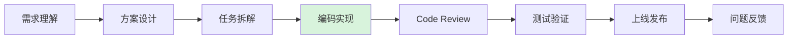
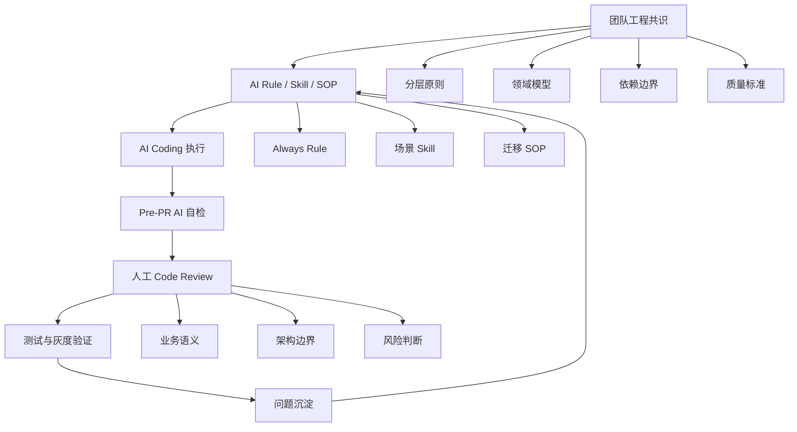

# AI Coding 时代的工程治理：先人人对齐，再人机对齐

最近团队里可能经常出现这样的场景。

一个需求刚讲完，工程师把上下文交给 AI，十几分钟后，接口、实现、测试都出来了。代码看起来很完整，命名也比过去规整，第一反应是：这次应该能提前交付。

但真正准备合入时，事情开始慢下来。

有人发现它沿用了一个早该淘汰的调用方式；有人认为这段逻辑应该留在应用层，另一个人觉得放到领域层更合理；测试虽然不少，却没有覆盖最危险的兼容路径；改动里还顺手抽出了一个新的公共组件，乍看漂亮，实际上把两个原本无关的模块绑在了一起。

**代码确实写快了，交付却没有同比变快。**更准确地说，原来花在“写”上的时间，被转移到了“想清楚、审明白、验证完”上。

**AI 带来的效率是真实的，只是研发的瓶颈已经换了位置。**

本文想讨论的，就是瓶颈变化之后，团队应该怎样工作。重点不在工具怎么用，也不打算再写一套越来越厚的 AI 使用守则。我们更关心的是：当代码生成越来越便宜，怎样不让判断、协作和质量成为新的债务。

## 一、AI 加速的是编码，不是整个研发过程

“AI 写了多少代码”很容易统计，也很容易制造一种效率已经发生的感觉。但一个需求从提出到上线，中间还有需求澄清、方案设计、任务拆解、联调、评审、测试、发布和问题反馈。编码只是其中一段。

把完整的研发链路摊开来看，会更直观：

现阶段，AI 最明显的提升仍然集中在图中的**编码实现阶段**。但研发中真正复杂的事情，大多发生在代码生成之前或之后：

- 需求是否被正确理解；
- 架构是否合理；
- 边界是否清晰；
- 修改是否影响已有系统；
- 测试是否覆盖关键风险。

AI 把一天的编码压缩到一个小时，并不意味着这些问题也随之消失，更不意味着一个运行多年的系统突然没有了历史约束。相反，生成端越快，下游越容易堵住：PR 变多、改动变大、Reviewer 来不及理解，测试和发布承受更多压力。

[一位将 Coding Agent 引入嵌入式团队一年多的开发者](./zhihu/vibe-coding/1951716962645288920_2008979992873284732-为什么我会感觉vibe-coding让程序员越来越浮躁了-Weyne-Chen.md)也观察到：AI 在编码、陌生项目理解和跨领域任务上带来了真实提效，但完整开发周期只略有缩短，因为需求变化、沟通协作、复杂业务和长链路调试仍然占据了大量时间。

**AI Coding 的第一阶段，不是替代研发流程，而是重新暴露研发流程中的瓶颈。**

所以我们不应该只问：

> AI 替我们写了多少代码？

更应该问：

> 从需求提出到稳定上线，等待时间少了多少？返工少了多少？团队接手这段代码时，理解成本有没有下降？

这是两套完全不同的效率观。**前者看产量，后者看交付。**

还有一个经常被忽略的事实：**AI 不承担上线后果。**它可以理解“这里出错会造成资损”，却不会真正承担资损；它可以建议重写，也不需要面对延期、兼容和回滚。最终决定要不要改、改到什么程度、什么时候停下来的，仍然是人。

因此，AI Coding 并没有让工程责任变轻。代码产出越快，人的判断责任反而越重。

## 二、当分歧开始被批量复制

AI 会读仓库里的现有代码，也会模仿它看到的结构。问题在于，仓库里的代码并不都是今天的最佳实践。里面有历史妥协，有临时方案，也有团队尚未清理的边界问题。

如果 Controller 里一直夹着业务逻辑，AI 会自然地继续往 Controller 里写；如果数据库对象已经穿透到接口层，它不会凭空知道这是技术债；如果公共目录里塞满了用途各异的 Helper，它很可能再补一个看起来同样合理的 Helper。

过去，一个含糊的工程判断可能只影响一个人、一个 PR。现在，**它可以在一次批量修改里被复制到几十个文件。**

所以 AI Coding 更值得警惕的工程风险，不是偶尔写错几行，而是让团队原有的不一致变得更便宜、更快，也更像“正确答案”。代码命名工整、注释完整、测试能跑，并不能证明边界就是对的。

治理也就不能从“怎样写出更好的 Prompt”开始，而要从“团队认为什么是好的工程决策”开始。

## 三、先人人对齐，再人机对齐

这句话里，顺序很重要。

很多团队引入 AI 后，第一件事是写 Rule、整理 Prompt、建设 Skill，希望把工具调教得更稳定。但如果同一个问题交给三位工程师，三个人对分层、抽象、测试和重构范围的判断都不一样，再完整的 Rule 也只会得到三种用法。

**AI Rule 不是团队共识的替代品，它只是团队共识的机器可执行版本。**

在要求 AI 遵守规则之前，我们至少要先讲清楚几件事：

- 一段逻辑为什么属于这一层，而不是相邻层；
- 什么对象可以跨层传递，什么对象必须在边界处转换；
- 什么时候应该抽象复用，什么时候宁可暂时重复；
- 一个需求碰到技术债时，允许顺带处理到哪里；
- 不同风险的改动，需要什么级别的测试、灰度和回滚准备；
- 谁对最终方案和上线结果负责。

这些问题很难靠一份通用规范一次写完。更现实的方式，是在真实需求和真实 Review 中不断对齐。哪类问题反复争论，就把它说透；哪种错误反复出现，就把它沉淀下来；哪次改动做得好，就留下一个可以照着走的样板。

**先让人对“什么叫做对”有相近的判断，再让 AI 稳定地执行这种判断。**这才是人机对齐的起点。

## 四、AI 时代，经验的价值从“写得熟”转向“判断得准”

过去，经验常常表现为熟悉代码：知道调用链在哪里，记得哪些接口不能动，能从大量日志里迅速定位可疑位置。这些能力仍然重要，但 AI 已经可以分担其中不少检索和整理工作。

它可以快速扫描调用关系、查找相似实现、列出影响文件、整理测试矩阵。以前需要花几个小时才能看全的东西，现在可能几分钟就有一份初步结果。

但“看得全”之后，难题才刚刚开始：

- 十几个风险里，哪三个会挡住上线？
- 发现的旧问题，哪些必须随本次需求一起解决？
- 两个都能工作的方案，哪个更符合未来一年的演进方向？
- AI 已经连续修改了几轮，现在应该继续修，还是先把主动权拿回来重新梳理？

**这些都属于取舍，无法靠多生成几版代码解决。**

AI 可以给出建议，却无法替团队拥有业务背景，也无法替负责人承担结果。工程师的价值不会因为少敲了代码而消失，只是更多地体现在定义问题、建立边界、识别风险和及时叫停上。

这也是我们不鼓励“代码能跑就继续往后推”的原因。使用 AI 不是放弃理解过程。恰恰相反，生成速度越快，越要刻意保留设计、质疑和验证的过程。**代码可以不是人逐字写的，但必须有人真正理解它。**

## 五、让 AI 进入流程，而不只是进入编辑器

如果 AI 只参与编码，团队得到的往往只是更快的代码生成器。要把个人效率变成交付效率，它必须进入需求开始到 PR 合入的整个过程。

整个治理体系可以概括为下面这张图：

这套架构不是一条只往前走的流水线。每次交付暴露出来的分歧、返工和风险，都会回到团队共识和 AI 规则中，成为下一次协作的上下文。

### 动手前，先对计划达成一致

对于涉及多个模块的改动，不要让 AI 收到需求后立刻批量写代码。先让它阅读相关实现，输出自己的理解、影响范围、准备修改的文件、关键风险和验证方式。

这一步不是为了增加一道形式上的审批，而是**把分歧暴露在代码生成之前**。计划里如果连业务边界都说不清，代码写得越多，后面的返工只会越大。

人要在这里确认的是目标和边界：问题有没有理解对，哪些行为必须保持，哪些内容明确不在本次范围内。AI 擅长把信息摊开，人负责作出选择。

### 实施时，先做样板，再做批量迁移

复杂重构最怕多人同时开工。即使大家面对同一份文档，不同人的理解、AI 拿到的上下文和迁移顺序也会不同，最后很容易得到一批表面相似、细节分叉的代码。

更稳妥的做法，是先选一个典型模块，由主负责人完整跑一遍。第一遍不追求最快，重点是把那些过去只存在于经验里的判断显性化：为什么逻辑移到这里，为什么对象要在这里转换，为什么某个公共方法暂时不抽，为什么某笔旧债这次先不还。

样板稳定以后，再把这条路径整理成 SOP，让 AI 承担调用点扫描、机械迁移、转换代码和测试骨架等重复工作。其他成员沿着同一条路径推进，人只需要集中检查业务语义和例外情况。

这里最有价值的产物不只是第一份代码，而是**一条团队已经走通的路**。

### 提交前，让 AI 先把基础问题挡下来

AI 生成代码更快以后，人工 Review 很容易成为新的瓶颈。如果 Reviewer 还要从明显重复、异常遗漏、无关改动和 PR 描述不清开始排查，前面省下来的时间很快就会在这里还回去。

因此每次提交前，可以让 AI 做一次 Pre-PR 自检：总结为什么改、改了什么、影响哪些入口，检查是否破坏分层、是否引入不必要抽象、是否遗漏异常和兼容路径，并列出已经完成的验证与仍需关注的风险。

Pre-PR 不是让 AI 给自己的作业打满分，更不是替代人工 Review。它的作用是清走基础噪音，**让 Reviewer 把时间放在最值得人判断的事情上**：业务是不是对的，边界是不是稳的，风险是否可以接受。

### 测试时，人先圈定风险，AI 再补覆盖

AI 很容易生成一长串测试用例，看起来全面，实际可能只是在反复覆盖 Happy Path。测试的关键从来不是数量，而是有没有守住最可能出问题的地方。

更合适的分工是：人先指出核心路径、历史兼容、危险数据和不可接受的失败方式；AI 再扫描改动，补充边界条件、受影响入口和执行步骤。最后仍由人确认，高风险场景有没有遗漏，低价值用例有没有挤占验证时间。

**人定义风险，AI 扩大覆盖，人对结果签字。**

## 六、技术债要借业务窗口消化，但不能借机失控

AI 让重构看起来比过去容易，也因此更容易诱发范围膨胀。改一个接口时顺便统一目录，统一目录时顺便替换框架，替换框架时又发现测试体系也该重做，最后一个业务需求变成了没有边界的工程改造。

但另一个极端也不可取：因为业务一直赶，就永远沿着旧结构继续写，让 AI 更快地复制历史问题。

我们更倾向于把技术债放进真正相关的业务窗口中，小步消化。判断标准不是“既然看到了就顺手改”，而是“不处理这一小块，会不会让本次需求继续扩大问题”。

每次顺带治理，都要能回答四个问题：这次具体处理哪一块，哪些问题明确不处理，怎样证明原有行为没有被破坏，出现问题时怎样回退。

**边界说不清，就先不要扩大改动。**技术债治理需要勇气，也需要克制。

## 七、Leader 要管理的不是 AI 使用率，而是团队判断力

AI 进入团队后，很容易出现新的管理幻觉：既然代码生成快了，排期就应该成倍缩短；既然工具每个人都有，使用率越高，团队就越先进。

这两个指标都可能把团队带偏。

如果只追求生成量，大家会越来越不愿意花时间澄清需求、阅读代码和验证边界，因为这些工作在表面上没有“产出代码”。最后代码变多，信任变少，Reviewer 和测试同学承担所有下游压力。

Leader 真正需要关注的是：团队有没有更早发现错误方向，有没有减少等待和返工，有没有把高频问题沉淀成可复用的规则，**有没有明确谁为 AI 产出的变更负责**。

这要求 Leader 不能只做工具采购和进度统计，也要深入真实需求、样板改造和事故复盘。很多工程标准不是开会想出来的，而是在一线取舍中形成的。脱离这些具体问题，就很难判断一条 Rule 到底是在保护质量，还是在增加形式负担。

**AI 时代需要的不是更多“发号施令的人”，而是能把目标讲清、把边界定住、在关键处作出判断的人。**

## 八、我们准备怎样开始

不需要先写一套覆盖所有语言、所有场景的完整制度。治理应该从一个真实需求开始，并且接受第一版并不完美。

我们可以先做三件事。

第一，选一个近期的中等复杂度需求，在编码前增加计划评审，在提交前增加 Pre-PR，看看它们是否真的减少了返工和人工 Review 的基础工作。

第二，选一个边界问题比较典型的模块，由主负责人做一次样板重构。把过程中的关键判断留下来，形成第一份能被复用的 SOP，而不是先写一份脱离代码的理想规范。

第三，定期回看真实数据和问题：交付周期有没有缩短，返工来自哪里，Review 最常拦下什么，哪些 AI 规则确实有用，哪些只是写在文档里没人使用。有效的留下，无效的删掉，反复出现的问题继续沉淀。

最终，团队会逐步形成四类资产：少量始终生效的底线规则，按场景调用的 Skill，经过样板验证的 SOP，以及进入人工 Review 前的 Pre-PR 检查。它们不是一次设计完成的，而是从一次次交付中长出来的。

## 结语

AI Coding 带来的变化，不只是把同样的代码写得更快。它正在重新分配研发过程中的稀缺资源：生成不再稀缺，清晰的问题、可靠的判断和可承担的责任变得更稀缺。

所以我们不把“AI 写了多少”当成终点，也不把治理理解成给 AI 套上越来越多的规则。

我们真正想建立的是一种新的协作方式：团队先对好的结构、好的变更和可接受的风险形成共识，再把这份共识交给 AI 执行；AI 帮我们看得更广、做得更快，人决定往哪里走、什么时候停，并对最终结果负责。

**先人人对齐，再人机对齐。**

顺序对了，AI 才会放大团队的工程能力；顺序错了，它只会让分歧更快地变成代码。

## 推荐补充阅读

### 美团

[《用 Agent 评测思路管理 AI Coding —— 31 万行代码 AI 重构的实践》](https://tech.meituan.com/2026/05/07/Agent-AI-Coding.html)

### Anthropic

[Building Effective Agents](https://www.anthropic.com/engineering/building-effective-agents)

### Google Research

[AI-assisted Assessment of Coding Practices in Industrial Code Review](https://research.google/pubs/ai-assisted-assessment-of-coding-practices-in-industrial-code-review/)

### Google Cloud

[Five Best Practices for Using AI Coding Assistants](https://cloud.google.com/blog/topics/developers-practitioners/five-best-practices-for-using-ai-coding-assistants/)

### GitHub Copilot / AI Code Review

[GitHub Copilot Code Review 能力评估](https://arxiv.org/abs/2509.13650)
