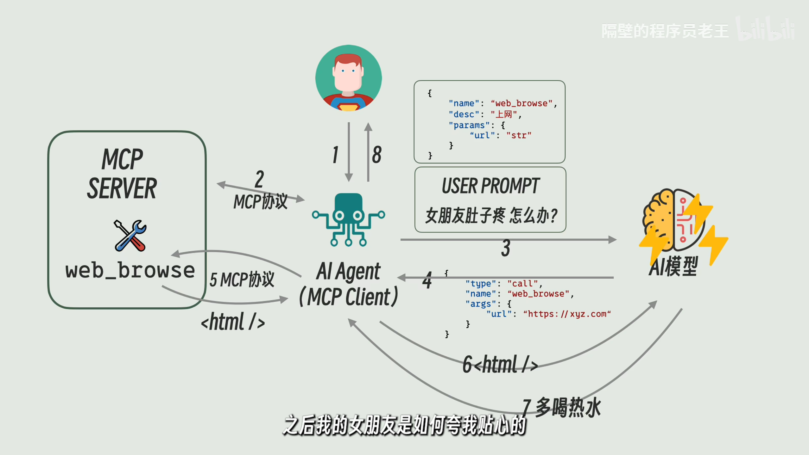

# 大语言模型应用

## RAG

检索增强生成(RAG, Retrieval-Augmented Generation)是一种结合了检索和生成的模型架构，其核心思想是在生成文本时，先从外部知识库中检索相关信息，再结合这些信息进行生成。

RAG 的优势：

* 减少幻觉：通过检索真实的资料，降低生成错误信息的概率
* 突破上下文限制：外部知识库可以包含大量信息，不受模型上下文长度限制
* 动态更新知识：知识库可以随时更新，模型能够利用最新的信息

### RAG的工作流程

#### 知识库构建

1. 文本预处理：对原始文本进行清洗、分词、去重等处理
2. 向量化表示：使用预训练的文本编码器（如 Sentence-BERT）将文本转换为向量表示
3. 存储索引：将向量存储在高效的向量数据库中（如 FAISS、Pinecone）

#### 检索

1. 查询编码：将用户输入的问题或提示转换为向量表示
2. 相似度计算：在向量数据库中计算查询向量与知识库中向量的相似度
3. 结果排序：根据相似度得分对检索结果进行排序，选择前 k 个最相关的文本片段

#### 生成

1. 上下文构建：将检索到的文本片段与用户输入拼接，形成生成模型的输入上下文prompt
2. 文本生成：新的 prompt 输入给模型，从而生成基于专业知识的回答
3. 后处理：对生成的文本进行必要的格式化、过滤等处理，如重写、重排等

### 文档切分

在构建知识库时，文档切分是一个重要步骤。合理的切分可以提高检索的准确性和生成的质量。
* 长文档切分的缺点：
    * 输入上下文增大，降低回答质量
    * 信息量过多，检索准确度降低，正确参考信息被无关信息淹没
* 短文档切分的缺点：
    * 信息量过少，大模型找不到参考信息
    * 文档数量提升，降低检索速度
    * 更多的语义碎片，丢失语义连贯性和长文本中的实体依赖关系，俗称“说话说一半”

常见Splitter函数与参量：

**split_by**：常用的基本单位有page、passage、sentence、line、word，这里我们以词(word)为基本单位进行切分。哪个基本单位好呢？
  * word看起来很好，因为它可以保证所有的文档块都一样长，足够平均；但在头尾处会出现严重的不连贯现象
  * page和passage则是的文档块长度分布不均，以及超长文档块的出现
  * 所以一般而言sentence或line是个不错的选择

**split_length**：切分的基本长度

**split_overlap**：为了减少“说话说一半”的情况出现，让文档块之间相互重叠。假如2 3是连贯内容，重叠就可以使得它们连起来；不重叠则会被切断

```python
from haystack.components.preprocessors import DocumentSplitter
from haystack import Document

numbers = "0 1 2 3 4 5 6 7 8 9"
document = Document(content=numbers)
splitter = DocumentSplitter(split_by="word", split_length=3, split_overlap=1)
docs = splitter.run(documents=[document])["documents"]

print(f"document: {document.content}")
for index,doc in enumerate(docs):
	print(f"document_{index}: {doc.content}")
```

**NLTKDocumentSplitter**：处理奇怪输入，如"Mr."等

```python
from haystack.components.preprocessors import NLTKDocumentSplitter, DocumentSplitter
from haystack import Document

text = """The dog was called Wellington. It belonged to Mrs. Shears who was our friend.
She lived on the opposite side of the road, two houses to the left."""
document = Document(content=text)

simple_splitter = DocumentSplitter(split_by="sentence", split_length=1, split_overlap=0)
simple_docs = simple_splitter.run(documents=[document])["documents"]
print("\nsimple:")
for index, doc in enumerate(simple_docs):
    print(f"document_{index}: {doc.content}")

nltk_splitter = NLTKDocumentSplitter(split_by="sentence", split_length=1, split_overlap=0)
nltk_docs = nltk_splitter.run(documents=[document])["documents"]
print("\nnltk:")
for index, doc in enumerate(nltk_docs):
    print(f"document_{index}: {doc.content}")
```

### 检索的几种方式

#### Retriever

BM25是搜索引擎领域计算查询与文档相关性的排名函数，它是一种**基于词袋的检索函数**：通过统计查询和文档的单词匹配数量来计算二者相似度分数。
$$
\text{score}(D, Q) = \sum_{i=1}^{n} \text{IDF}(q_i) \cdot \frac{f(q_i, D) \cdot (k_1 + 1)}{f(q_i, D) + k_1 \cdot \left(1 - b + b \cdot \frac{|D|}{\text{avgdl}}\right)}
$$

其中：
- 查询$Q$包含关键字$q_1,…,q_n$
- $f(q_i,D)$是$q_i$在文档$D$中的词频
- $|D|$是文档长度
- $avgdl$是平均文档长度 ; $IDF(q_i )$是$q_i$的逆向文档频率权重 ; $k_1$和$b$是超参数

```python
from haystack import Document
from haystack.components.retrievers.in_memory import InMemoryBM25Retriever
from haystack.document_stores.in_memory import InMemoryDocumentStore

document_store = InMemoryDocumentStore()
documents = [
	Document(content="There are over 7,000 languages spoken around the world today."),
	Document(content="Elephants have been observed to behave in a way that indicates
          a high level of self-awareness, such as recognizing themselves in mirrors."),
	Document(content="In certain parts of the world, like the Maldives, Puerto Rico,
        and San Diego, you can witness the phenomenon of bioluminescent waves.")
]
document_store.write_documents(documents=documents)
```

```python
# 处理查询
retriever = InMemoryBM25Retriever(document_store=document_store)
docs = retriever.run(query="How many languages are spoken around the world today?")["documents"]
for doc in docs:
	print(f"content: {doc.content}")
	print(f"score: {doc.score}")
```
输出

> content: There are over 7,000 languages spoken around the world today.
> score: 7.815769833242408
>
> content: In certain parts of the world, like the Maldives, Puerto Rico, and San Diego, you can witness the phenomenon of bioluminescent waves.
> score: 4.314753296196667
>
> content: Elephants have been observed to behave in a way that indicates a high level of self-awareness, such as recognizing themselves in mirrors.
> score: 3.652595952218814


优缺点：

* **速度快**：基于统计的分数计算公式很简单，可以快速处理大规模文本数据
* **存储开销小**：除文本外无需存储额外数据。如果下游大模型通过API调用，rag不需要显卡也能跑起来，而且很快
* **太依赖关键字**：query质量不高就搜不到，无法捕获文本的上下文语义信息。比如，在搜索引擎中，如果不输入关键字那必然搜不到我们想要的内容

#### DenseEmbeddingRetriever: 文本嵌入模型

最近几年，一种基于BERT架构衍生出来的多种语义检索技术被更多地用到了RAG中，他是一种encoder-only的transformer架构。密集嵌入检索器基于双编码器(Bi-Encoder)架构，在BERT上面外加一层池化层(Pooling)，得到单一的句向量，存储到document.embedding中。
- sentence ->**BERT-Encoder** -> token vectors
- token vectors -> **Pooling Layer** -> sentence vector
- score(SentenceA, SentenceB) = cosine_similarity(vectorA,vectorB)

密集向量会交给一个经过训练的嵌入模型生成，它可以将**相似的句子**映射到高维空间中**距离相近、方向相似的向量**，常用的相似度分数计算公式有两种：

**余弦相似度**：常用的相似度计算公式，计算两个向量之间的夹角的余弦值。两个向量的方向越一致相似度越高
  $$\text{Cosine Similarity} = \frac{\mathbf{A} \cdot \mathbf{B}}{\|\mathbf{A}\| \|\mathbf{B}\|} = \frac{\sum_{i=1}^n A_i B_i}{\sqrt{\sum_{i=1}^n A_i^2} \cdot \sqrt{\sum_{i=1}^n B_i^2}}$$
**欧式似度**：直接计算两个向量之间的欧几里得距离，然后取个倒数得到相似度分数。也可以用其他距离：曼哈顿距离、汉明距离等
	$$\text{Euclidean Similarity} = \frac{1}{1+\sqrt{\sum_{i=1}^n (A_i - B_i)^2}}$$

例子：

使用sentence-transformers库中的预训练模型sentence-transformers/all-MiniLM-L6-v2来生成句向量，并使用余弦相似度计算查询与文档之间的相似度分数。

```python
from haystack import Document, Pipeline
from haystack.document_stores.in_memory import InMemoryDocumentStore
from haystack.components.embedders import (
    SentenceTransformersTextEmbedder,
    SentenceTransformersDocumentEmbedder,
)
from haystack.components.retrievers import InMemoryEmbeddingRetriever

document_store = InMemoryDocumentStore(embedding_similarity_function="cosine")

documents = [
    Document(content="There are over 7,000 languages spoken around the world today."),
    Document(content="Elephants have been observed to behave in a way that indicates
    a high level of self-awareness, such as recognizing themselves in mirrors."),
    Document(content="In certain parts of the world, like the Maldives, Puerto Rico,
    and San Diego, you can witness the phenomenon of bioluminescent waves."),
]
document_embedder = SentenceTransformersDocumentEmbedder(
    model="sentence-transformers/all-MiniLM-L6-v2"
)
document_embedder.warm_up()
documents_with_embeddings = document_embedder.run(documents)["documents"]
document_store.write_documents(documents_with_embeddings)
for doc in documents_with_embeddings:
    print(f"content: {doc.content}")
    print(f"score: {doc.score}")
    print(f"embedding: {doc.embedding}\n")
```
输出：

> content: There are over 7,000 languages spoken around the world today.
> score: None
> embedding: [0.03276507928967476, ..., 0.022160163149237633]
>
> content: Elephants have been observed to behave in a way that indicates a high level of self-awareness, such as recognizing themselves in mirrors.
> score: None
> embedding: [0.01985647901892662, ..., 0.007489172276109457]
>
> content: In certain parts of the world, like the Maldives, Puerto Rico, and San Diego, you can witness the phenomenon of bioluminescent waves.
> score: None
> embedding: [0.08535218983888626, ..., 0.013049677945673466]

处理查询：

```python
query_pipeline = Pipeline()
query_pipeline.add_component(
    "text_embedder",
    SentenceTransformersTextEmbedder(model="sentence-transformers/all-MiniLM-L6-v2"),
)
query_pipeline.add_component(
    "retriever", InMemoryEmbeddingRetriever(document_store=document_store)
)
query_pipeline.connect("text_embedder.embedding", "retriever.query_embedding")

query = "How many languages are there?"
result = query_pipeline.run({"text_embedder": {"text": query}})
result_documents = result["retriever"]["documents"]
for doc in result_documents:
    print(f"content: {doc.content}")
    print(f"score: {doc.score}\n")
```
输出：
> content: There are over 7,000 languages spoken around the world today.
> score: 0.7557791921810213
>
> content: Elephants have been observed to behave in a way that indicates a high level of self-awareness, such as recognizing themselves in mirrors.
> score: 0.04221229572888512
>
> content: In certain parts of the world, like the Maldives, Puerto Rico, and San Diego, you can witness the phenomenon of bioluminescent waves.
> score: -0.001667837080811814

优缺点：
- **速度快**：可以提前在GPU上计算并存储文档块的dense embedding，计算相似度就会很快
- **存储开销小**：每个文档块只需要额外存储一个高维向量(通常768或1024维)
- **捕获句子的语义信息**：只要是相似的句子，关键字不匹配也可以检索到
- **丢失词元信息**：BERT产生的众多词元向量全部被映射到单一句向量，丢失了很多文本中的细节。快速地粗读文本，速度虽快但忽略了细节，只了解了个大概

#### similarity reranker：相似度计算模型

similarity reranker基于交叉编码器(cross-encoder)架构，直接将两个句子串联起来，交给BERT，使得两个句子的词元向量可以在BERT内部相互交叉(cross)地进行交互，最终经过softmax得到一个相似度分数。
```python
from haystack import Document
from haystack.components.rankers import TransformersSimilarityRanker

documents = [
    Document(content="There are over 7,000 languages spoken around the world today."),
    Document(content="Elephants have been observed to behave in a way that indicates
    a high level of self-awareness, such as recognizing themselves in mirrors."),
    Document(content="In certain parts of the world, like the Maldives, Puerto Rico,
    and San Diego, you can witness the phenomenon of bioluminescent waves."),
]
ranker = TransformersSimilarityRanker(model="cross-encoder/ms-marco-MiniLM-L-6-v2")
ranker.warm_up()
query = "How many languages are there?"
ranked_documents = ranker.run(query=query, documents=documents)["documents"]
for doc in ranked_documents:
    print(f"content: {doc.content}")
    print(f"score: {doc.score}\n")
```
输出：

> content: There are over 7,000 languages spoken around the world today.
> score: 0.9998884201049805

> content: Elephants have been observed to behave in a way that indicates a high level of self-awareness, such as recognizing themselves in mirrors.
> score: 1.4616251974075567e-05

> content: In certain parts of the world, like the Maldives, Puerto Rico, and San Diego, you can witness the phenomenon of bioluminescent waves.
> score: 1.4220857337932102e-05

优缺点：

- **充分利用词元信息**：相似度直接在模型内部完成计算。同时看两个文本，交叉理解两个文本的单词的含义，训练好的模型可以得到很好的相似度计算结果
- **在线计算**：所有的计算都要在GPU上在线完成，无法提前存储一些信息，实现之前的离线计算，因此会很慢

### 上下文丰富

小文档块的检索准确度更高，但丢失了更多上下文信息，因此可以在检索后丰富上下文来补偿。以小文档块为单位进行检索可以保证检索准确度，和相邻若干文档块合并形成大文档块可以保证信息量，类似翻阅书本时，突然扫到了重点，会下意识联系上下文看一看，看有没有额外的相关信息可以参考

<p align="center">
  
</p>

### 基于LangChain的RAG实现

LangChain 是一个用于构建基于语言模型应用的框架，特别适合实现 RAG（检索增强生成）系统。以下是使用 LangChain 实现 RAG 的基本步骤：

```python
import bs4
from bs4.filter import SoupStrainer
from langchain_community.document_loaders import WebBaseLoader
from langchain_core.documents import Document
from langchain_text_splitters import RecursiveCharacterTextSplitter
from langgraph.graph import START, StateGraph
from typing_extensions import List, TypedDict
from langchain_openai import ChatOpenAI

llm = ChatOpenAI(model="gpt-4o-mini")

from langchain_openai import OpenAIEmbeddings

embeddings = OpenAIEmbeddings(model="text-embedding-3-large")

loader = WebBaseLoader(
    web_paths=("https://lilianweng.github.io/posts/2023-06-23-agent/",),
    bs_kwargs=dict(
        parse_only=bs4.filter.SoupStrainer(
            class_=("post-content", "post-title", "post-header")
        )
    ),
)
docs = loader.load()

text_splitter = RecursiveCharacterTextSplitter(chunk_size=1000, chunk_overlap=200)
all_splits = text_splitter.split_documents(docs)
```

```python
from langchain_core.vectorstores import InMemoryVectorStore
from langchain_classic import hub

vector_store = InMemoryVectorStore(embeddings)
_ = vector_store.add_documents(documents=all_splits)

# Define prompt for question-answering
prompt = hub.pull("rlm/rag-prompt")
```

```python
# Define state for application
class State(TypedDict):
    question: str
    context: List[Document]
    answer: str

# Define application steps
def retrieve(state: State):
    retrieved_docs = vector_store.similarity_search(state["question"])
    return {"context": retrieved_docs}

def generate(state: State):
    docs_content = "\n\n".join(doc.page_content for doc in state["context"])
    messages = prompt.invoke({"question": state["question"], "context": docs_content})
    response = llm.invoke(messages)
    return {"answer": response.content}
```

```python
graph_builder = StateGraph(State).add_sequence([retrieve, generate])
graph_builder.add_edge(START, "retrieve")
graph = graph_builder.compile()

# response = graph.invoke({"question": "What is Task Decomposition?"})
# print(response["answer"])
```

## Harness Engineering

Harness Engineering是指在大模型的基础上，构建一个可控、可扩展的系统，使其能够更好地适应实际应用场景。

### MCP
MCP(Model Context Protocol)，即大模型上下文协议，是一个通信协议，专门用来规范Agent与Tool之间是如何交互的，运行Tool的服务叫做MCP Server，调用它的智能体叫做MCP Client。MCP规定了两者如何通信，例如Server需要提供哪些接口（如何查询所有Tool、每个Tool的功能、格式等），除了提供tools，Server还可以提供resource、prompt等数据。

<p align="center">
  
</p>

理解MCP得从AI Agent开始讲起，Agent可以看作是一个能够根据用户指令实现对应功能的智能体，有别于大模型，其本质其实是一个在用户、模型、工具（Agent Tool）之间传话的“智能体”。

AI Agent与大模型之间：有时候大模型的回答并不让人满意或是会给出不规范的回答（反复重试会增加Token的使用），因此引入了Function Call的概念，对User Prompt和Reply都进行了标准化，例如都使用json文件进行传递（相当于将自然语言转化为了计算机语言）。由于Function Call没有一个统一的标准，因此目前System Prompt和Function Call是共存的。

AI Agent与Agent Tool之间：MCP是一个通信协议，专门用来规范Agent与Tool之间是如何交互的，运行Tool的服务叫做MCP Server，调用它的智能体叫做MCP Client。MCP规定了两者如何通信，例如Server需要提供哪些接口（如何查询所有Tool、每个Tool的功能、格式等），除了提供tools，Server还可以提供resource、prompt等数据。

### Skill

### Hook

### Loop