# 大语言模型基础

## NLP

Natural Language Processing，即自然语言处理，是语言学、计算机科学和人工智能的跨学科子领域，关注计算机和人类语言之间的交互，特别是如何编程使计算机能够处理和分析大量的自然语言数据。其目标是使计算机能够“理解"文档的内容，包括其中的语言背景细微差别。然后，这项技术可以准确提取文档中包含的信息和见解，以及对文档本身进行分类和组织。本质上是一个“填字游戏”，基于条件概率$p(y|x)$。

<p align="center">
  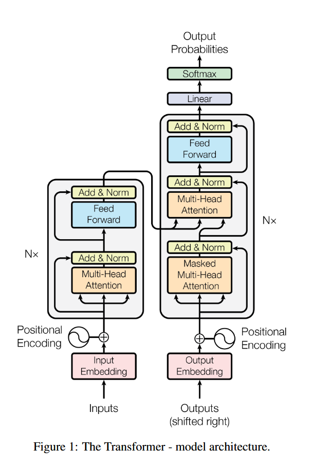
</p>

### Decoder-encoder

Google BERT使用的方法。由经典的Transformer图片可以看到，左侧理解输入，并通过encoder编码器输出给右侧的decoder，最后进行输出。

### Decoder-only

GPT(Generative Pre-trained Transformer)使用的方法。将encoder部分删除，只保留decoder部分，相当于将理解的任务也交给decoder。

**举一个比较形象的例子就是，decoder-encoder方法可以理解为“完形填空”，而decoder-only方法则可以理解为“词语接龙”。在使用模型时，通常的方式是提问，即形式偏向于“词语接龙”。**

> 为什么当前主流大模型都采用 decoder-only 架构，而不是 encoder-only 或 encoder-decoder？

主要有以下三个核心原因：

1. **生成任务天生是自回归的**：语言生成的本质是预测下一个token，decoder-only的因果注意力恰好对应这个任务
2. **推理时KV Cache复用**：因果注意力下，每个token的KV只算一次，后续token直接复用，生成每个新token只需要算自己的Q
3. **训练数据利用率高 / scaling 更好**：自回归目标里**每个 token 都是「用前文预测自己」的监督目标**，全序列 token 都贡献损失，无标注语料的利用率是 100%

## Input Embedding

### 嵌入(Embedding)

将自然语言翻译为token以供大模型理解和处理，每个模型都有一个独特的embedding table，其大小为[vacob_size, hidden_dim/d_model]，记录了模型已知的所有词。同时，每个模型会自带tokenizer，起作用为将用户输入的信息进行分词，得到一系列token，并得到token_id。通过查询这些token_id，就能将自然语言转换为大模型能够理解的信息。

### Tokenizer

尝试[Tiktokenizer](https://github.com/openai/tiktoken)：

<p align="center">
  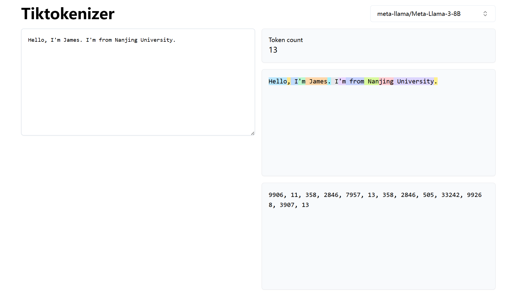
</p>

用以下方式加载模型对应的tokenizer:

```python
import transformers
print(transformers.__version__)
from transformers import AutoModelForCausalLM, AutoTokenizer
model_id = ""
tokenizer = AutoTokenizer.from_pretrained(model_id)
```

使用方法：

* `tokenizer(input)` - 完整编码，返回字典
* `tokenizer.tokenize(input)` - 只分词，返回字符串列表
* `tokenizer.encode(input)` - 编码为ID，可选择特殊符号
* `tokenizer.decode(input)` - 解码ID为文本

#### Tokenizer的返回值

除了input_ids外，tokenizer还会返回attention_mask（这里的attention mask注意要和后面的因果attention mask区分一下），表示哪些token是有效的，哪些是padding的无效token。1表示有效，0表示无效。

```python
encoded = tokenizer(text)
print(encoded)
 {'input_ids': [128000, 59563, 47653, 102667, 128001],
  'attention_mask': [1, 1, 1, 1, 1]}
```

#### 编码与解码

`tokenizer(input)`: 得到{'input_ids','attention_mask'}字典结构

`tokenizer.tokenize(input)`: 得到tokens

`tokenizer.encode(input)`: 得到tokens的ids

`tokenizer.decode(input)`: 得到文本，为ids的List

#### Tokenizer基本操作

##### Padding，补齐

当对一批长度不一的文本进行tokenizer时，可以使用`padding=True`参数让tokenizer自动对齐长度，默认会对齐到该批次中最长文本的长度。

```python
batch_sentences = [
    "Tell me a story about Nanjing University.",
    "大语言模型课程怎么考试？",
]
encoded_inputs = tokenizer(batch_sentences)
print(encoded_inputs)
encoded_input_padding_true = tokenizer(batch_sentences, padding=True)
print(encoded_input_padding_true)
# 指定长度进行padding
encoded_input = tokenizer(batch_sentences, padding="max_length", max_length=20, truncation=True)
```

**控制padding方向：**

在模型推理过程中，一般使用左侧padding，即在序列的左侧添加padding token，使得有效token位于序列的右侧。这种方式有助于模型更好地捕捉序列的上下文信息，便于模型生成下一个token，尤其是在处理变长输入时。

```python
tokenizer.padding_side = 'left'
encoded_input = tokenizer(batch_sentences, padding="max_length", max_length=20, truncation=True)
```

##### Truncation，截断

训练时可能遇到某个样本非常长的情况，该组内其他所有batch都使用大量padding token补0，导致整体的tensor非常大，进而内存出现OOM(out of memory)的情况，这时候就需要用到truncation进行截断。

### 位置编码(PE, Positional embenddings)

位置编码用来标记每个token的位置。由于Transformer架构的核心组件（Self-Attention 机制）是并行处理输入序列中的所有词（Token）的，它本身不具备捕捉序列顺序的能力（即它无法区分“猫追狗”和“狗追猫”的区别，因为它只关注词与词之间的关联度，而不关注谁在前谁在后），本质上是衡量token与token之间的相关性。从自然语言的角度思考，考虑相关就必须带入某种语境，位置编码就是为了解决这个问题引入的。它为输入序列中的每个位置分配一个独特的向量，并将这个向量与对应位置的 Token Embedding 相加（或旋转），从而将“位置信息”注入到模型中，让LLM更好地建模不同位置的token之间的关系。

<p align="center">
  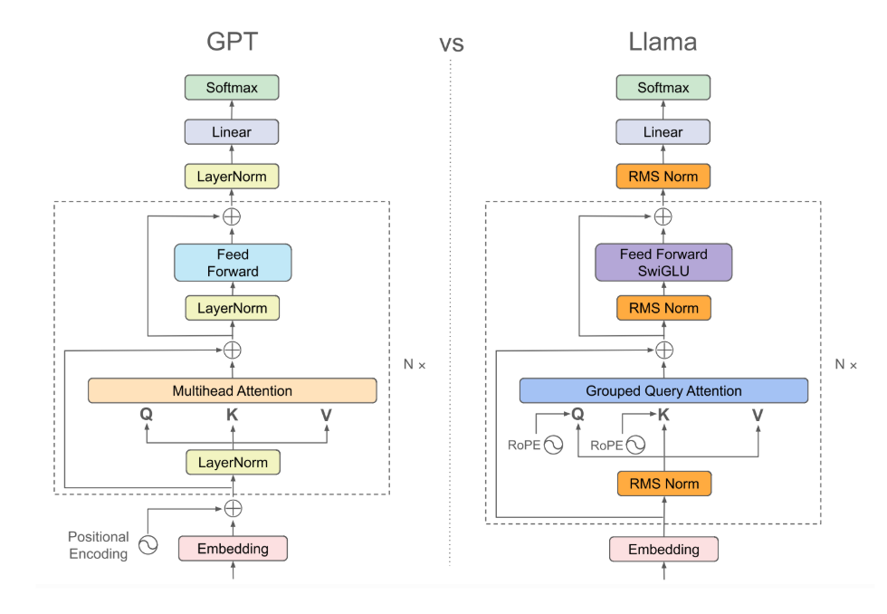
</p>

位置编码的重要性：

* 赋予序列感：它是模型理解语言语序的关键。没有位置编码，Transformer 就退化成了一个“词袋”模型（Bag-of-Words），只能处理词汇共现关系，无法理解语法结构和逻辑顺序。
* 区分相同词汇：如果一个句子中出现了两次相同的词（例如“The dog ate the bone”中的两个 "the"），如果没有位置编码，模型会认为它们是完全一样的输入；有了位置编码，模型就能根据它们在句子中的位置区分它们。
* 长距离依赖：合适的位置编码（如旋转位置编码 RoPE）有助于模型更好地处理长文本，捕捉距离较远的词之间的关系。

#### 绝对位置编码

直接在每个token的embedding上线性叠加位置编码: $x_i + p_i$，其中$p_i$为可训练的向量，例子为[Attention is all you need](https://arxiv.org/abs/1706.03762)中的sinusoidal PE。

使用sin方法的绝对位置编码的劣势：它采用直接相加的方式混入词向量，表达相对位置关系时非常间接，且缺乏优秀的长度外推性，无法自然地将绝对位置转化为注意力机制中的相对距离乘积。

#### 旋转位置编码(RoPE, Rotary PE)

通过叠加旋转位置编码的方式由加法改乘法。假设两个token的embedding为$x_m$和$x_n$，$m$和$n$分别代表两个token的位置，目标找到一个等价的位置编码方式，使得下述等式成立：
$$ \left \langle   f_q(x_m,m),f_k(x_n,n) \right \rangle=g(x_m,x_n,m-n)$$

[RoFormer](https://arxiv.org/abs/2104.09864)提出Rotary PE，在embedding维度为2的情况下：
$$\begin{aligned}
f_{q}\left(\boldsymbol{x}_{m}, m\right) & =\left(\boldsymbol{W}_{q} \boldsymbol{x}_{m}\right) e^{i m \theta} \\
f_{k}\left(\boldsymbol{x}_{n}, n\right) & =\left(\boldsymbol{W}_{k} \boldsymbol{x}_{n}\right) e^{i n \theta} \\
g\left(\boldsymbol{x}_{m}, \boldsymbol{x}_{n}, m-n\right) & =\operatorname{Re}\left[\left(\boldsymbol{W}_{q} \boldsymbol{x}_{m}\right)\left(\boldsymbol{W}_{k} \boldsymbol{x}_{n}\right)^{*} e^{i(m-n) \theta}\right]
\end{aligned}
$$

RoPE的可视化展示：

<p align="center">
  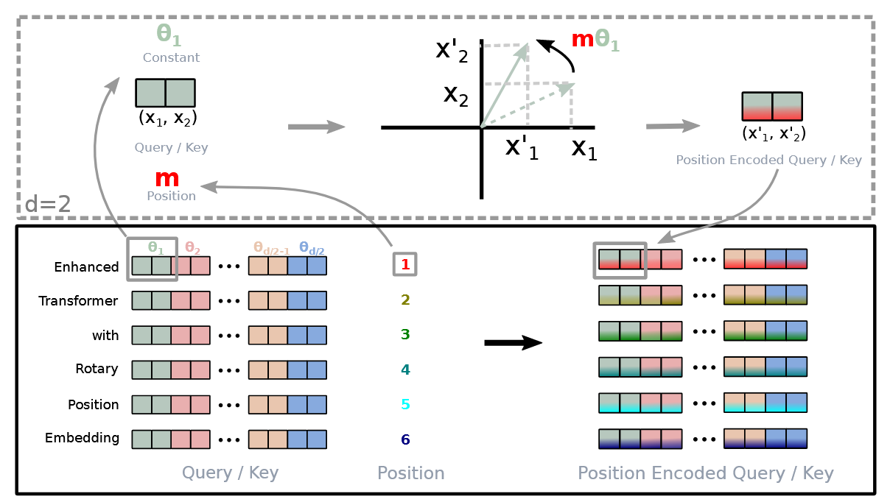
</p>

RoPE在LlaMA中的构建：

不同于经典Transformers结构，只对输入的token做位置编码的叠加，LlaMA中的RoPE在Transformer的每一层都会对Q和K进行位置编码的叠加。

<p align="center">
  
</p>

RoPE的代码实现：

<p align="center">
  
</p>

对于维度大小为(batch_size=1, seq_len, dim)的token来说，m表示每个token的具体位置（m对应seq_len），对于某一个具体的m，从n维实现的图中可以看出，每两个dim共用一个$\theta$，因此只需要$d=\dim/2$即可。

* 基础频率：$\theta_i = \text{base}^{-2i/d}$，常用$\text{base}=10000$
* 位置角度：$\theta_{n,i} = n\,\theta_i$，其中$n$为token位置，$i$为维度对索引

```python
import torch

def build_rope_cache(seq_len, dim, base=10000, device=None):
    device = device or torch.device('cpu')
    position = torch.arange(seq_len, dtype=torch.float32, device=device)
    dim_idx = torch.arange(dim // 2, dtype=torch.float32, device=device)
    inv_freq = base ** (-dim_idx / (dim // 2))
    # 计算外积，得到(seq_len, dim/2)维度的m\theta/2
    freqs = torch.outer(position, inv_freq)
    cos = torch.cos(freqs) # shape=(seq_len, dim/2)
    sin = torch.sin(freqs) # shape=(seq_len, dim/2)
    return cos, sin

def apply_rope(x, cos, sin):
    cos = cos.unsqueeze(0) # shape=(1, seq_len, dim/2)
    sin = sin.unsqueeze(0) # shape=(1, seq_len, dim/2)
    x_even = x[..., ::2] # 偶数列
    x_odd = x[..., 1::2] # 奇数列
    rotated_even = x_even * cos + x_odd * sin
    rotated_odd = x_odd * cos - x_even * sin
    # 最后两个维度展平
    rotated = torch.stack([rotated_even, rotated_odd], dim=-1).flatten(-2)
    return rotated

seq_len, dim = 4, 8 # dim一般为耦合
hidden_states = torch.arange(seq_len * dim, dtype=torch.float32).view(1, seq_len, dim)
cos, sin = build_rope_cache(seq_len, dim, device=hidden_states.device)
rope_hidden = apply_rope(hidden_states, cos, sin)
print('original token 0:', hidden_states)
print('after RoPE    :', rope_hidden)
```

旋转位置编码与Sin绝对位置编码的对比：

* 相对位置建模能力弱：
  * Sinusoidal（绝对）：将位置向量直接加到词嵌入上 (\(X + P\))。在计算内积 \(QK^{T}\) 时，相对位置信息被拆解成了复杂的绝对位置交叉项，模型很难直接从数值上感知两个词之间的相对距离。
  * RoPE（旋转）：通过复数旋转矩阵将位置信息作用于 \(Q\) 和 \(K\)，其内积结果自然只与两者的相对距离 (\(m-n\)) 相关，乘性结构对注意力机制更友好。
* 长度外推性差：
  * Sinusoidal（绝对）：面对训练时没见过的更长序列时，超出预设长度的绝对位置编码没有平滑的衰减或延伸机制，导致长文本效果急剧下降。
  * RoPE（旋转）：天然具备更好的相对衰减特性，配合 NTK-aware 等外推方法可以轻松扩展到超长上下文。
* 与注意力机制的融合方式不够直接：
  * Sinusoidal（绝对）：破坏了向量空间的纯粹几何意义，属于外加的辅助标记。
  * RoPE（旋转）：将位置编码融入到向量旋转中（乘性交互），不改变基础维度，更贴合自注意力的计算本质

## Norm

即标准化/归一化(Normalization)。对输入的embedding token以及训练循环中的outputs进行归一化，作用主要是调整数据的分布，加速训练收敛，让输入更“规整”，降低过拟合(overfitting)，增强泛化(generalization)，以下图为例，当对一个二维tensor进行训练时，若一个维度的数值远大于另一维，则更新迭代过程中该维度会占据主导地位。因此，适当的归一化能够防止数值在传播过程中过大或过小，使优化过程更平滑。

<p align="center">
  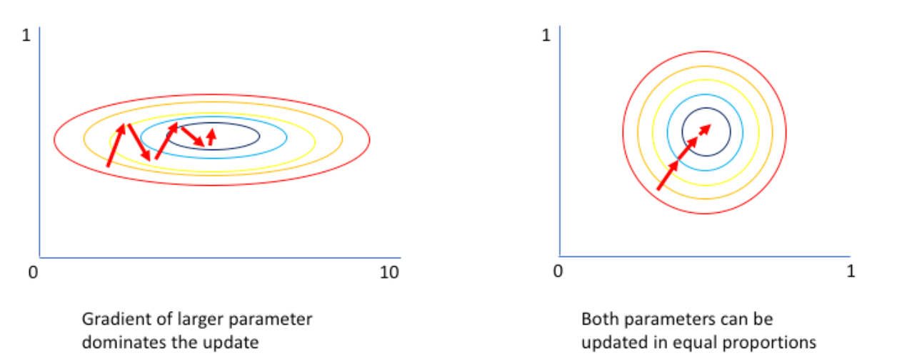
</p>

Normalization v.s. Regularization：

目标不同：
  
* Normalization=调整数据，比如: $X'=X-\frac{X_{\min}}{X_{\max}-X_{\min}}$
* Regularization=调整预测/损失函数，比如: $\text{loss}=\min\sum_{i=1}^N L(f(x_i), y_i)+\lambda R(\theta_f)$

大语言模型引入Normalization：

* 原始输入: vocab embedding
`tensor shape: <batch_size, sequence_length, hidden_dim>`
* 深度学习模型中间层表示(hidden states/representations)
`tensor shape: <batch_size, sequence_length, hidden_dim>`

对于embedding token，通常情况下batch_size和sequence_length都是不确定的，而**hidden_dim**一般确定，如`2048`或`4096`等，所以一般针对**每个token在hidden_dim维度上做标准化**，避免依赖batch/sequence。

### RMSNorm

当前流行的LayerNorm：[RMSNorm](https://arxiv.org/pdf/1910.07467)

torch 2.8，提供了RMSNorm类的实现[torch.nn.RMSNorm](https://pytorch.org/docs/stable/generated/torch.nn.RMSNorm.html#torch.nn.RMSNorm)

手搓RMSNorm：

$$ y_i = \frac{x_i}{\text{RMS}(x)}*\gamma_i $$

$$ \text{RMS}(x)=\sqrt{\frac{\sum_{i=1}^N x_i^2}{N}+\epsilon} $$

其中$\epsilon$为一个极小的非零量，保证分母不为0；$\gamma$为训练参数。

```python
import torch.nn as nn

input = torch.randn(2, 3, 4, requires_grad=True)
print(input)
print(input.mean(-1, keepdim=True)) # keepdim隐藏时默认置为False，表示不保留mean的维度
print(input.mean(-1, keepdim=True).shape)
print(input.mean(1))
print(input.mean(1).shape)
```

```python
# 手搓
variance_epsilon = 1e-6
input = input.to(torch.float32)
RMS = (input.pow(2).mean(-1, keepdim=True) + variance_epsilon).rsqrt()
RMSNorm = input * RMS
print(RMS.shape)
print(RMSNorm)
print(RMSNorm.shape)
# 使用pytorch自带的RMSNorm实现
layerNorm = nn.RMSNorm([4])
RMSNorm1 = layerNorm(input)
print(RMSNorm1)
print(torch.allclose(RMSNorm, RMSNorm1))
```

## Transformer

### Attention Mechanism

注意力机制为Transformer架构的核心，它决定了模型如何理解上下文。注意力机制本质上是一个“基于内容的寻址过程”，可以将它想象成数据库查询：

* Q(Query):当前的token，“我要找什么”
* K(Key):序列中所有token的标签(可以理解为字典中键值对的“键”)，“哪里有我想要的”
* V(Value):序列中所有token的内容(可以理解为字典中键值对的“值”)，“我想要的内容是什么”

打印一下LlaMA的Attention可以得到：

```python
(self_attn): LlamaAttention(
  (q_proj): Linear(in_features=2048, out_features=2048, bias=False)
  (k_proj): Linear(in_features=2048, out_features=512, bias=False)
  (v_proj): Linear(in_features=2048, out_features=512, bias=False)
  (o_proj): Linear(in_features=2048, out_features=2048, bias=False)
  (rotary_emb): LlamaRotaryEmbedding()
)
```

Attention内部结构：

4个Linear层：`q_proj`、`k_proj`、`v_proj`、`o_proj`，本质上几种不同的“投影”方式；

推理视角(Forward，Backward靠Autograd自动求导):
$$\text{head}=\text{Attention}(Q,K,V)=\text{softmax}(\frac{QK^T}{\sqrt{d_k}})V$$

给定由一段样本通过tokenizer得到的Input Embedding，共有batch_size段，每段的长度为seq_len，Embedding table中的维度为hidden_dim，记为$X$，其shape为：[batch_size, seq_len, hidden_size]。

前向传播得到$Q,K,V$（通过linear.module）：

* $Q=\text{q\_proj}(X)=XW_Q$，$W_Q$的shape: `[hidden_size, hidden_size]`
* $K=\text{k\_proj}(X)=XW_K$，$W_K$的shape: `[hidden_size, hidden_size]`
* $V=\text{v\_proj}(X)=XW_V$，$W_V$的shape: `[hidden_size, hidden_size]`

**Step1：得到$Q,K,V$**

设N = batch_size * seq_len, d = hidden_dim

<p align="center">
  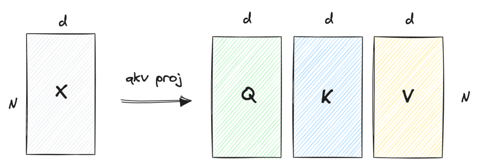
</p>

**Step2：计算$QK^T$**

$P=\text{mask}(\frac{QK^\top}{\sqrt{d_k}}+bias)$，本质上是计算查询和键的相关性（相似度矩阵），数值上越大表示两者在语义上的相关性越大。$\sqrt{d_K}$为缩放因子，防止内积过大。

<p align="center">
  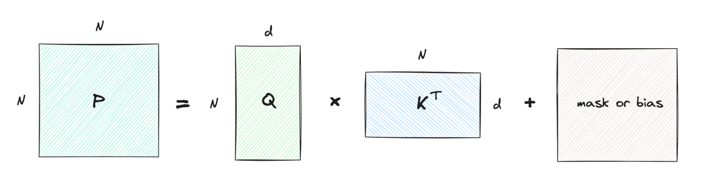
</p>

**Step3：计算$\text{Attention}$**

给定$P$，计算$A=\text{softmax}(P)$，相当于按照行进行归一化为概率分布。

`softmax`一般计算方式：
$$\text{softmax}(x)=\frac{e^x}{\sum{e^x}}$$

实际使用过程中一般会在指数上减去m(m=row_max)，防止指数爆炸，转为浮点数；diag用于将一维tensor转换成对角线上放置对应值、其他全0的方阵。

$$ l=\text{row\_sum}(S),S=\text{exp}(P-m),m=\text{row\_max}(P) $$
$$ \text{row-wise softmax}: A_i = \text{softmax}(P_i)=\text{diag}(l)^{-1}S $$

<p align="center">
  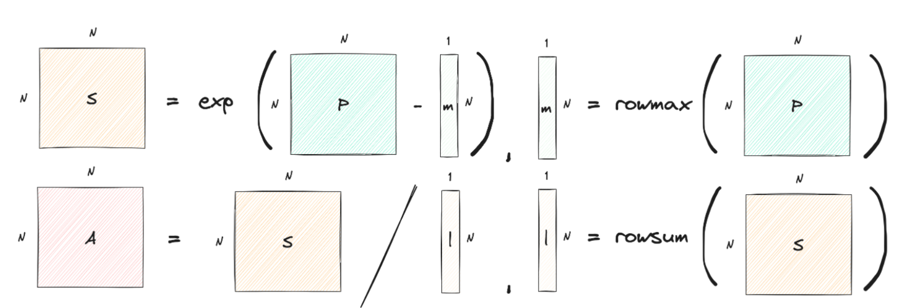
</p>

**Step4：计算输出$O$**

$O=AV$，根据概率加权聚合信息。

<p align="center">
  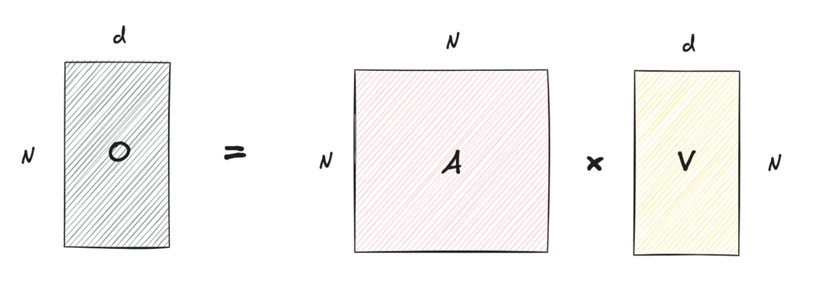
</p>

mask的作用：

* **padding mask**：在实际情况中由于每句话都长短不一，对每个seq的划分需要以最长seq为基准补全，补全的部分称为padding token(参考tokenizer部分的mask)。为了避免padding对attention的影响，在计算$P$时，我们可以将padding的部分设置为一个很大的数，如$-\infty$。

* **causal attention mask(因果mask)**：当前token只与历史token有关，与未来token无关，对于第i个token，需要屏蔽i+1及后续token对它的影响。

#### Attention的实现

```python
import torch
import torch.nn as nn
import torch.nn.functional as F
import math

torch.manual_seed(42)
torch.set_printoptions(precision=4, sci_mode=False)
print(f"PyTorch version: {torch.__version__}")
```

```python
# 从hidden_state得到QKV
batch_size, seq_len = 2, 4
num_heads = 4
head_dim = 8
hidden_size = num_heads * head_dim

hidden_states = torch.randn(batch_size, seq_len, hidden_size)

q_proj = nn.Linear(hidden_size, hidden_size, bias=False)
k_proj_full = nn.Linear(hidden_size, hidden_size, bias=False)
v_proj_full = nn.Linear(hidden_size, hidden_size, bias=False)
o_proj = nn.Linear(hidden_size, hidden_size, bias=False)

q = q_proj(hidden_states)
k = k_proj_full(hidden_states)
v = v_proj_full(hidden_states)

print(f"hidden_states shape: {hidden_states.shape}")
print(f"q shape: {q.shape}, k shape: {k.shape}, v shape: {v.shape}")
```

```python
# 只展示因果 mask（decoder 的自回归约束）
scale = 1.0 / math.sqrt(hidden_size)
scores = torch.matmul(q, k.transpose(-2, -1)) * scale
# 首先构建一个全1的方阵，然后使用triu函数将上三角部分全置为True，将该tensor作为mask
causal_mask = torch.triu(torch.ones(seq_len, seq_len, dtype=torch.bool), diagonal=1)
scores_masked = scores.masked_fill(causal_mask, float('-inf'))
# 使用pytorch的F函数
attn_weights = F.softmax(scores_masked, dim=-1)
context_single = torch.matmul(attn_weights, v)

print('scores shape:', scores.shape)
print('attention weights sums:', attn_weights.sum(dim=-1))
print('context_single shape:', context_single.shape)
print(causal_mask)
print(scores_masked)
```

```python
def stable_softmax(x: torch.Tensor) -> torch.Tensor:
    x_max = torch.nan_to_num(x.max(dim=-1, keepdim=True).values)
    x_exp = torch.exp(x - x_max)
    return x_exp / x_exp.sum(dim=-1, keepdim=True)

manual_weights = stable_softmax(scores_masked)
print('manual == torch.softmax?', torch.allclose(manual_weights, attn_weights, atol=1e-6))
```

#### 多头注意力

##### MHA(Multi-head Attention)

在单头注意力中，计算$QK^T$会将所有信息压缩成唯一的一组注意力分数。而在实际情况中，在实践中，当给定相同的查询、键和值的集合时，希望模型可以基于相同的注意力机制学习到**不同的行为**，然后将不同的行为作为知识组合起来，捕获序列内各种范围的依赖关系（例如，**短距离依赖和长距离依赖关系**）。因此，允许注意力机制组合使用查询、键和值的不同子空间表示（representation subspaces）可能是有益的。

给定$Q,K,V$ (形状是`[bs, seq, hs]`)，简化为$N\times d$，分解：

* $Q=[Q_1,Q_2,...,Q_h]$
* $K=[K_1,K_2,...,K_h]$
* $V=[V_1,V_2,...,V_h]$

形状的变换(`tensor.view`实现):`[N, d] -> [N, num_heads, head_dim]`，其中, `d = hidden_size = num_heads * head_dim`。

在实际实现中，需要额外**进行2、3两个维度的交换**，即`[bs, seq, hs]` -> `[bs, seq, nh, hd]`, 再`transpose()`为`[bs, nh, seq, hd]`。这是因为注意力是在**不同序列位置**即`seq_len`之间关联计算，而不是在不同的头之间做关联。

在线性代数库（NumPy、PyTorch）中，`@`运算符默认**对张量的最后两个维度**进行二维矩阵相乘，而将前面的所有维度视为独立的 Batch（批处理）维度。我们需要计算的注意力得分矩阵本质是：每个序列位置对其他所有序列位置的权重，其维度必须是 $(seq\_len, seq\_len)$。

手撕MHA代码实现：

```python
# 手撕多头注意力
import torch
import torch.nn as nn
import torch.nn.functional as F # 用于计算softmax
import math

# 定义MHA类
class MultiHeadAttention(nn.Module):
    # 初始化变量：d_model为模型维度（q、k、v维度）；num_heads为头数
    def __init__(self, d_model, num_heads):
        # 父类声明
        super().__init__()
        # 注意保证维度可以整除头数
        assert d_model % num_heads == 0
        # 定义关键变量
        self.d_model = d_model
        self.num_heads = num_heads
        self.head_dim = d_model // num_heads # 每个头的维度H
        # 初始化四个线性层，分别用于q、k、v和输出
        self.w_q = nn.Linear(d_model, d_model, bias=False)
        self.w_k = nn.Linear(d_model, d_model, bias=False)
        self.w_v = nn.Linear(d_model, d_model, bias=False)
        self.w_o = nn.Linear(d_model, d_model, bias=False)

    def forward(self, x, mask=None):
        # 拿到输入的batch_size和seq_len
        batch_size, seq_len, _ = x.shape
        # 1. 线性变换与多头拆分，维度变化为:[batch_size, seq_len, d_model] -> [batch_size, seq_len, num_heads, head_dim] -> [batch_size, num_heads, seq_len, head_dim]
        q = self.w_q(x).view(batch_size, seq_len, self.num_heads, self.head_dim).transpose(1, 2)
        k = self.w_k(x).view(batch_size, seq_len, self.num_heads, self.head_dim).transpose(1, 2)
        v = self.w_v(x).view(batch_size, seq_len, self.num_heads, self.head_dim).transpose(1, 2)

        # 2.计算注意力分数，矩阵点积，q：[b, nh, l, hd] k^T:[b, nh, hd, l] -> attn_scores:[b, nh, l, l]
        attn_scores = torch.matmul(q, k.transpose(-2, -1)) / math.sqrt(self.head_dim)

        # 3.是否加mask
        if mask is not None:
            attn_scores = attn_scores.masked_fill(mask == 0, -1e9) # 将0替换为极小值，softmax之后为0

        # 4.softmax，attn_prob:[b, nh, l, l]
        attn_prob = F.softmax(attn_scores, dim = -1)

        # 5.加权求和,output:[b, nh, l, hd]
        output = torch.matmul(attn_scores, v)

        # 6.多头合并,[b, nh, l, hd] -> [b, l, nh, hd] -> [b, l, d]
        output = output.transpose(1,2).contiguous().view(batch_size, seq_len, self.d_model)

        return self.w_o(output)

def generate_causal_mask(seq_len):
    mask = torch.tril(torch.ones(seq_len, seq_len))
    return mask

d_model = 128
num_heads = 8
mha = MultiHeadAttention(d_model, num_heads)
x = torch.randn(2, 5, 128)
mask = generate_causal_mask(5)
print(mask)
# 前向传播
output = mha(x, mask=mask)
# 打印维度
print(x.shape)
print(output.shape)
print(mask.shape)
print(output)
```

##### MQA(Multi-query Attention)

多个Query对应单个Key/Value，但会出现性能上的问题，即获取不到多角度的特征表示，导致模型表达能力下降。为了解决这个问题，提出了GQA。

##### GQA(Grouped-query Attention)

介于MQA和MHA之间的一种折中方案，提出GQA(Grouped-query Attention)，即将多个query头分组，每组共享一套key/value头，num_key_value_heads=g。

* **推理显存**：每个token的KV缓存从$h\times d_k$降为$g\times d_k$，长上下文推理显存压力显著降低
* **吞吐表现**：减少`k_proj`/`v_proj`的矩阵乘与显存访问，提升批量推理吞吐
* **模型实践**：Llama-2/3、Gemma、Mistral等开源模型默认启用GQA (`num_key_value_heads=g`)
* **表达能力**：合理选择$g$（常见$g=h/2$或$h/4$）可兼顾速度与精度，分组过大可能削弱头部多样性

##### MLA(Mutli-head Latent Attention)

MLA 是 DeepSeek 提出的进一步压缩方案：不共享头，而是把 K/V 投影到一个低维潜向量再缓存，推理时只缓存潜向量，压缩率高于 GQA。

MLA在结构上类似MHA，但没有使用MHA的全量存储，而是采用了**低秩联合压缩技术**（Low-Rank Joint Compression）。

**KV的低秩压缩与潜空间缓存（Latent Cache）：**

传统注意力计算方式将输入投影到高维度的多头$K$和$V$并存入显存，而MLA将输入通过下投影矩阵，压缩到一个**低维度的潜在向量（Latent Vector）** $c_t^{KV}$（压缩维度远小于多头总维度）。在 KV Cache 里，只存这个低维潜向量 $c_t^{KV}$。实际存储量比 MHA 降低约 90% 以上，甚至比 8 组的 GQA 还要小得多。

**推理阶段的矩阵吸收（Matrix Absorption）：**

一个很容易想到的问题是，虽然缓存了低秩的矩阵，但是在最后计算注意力时还是需要还原。Deepseek利用矩阵乘法的结合律化解了这一问题：
$$\text{Score} = Q \cdot K^T = Q \cdot (c^{KV} W_K)^T = (Q \cdot W_K^T) \cdot (c^{KV})^T$$

即在推理自回归计算时，$W_K^T$ 可以直接与 Query 结合（即**提前投影 Query到低维度**），让 Query 直接与显存中的低维压缩向量 $c^{KV}$ 相乘。这意味着在推理时，甚至完全**不需要将 KV 解压还原**回多头形式，既省了显存，又没有增加访存负担。

**解耦RoPE：**

传统位置编码（RoPE）直接乘在 $K$ 向量上，因为旋转矩阵的存在，破坏了低秩矩阵的线性结合律（无法直接被 Query 矩阵吸收）DeepSeek 的解决方法是：把 $Q$ 和 $K$ 拆分成两部分：

* 内容部分（Content）：走低秩压缩路径，负责语义匹配，享受极致压缩与矩阵吸收。
* 位置部分（Position）：走轻量级无压缩通道，单独施加 RoPE 旋转位置编码。

计算注意力时，将“内容内积”与“位置内积”直接相加，完美兼顾了 RoPE 位置感知与低秩压缩。

<p align="center">
  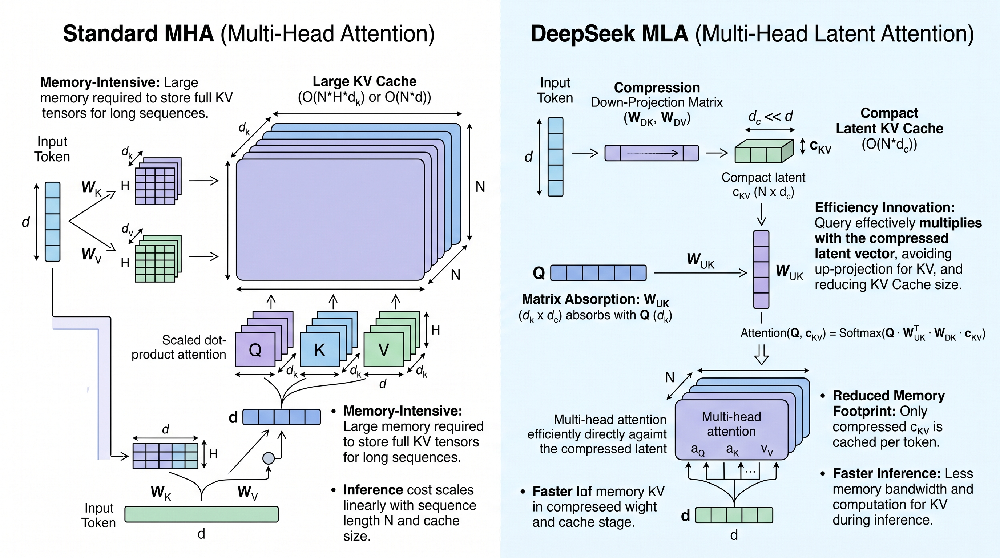
</p>

直观展示集中多头注意力机制的区别：

<p align="center">
  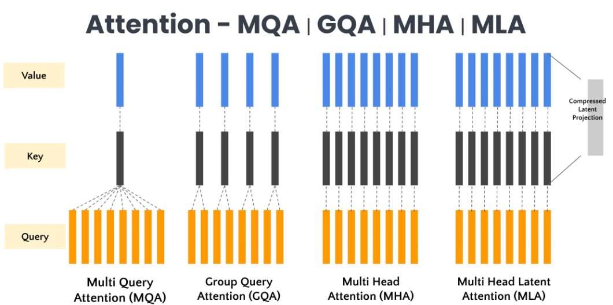
</p>

|特性/维度|MHA|GQA|MQA|MLA|
|---|---|---|---|---|
|**KV Cache 显存占用**|100% (极高)|~12.5% - 25% (中等)|~1% - 3% (极低)|~5% - 10% (极低)|
|**模型表达能力**|基准上限 (高)|接近 MHA|显著受损|甚至略超或持平 MHA|
|**头间特征独立性**|完全独立|组内强行共享|全局强行共享|通过解压保持独立|

#### Attention变体

针对Attention提出的优化技术有很多。除多头注意力外，本小节提供一个概览，公式推导与实现细节统一放在[推理笔记的 Attention 优化](../Inference/notes.md#attention优化)。

| 类别 | 代表变体 | 一句话本质 | 何时用 |
|------|---------|-----------|--------|
| 参数共享 | MHA / MQA / GQA / MLA | 多个 query 头如何共享同一组 K/V | 训练前决定，直接决定 KV Cache 大小 |
| IO 优化 | BlockedAttention / FlashAttention | 把 Q/K/V 留在片上存储，减少 HBM 往返 | 训练与推理提速，不改变数学结果 |
| 稀疏化 | Sparse Attention | 并非每个 token 都需要关注全部历史 | 长上下文，可接受一定近似 |
| 复杂度降阶 | Linear / Gated Attention | 借助结合律把 $O(N^2)$ 降到 $O(N)$ | 超长序列，通常需要重训 |
| 显存管理 | PagedAttention | KV Cache 分页存储，按需分配与跨请求共享 | 高并发在线服务 |

##### 参数共享：MHA / MQA / GQA / MLA

见上一节的[多头注意力](#多头注意力)。核心是用更少的 K/V 头服务同样多的 Q 头，以少量表达能力换取 KV Cache 的成倍下降。

##### IO 优化：BlockedAttention / FlashAttention

标准的 $O=\text{softmax}(\frac{QK^T}{\sqrt{d_k}})V$ 需要多次往返 HBM。这类方法把矩阵分块（Tiling）后尽量在 SRAM 上完成计算，**不改变数学结果**，只改变访存模式。

BlockedAttention 解决「分块后 softmax 不能各块独立归一化」的问题：必须维护全局的行最大值 $m_i$ 与行和 $l_i$，这正是 FlashAttention 的基础。

详见 [FlashAttention 与 BlockedAttention 详解](../Inference/notes.md#flashattention)。

##### 稀疏化：Sparse Attention

只让 token 关注部分历史（滑窗、attention sinks、动态选择关键 page），把复杂度降到 $O(N\log N)$ 甚至 $O(N)$。属于**近似**方法，精度会下降，适合长上下文场景。

详见 [Sparse Attention 详解](../Inference/notes.md#sparse-attention)。

##### 复杂度降阶：Linear / Gated Attention

利用矩阵乘法结合律改换计算顺序：先算 $K^TV$ 得到 $d\times d$ 的小矩阵，再乘 $Q$，复杂度从 $O(N^2)$ 变为 $O(Nd^2)$。Gated Attention 在此之上引入门控（遗忘门），让模型能丢弃无用历史。属于**架构改动**，通常需要重训。

详见 [Linear Attention 详解](../Inference/notes.md#linear-attention) 与 [Gated Attention 详解](../Inference/notes.md#gated-attention)。

##### 显存管理：PagedAttention

不改变 attention 的计算方式，而是把 KV Cache 切成固定大小的块，用类似操作系统页表的结构管理，消除预留浪费并支持跨请求共享。

详见 [Paged Attention 详解](../Inference/notes.md#paged-attention)。

### MLP

<p align="center">
  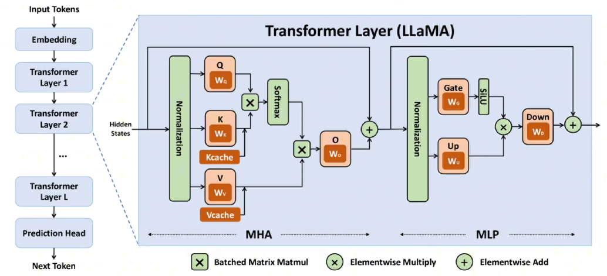
</p>

在Transformer的多层感知机(MLP, Mulilayer Perceptron)部分，除了 Self-Attention 负责“混合”不同 token 之间的信息外，还有一个独立处理每个 token 的前馈神经网络(FFN, Feed Forward Network)。

如果说 Self-Attention 是让词与词之间“对话”（建立上下文联系），那么 FFN 就是让每个词“反思”和“加工”自己。

* 知识存储与记忆：

研究表明，FFN 的参数矩阵中存储了大量的具体知识（例如“法国的首都是巴黎”这种事实性知识可能就编码在 FFN 的权重里）。

* 增加非线性/复杂性：

没有激活函数的神经网络堆叠再多层也等价于一层线性变换。FFN 中的激活函数赋予了模型拟合复杂抽象概念的能力。

* 维度变换与特征提取：

FFN 通常会将隐层维度放大（例如 LLaMA 中从 4096 放大到 11008 再变回 4096），在这个高维空间中，模型可以更细致地解耦和处理特征。

#### FFN实现

LlamaMLP：

```python
(mlp): LlamaMLP(
  (gate_proj): Linear(in_features=2048, out_features=8192, bias=False)
  (up_proj): Linear(in_features=2048, out_features=8192, bias=False)
  (down_proj): Linear(in_features=8192, out_features=2048, bias=False)
  (act_fn): SiLU()
)
```

组件：三个nn.Linear层（gate、up、down），一个SiLU激活函数

* SiLU: torch.nn.functional.silu(x)
* Linear: torch.nn.Linear(in_features, out_features)

输入$x$同时进入 gate 和 up，gate 的输出经过激活函数 (SiLU) 后与 up 的输出相乘，结果再通过 down 映射回原来的维度。

#### FFN流程

* 输入tensor: <batch_size, sequence_length, hidden_dim>
* 第一步：
  * 通过gate_proj获得gate tensor'，经过SiLU激活得到gate tensor
  * 通过up_proj获得up tensor
* 第二步：元素乘(elementwise multiply): gate tensor 和 up tensor
* 第三步: 通过down_proj获得down tensor

#### 激活函数

激活函数的核心作用是引入非线性。如果没有激活函数，无论神经网络由多少层线性变换（矩阵乘法）堆叠而成，它最终都等价于单层的线性变换，无法学习复杂的模式。

##### 1. Sigmoid (S型函数)

这是最早期的激活函数之一，来自于统计学中的逻辑回归。

* **公式**: $\sigma(x) = \frac{1}{1 + e^{-x}}$
* **图像**: 将所有输入压缩到 $(0, 1)$ 区间，呈“S”形。
* **特点**:
  * **输出范围**: $(0, 1)$。这使得它很适合做概率预测（二分类）。
  * **平滑性**: 处处可导。
* **缺点 (为什么现在的大模型很难见到它作为隐层激活函数)**:
  * **梯度消失 (Gradient Vanishing)**: 当输入非常大或非常小时（饱和区），导数趋近于 0。在深层网络的反向传播中，连乘的梯度会迅速变为 0，导致网络无法训练。
  * **非零中心 (Not Zero-centered)**: 输出恒为正，这会导致反向传播时权重的更新方向出现锯齿状震荡，收敛变慢。
  * **计算昂贵**: 指数运算 $e^{-x}$ 在计算机中相对耗时。

##### 2. ReLU (Rectified Linear Unit, 线性整流单元)

为了解决 Sigmoid 的梯度消失问题，ReLU 应运而生，并成为了深度学习爆发时期的标配。

* **公式**: $f(x) = \max(0, x)$
* **图像**: $x < 0$ 时为平线，$x \ge 0$ 时为斜率为 1 的直线。
* **特点**:
  * **计算极快**: 只需要判断是否大于 0，没有复杂的数学运算。
  * **解决梯度消失**: 在正区间（$x>0$）导数恒为 1，梯度可以无损地传回前面的层，非常适合深层网络。
  * **稀疏性**: 负区间的神经元输出为 0，这让网络具有一定的稀疏激活性，模拟了生物神经元的特性。
* **缺点**:
  * **Dead ReLU (神经元死亡)**: 如果某个神经元在训练中陷入负区间，其梯度永远为 0，这个神经元在后续训练中将永远不再被更新（“死掉了”）。

##### 3. SwiGLU (Swish-Gated Linear Unit)

这是目前主流 LLM（如 LLaMA、PaLM、DeepSeek 等）普遍采用的激活函数变体，它是 GLU（门控线性单元）和 Swish 激活函数的结合。

* **背景 - Swish**: $f(x) = x \cdot \sigma(\beta x)$。它具备“平滑”、“非单调”的特性（负区间有一个小凹坑），在深层模型中表现优于 ReLU。
* **背景 - GLU (门控制机制)**: 类似于 LSTM 的门控，它有两个线性变换，其中一个作为“门”控制另一个的信息流：$GLU(x) = (xW) \cdot \sigma(xV)$。
* **SwiGLU 公式**:
    $$ \text{SwiGLU}(x) = (xW) \cdot \text{Swish}(xV) $$
    或者简化理解为：$y = (x W_1) \cdot \text{SiLU}(x W_2)$ （即输入映射成两路，一路经过激活函数作为“门”，再点乘另一路）。
* **特点**:
  * **参数量增加**: 相比普通 FFN，它需要三个权重矩阵（Gate, Up, Down），而普通只用两个。虽然参数多了，但通常会减少维度来保持总计算量平衡。
  * **更强的表达能力**: 门控机制允许模型选择性地通过信息，学习能力更强。
  * **训练稳定性**: 结合了 ReLU 的易优化性和 Sigmoid/Swish 的平滑性（处处可导），在大多数 LLM 只有 Decoder 的架构中表现出更好的性能（Perplexity 更低）。

##### 总结对比表

| 特性 | Sigmoid | ReLU | SwiGLU |
| :--- | :--- | :--- | :--- |
| **主要应用时代** | 早期神经网络 / 概率输出层 | CNN / Transformer 早期 | 现代大模型 (LLaMA, PaLM等) |
| **梯度消失问题** | **严重** (两端饱和) | **解决** (正区间导数为1) | **解决** |
| **计算复杂度** | 高 (指数运算) | **极低** (比较运算) | 中等 (包含乘法和Sigmoid) |
| **参数量需求** | 标准 | 标准 | **更高** (通常多一个权重矩阵) |
| **核心优势** | 输出有概率解释 | 简单、高效、稀疏性 | **性能最好**，收敛更快，精度更高 |

### 残差连接 (Residual Connection)

在Transformer的每个Decoder block中（即在Self-Attention和FFN之后），都会使用残差连接（Residual Connection, 也就是Skip Connection），配合Normalization层使用，通常结构为 `LayerNorm(x + SubLayer(x))`（Post-Norm）或者 `x + SubLayer(LayerNorm(x))`（Pre-Norm，如LlaMA）。

其数学表达式为：
$$ x_{\text{out}} = \text{SubLayer}(x) + x$$

这样做的好处主要体现在以下几个方面：

1. **解决梯度消失问题 (Gradient Vanishing)**：

在反向传播过程中，梯度通过加法运算可以直接传递（加法的导数是1）。这相当于为梯度提供了一条“高速公路”，使得梯度可以无损地流向更浅层的网络。对于像LLM这样动辄几十上百层的深层网络，这是模型能够成功训练的关键。

1. **缓解网络退化 (Degradation Problem)**：

理论上，深层网络的表现不应低于浅层网络（至少可以是恒等映射）。但在残差结构提出之前，简单堆叠层数往往导致训练误差变大。引入残差后，模型只需要学习输入与目标输出之间的“差值”（Residual）。如果某一层不需要做任何处理，模型只需将权重置为0，即可实现恒等映射（Identity Mapping, 输出=输入）。这大大降低了学习难度。

1. **信息保留与特征集成**：

在NLP任务中，Token的初始Embedding包含了重要的语义信息。残差连接保证了原始信息不会随着层数的加深而丢失，每一层实际上是在对原始特征进行“修补”或“增量更新”，而不是完全重写。

## MoE

MoE(Mixture of Experts)，即混合专家。随着大模型参数规模的不断膨胀，如何在有限的算力预算下进一步提升模型智能，成为了学术界和工业界共同面临的挑战。 混合专家模型 (Mixture of Experts, MoE) 应运而生，它打破了传统 Dense 模型“参数量等于计算量”的魔咒，允许模型在拥有万亿级参数的同时，仅激活其中极少部分参与计算。MoE 是一种基于条件计算 (Conditional Computation) 的神经网络架构。它的核心思想是将大模型中庞大的全连接层（FFN/MLP）拆分成多个较小的“专家”网络（Experts），对于每一个输入 token，并不激活所有的专家，而是通过一个“门控网络”（Gating Network / Router）选择一小部分最相关的专家来处理。

### MoE中的稀疏

所谓dense模型与sparse模型，从模型训练参数量和实际使用参数量方面考虑，对于MoE模型来说，虽然整体参数量巨大（通常达到数百亿甚至上千亿级别），但在每次前向传播过程中，仅有极少数的专家被激活参与计算（例如每个token只激活top-k个专家）。这种“稀疏激活”机制使得MoE模型在保持超大参数规模的同时，实际计算量和内存占用却与传统的dense模型相当，从而实现了“以小博大”的效果。

### MoE结构示例

<p align="center">
  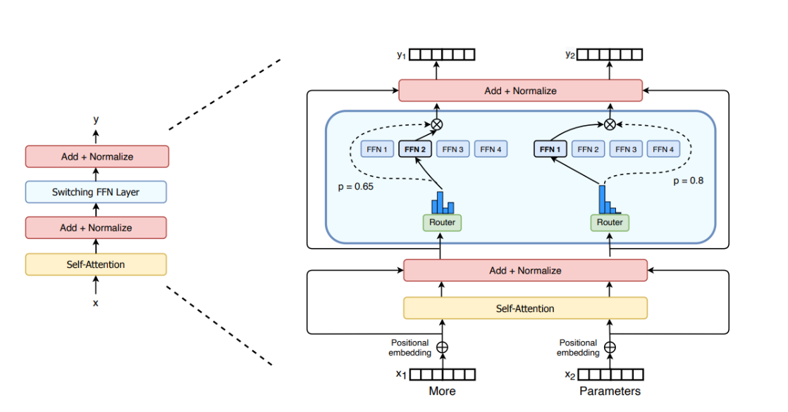
</p>

Swtich Transformers中将FFN替换为了MoE结构。

在 Transformer 架构中，MoE 通常用来替换标准的 **FFN (Feed-Forward Network)** 层。

1. **专家层 (Experts)**：由一组独立的简单前馈神经网络（MLP）组成（例如 $E_1, E_2, ..., E_n$）。
2. **门控网络 (Gating Network / Router)**：一个可训练的线性层+Softmax，用于计算每个专家对当前 token 的匹配权重。
3. **稀疏激活 (Sparse Gating/Top-k)**：
    * 输入 $x$ 进入 Router，计算所有专家的分数。
    * **Top-k**：只选取分数最高的 $k$ 个专家（通常 $k=1$ 或 $2$），其余专家的输出置为 0（不进行计算）。
    * **输出聚合**：将选中的专家输出按 Router 的权重进行加权求和。
$$ y = \sum_{i \in TopK} G(x)_i \cdot E_i(x) $$

### 负载均衡(Load Balancing)

在 MoE 模型中，由于每个 token 只激活部分专家，容易导致某些专家被频繁选中，而其他专家则很少被使用，造成“专家过载”或“专家闲置”的问题。为了缓解这一问题，通常会在训练过程中引入负载均衡（Load Balancing）机制，鼓励模型均匀地利用所有专家，从而提升整体性能和泛化能力。

通常会引入辅助损失函数（Auxiliary Loss）来强制让分配尽量均匀。DeepSeek-V3 通过共享专家与容量约束(capacity factor)等机制控制路由均衡，因此并未额外引入Switch Transformer式的auxiliary loss。

### 共享专家(Shared Experts)

在一些 MoE 变体中，不同层或不同模块之间会共享同一组专家网络（Experts），以减少模型的总参数量，同时保持模型的表达能力。这种“共享专家”机制使得模型能够在不同的上下文中复用相同的专家，从而提升参数利用率和训练效率。如DeepSeek-V3 (670B A37B)的expects总数为256+1，top-k数量为8+1，Qwen3-235B-A22B则分别为128与8。

### MoE的代码实现结构示意

```python
import torch
import torch.nn.functional as F

def moe_forward(x, gate_weight, experts, k=2):
    # x: [batch_size, seq_len, hidden_dim]

    # 1. 计算路由得分 (Logits)
    router_logits = torch.matmul(x, gate_weight) # [batch, seq, num_experts]

    # 2. Top-K 选择
    # routing_weights: 选中的专家的原始分数 (或经过 softmax 后的概率)
    # selected_experts: 选中的专家索引
    routing_weights, selected_experts = torch.topk(router_logits, k, dim=-1)

    # 3. 归一化 (通常在 TopK 之后做 Softmax)
    routing_weights = F.softmax(routing_weights, dim=-1)

    # 4. 专家计算 (这里简化了并行计算的复杂性)
    # 实际工程中会使用 Permutation 或 Scatter/Gather 操作
    final_output = torch.zeros_like(x)
    for i in range(k):
        expert_idx = selected_experts[:, :, i]
        weight = routing_weights[:, :, i].unsqueeze(-1)

        # 伪代码：取出对应专家计算并加权
        # expert_out = run_expert(experts, expert_idx, x)
        # final_output += weight * expert_out

    return final_output
```
