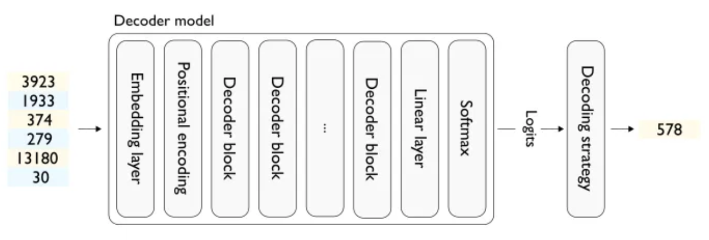
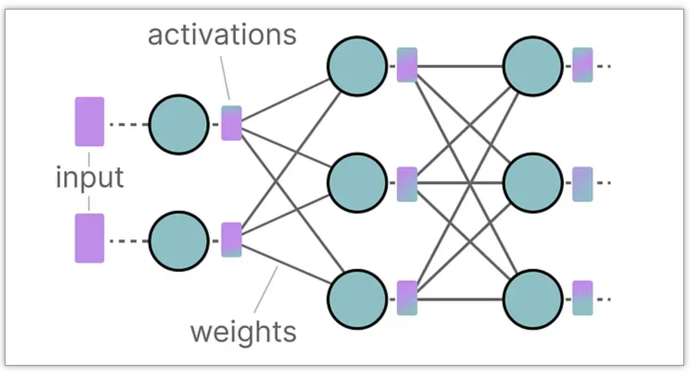
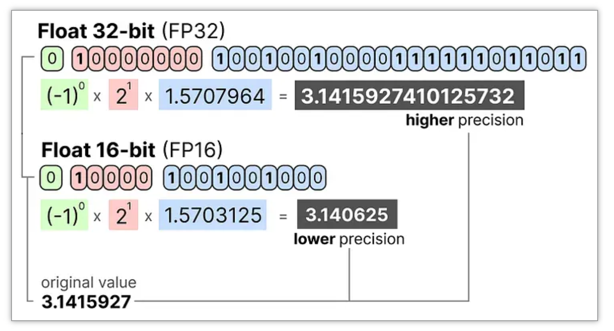
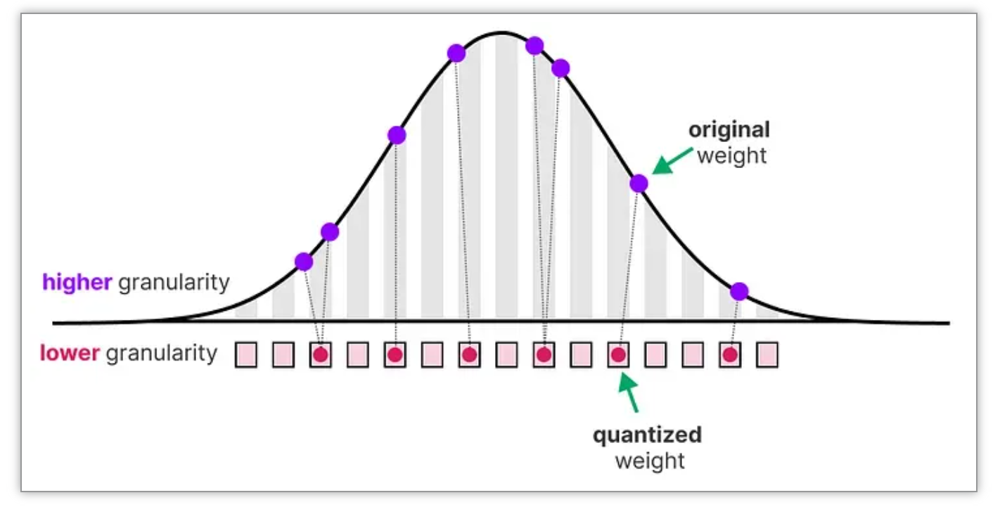
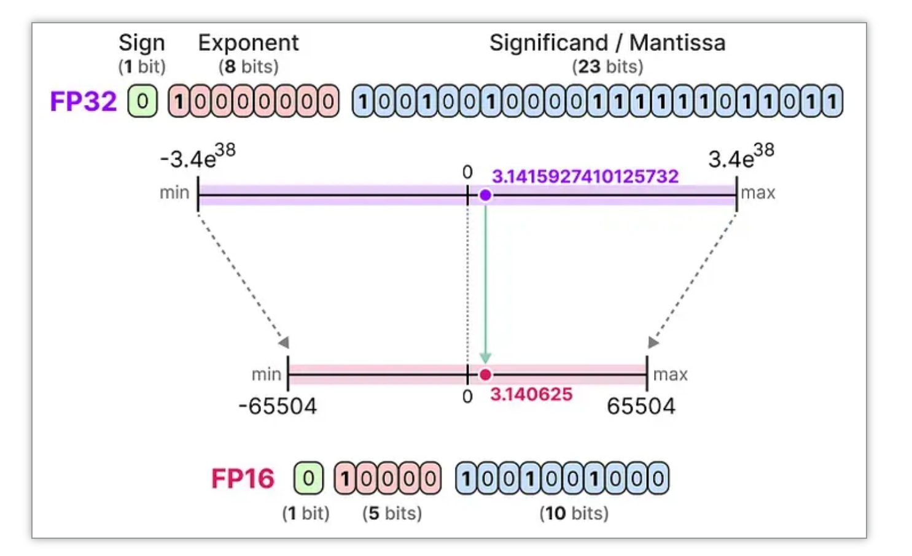
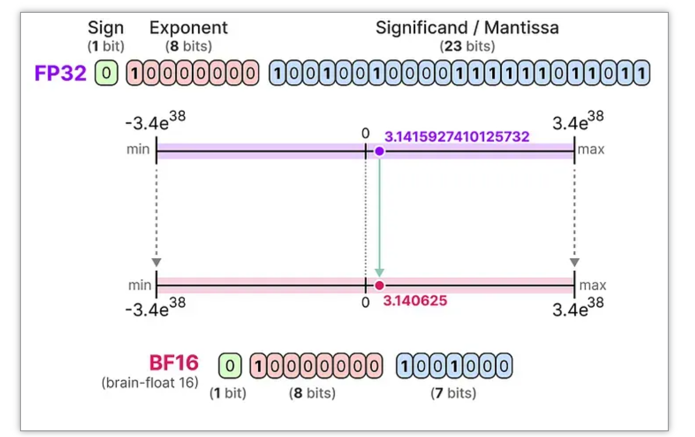
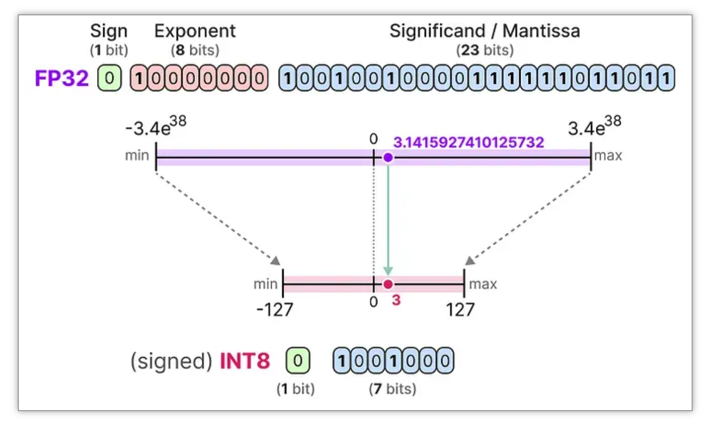
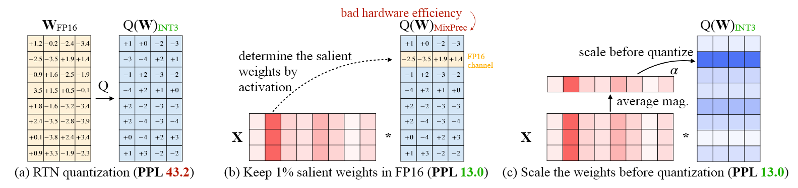
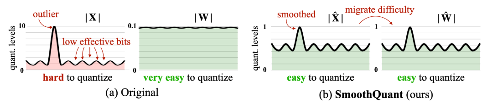

# 大语言模型推理

在经过训练过后的大模型中，所有的权重矩阵、LayerNorm参数、Embedding表等都已经确定下来，模型可以根据输入的文本进行推理(inference)，即根据输入的文本生成相应的输出文本。

<p align="center">
  
</p>

模型推理到最后输出的是logits（通过softmax得到token的概率分布），要得到token，还需通过decoding strategy（解码策略）将logits转换为token id，再通过tokenizer转换为文本。

## LLM的解码(Decoding)

### 不同的解码策略

常见的解码策略如下：

- 贪心解码(Greedy Decoding)：每次直接选择概率最高的token，简单高效，但并非全局最优，相当于Top-k中的k=1。
- 采样(Sampling)：按一定的采样策略选择一个单词，增加生成过程的多样性，但可能会导致生成的文本不连贯。
- Beam Search：通过维护一个长度为k的候选序列集，每一步(单token推理)从每个候选序列的概率分布中选择概率最高的k个token，再考虑序列概率，保留最高的k个候选序列（避免随推理过程增加所关注序列的数量呈指数级增长）。
- top-p采样：核心思路是给定token分布$P(x_i\mid x_{1:i-1})$，top-p集合$V^{(p)}\subset V$，使得$\sum_{x\in V^{(p)}}P(x\mid x_{1:i-1})\geq p$，从$V^{(p)}$中采样。和top-k很像，区别在于在何处对分布进行截断（top-k可以理解为固定截断点，top-p是动态截断点）。

### Temperature

logits本质是未归一化的偏好；模型常常过度自信→输出缺少多样性；只靠top-k/top-p截断无法改变分布“尖锐程度”，难以在“稳定 vs 创造力”之间细调。

Temperature提供一个连续控制杆：既可降低幻觉/重复，也可放开想象力（创造vs稳定，类似基于高斯过程的贝叶斯优化中的exploration和exploitation的区别），因此在实践中常把temperature视为“首个要调”的超参数。

配合beam采样和top-p使用，调整temperature值来控制采样的随机性。

数学形式：

$$\tilde{p}_i = \text{softmax}(z_i / T),T>0$$

  * $T<1$：放大logits差异，分布更“尖锐”，输出更确定
  * $T>1$：压平logits，概率更平均，输出更随机
* 实践经验
  * 0.1-0.5：摘要/QA等需要确定性的任务
  * 0.7-1.3：创作/头脑风暴
  * $T\rightarrow 0$: 接近贪婪解码；$T\rightarrow \infty$: 接近均匀采样

### Penalty

纯靠temperature/top-k/top-p仍可能出现短循环、口头禅、提示词泄露等模式崩溃。由于不同任务对“重复”和“长度”容忍度不同，需要有针对性的约束手段。Penalty机制通过修改logits或得分，打破模型对高频token的偏好，提升可控性有的为“软惩罚”(repetition/presence)，有的为“硬约束”(no_repeat_ngram)，可组合使用。

#### 常见Penalty机制

* repetition penalty (HF实现):对生成过的token乘以$\frac{1}{\text{penalty}}$或$\text{penalty}$，惩罚重复；>1.0时抑制循环
* presence / frequency penalty (OpenAI)
  * presence：是否出现过→每次出现扣常数
  * frequency：出现次数越多扣得越多→抑制关键词刷屏
* length penalty (Beam Search)
  * 调整对长序列的偏好，$\text{score}/((5+|y|)^\alpha / (5+1)^\alpha)$

## LLM的推理(Inference)

一次大模型推理通常可以分为两个部分：Prefill和Decode。

**第一阶段：Prefill Phase**

当用户向大模型发送一段 Prompt时，模型首先需要“阅读”并理解这段完整的输入。这一步称为 Prefill Phase（预填充阶段）。在这个阶段，模型会将整个 Prompt 作为输入，一次性处理完毕，生成对应的隐藏状态（hidden states）和注意力缓存（Key/Value caches）。

在NTP过程中，模型需要不断地处理和存储历史上下文信息（Key/Value缓存），以便在生成下一个token时参考之前的内容。随着生成的token数量增加，Key/Value缓存的大小也会线性增长，导致显存占用和计算开销显著增加。而通过Prefill Phase，模型可以一次性处理完整的Prompt，提前计算并存储必要的上下文信息，从而在后续的token生成过程中减少重复计算，提高推理效率。

**第二阶段：Decoding Phase**

当第一个"下一个token"生成完毕后，LLM开始"自回归推理"生成。

第二个"下一个token"：输入x的shape: $(b,s+1,h)$，计算开销$O((s+1)^2)$

第三个"下一个token"：输入x的shape: $(b,s+2,h)$，计算开销$O((s+2)^2)$

第n个"下一个token"：输入x的shape: $(b,s+n-1,h)$，计算开销$O((s+n-1)^2)$

时间复杂为$O(n^2)$。

### 两阶段分析

Prefill阶段 与 Decode阶段 具有截然不同的计算与访存特性，它们对硬件存储介质（主要是GPU显存）的读写交互方式也完全不同。Prefill阶段并行处理整个输入提示词，属于计算密集型（Compute-Bound）任务，对存储主要执行“一次性批量写入KV Cache”；Decode阶段自回归逐个生成Token，属于访存密集型（Memory-Bound）任务，对存储持续执行“频繁读取历史KV Cache并追加写入少量新KV”的操作。

#### Prefill 阶段的特点与存储交互

特点：

- 并行处理：用户输入的整段Prompt（所有Token）在这一阶段同时输入模型。
- 计算密集：算力（Tensor Core）能被高度打满，计算复杂度随输入长度呈平方级（\(O(N^2)\)）上升。
- 核心指标：决定了 TTFT（Time to First Token，首字延迟）。

与存储介质的交互方式是大批量连续写入（Write-heavy / High Throughput Write），模型在计算每一层的注意力（Attention）时，把输入序列中所有Token对应的 Key (K) 和 Value (V) 矩阵 计算出来，一次性高并发地写入 到显存的 KV Cache 区域中。这种交互对显存带宽的压力相对平缓，更多依赖核心计算能力。

#### Decode 阶段的特点与存储交互

特点：

- 自回归逐个生成：模型基于已有上下文，一步步环形迭代，每次只吐出一个新Token。
- 访存密集：由于每次计算只处理1个新Token，运算量极小，算力单元大部分时间在“等数据”，瓶颈卡在 显存带宽（Memory Bandwidth） 上。
- 核心指标：决定了 TPOT（Time Per Output Token，每字生成速度/流畅度）。

与存储介质的交互方式是高频次、零散的读取与追加写入（Read-heavy & Append Write）：**读**时，每生成一个新Token，计算单元需要把显存中所有历史Token的KV Cache全部重新读入处理器中，与当前新Token的Query进行矩阵乘法。**写**时，当前新Token计算完成后，自身产生的最新KV数据会被追加写入显存的KV Cache末尾。

这种模式导致显存带宽被大量占用（每次都要搬运全部历史缓存），如果显存带宽不够，生成速度就会明显变慢。

## KV Cache

考虑一次LLM推理过程中的计算开销，先进行一下符号的规定：

* b: batch size
* s: sequence length
* h: hidden size/dimension
* nh: number of heads
* hd: head dimension

给定矩阵$A\in R^{m\times n}$和矩阵$B\in R^{n\times p}$，计算$AB$中的一个元素需要$n$次乘法操作和$n$次加法操作，一共有$mp$个元素，总计算开销为$2mnp$ 。

**Self-attn模块：**

第一步计算: $Q=xW_q$, $K=xW_k$, $V=xW_v$

  * 输入x的shape: $(b,s,h)$，weight的shape: $(h,h)$
  * Shape视角下的计算过程: $(b,s,h)(h,h)\rightarrow(b,s,h)$
  * 如果在此进行多头拆分(reshape/view/einops)，shape变为$(b,s,nh,hd)$，其中$h=bh*hd$
  * 计算开销: $3\times 2bsh^2\rightarrow 6bsh^2$

第二步计算: $O=\text{softmax}(\frac{QK^T}{\sqrt{h}})V$

  * $QK^T$计算: $(b,nh,s,hd)(b,nh,hd,s)\rightarrow (b,nh,s,s)$
  * 计算开销: $2b*nh*s^2*hd=2bs^2h$ (为理解方便，暂且忽略softmax的计算开销)
  * $\text{softmax}(\frac{QK^T}{\sqrt{h}})V$计算: $(b,nh,s,s)(b,bh,s,hd)\rightarrow(b,nh,s,hd)$
  * 计算开销: $2bs^2h$
  * 总计算开销: $4bs^2h$

第三步计算：$x_{\text{out}}= O W_o + x$

  * $O$的shape为$(b,s,h)$，$W_o$的shape为$(h,h)$，计算过程为$(b,s,h)(h,h)\rightarrow(b,s,h)$
  * 计算开销: $2bsh^2$

Self-attn模块总计算开销: $8bsh^2+4bs^2h$。

**MLP模块：**

$x=f_\text{activation}(x_{\text{out}}W_{\text{up}})W_{\text{down}}+x_{\text{out}}$
第一步计算，假设上采样到4倍
  * Shape变化:$(b,s,h)(h,4h)\rightarrow(b,s,4h)$
  * 计算开销: $8bsh^2$

第二步计算，假设下采样回1倍
  * Shape变化:$(b,s,4h)(4h,h)\rightarrow(b,s,h)$
  * 计算开销: $8bsh^2$

MLP模块总计算开销: $16bsh^2$

Decoder layer一次推理的总开销：$24bsh^2+4bs^2h$，为$s$的平方级别（$b\ll s$，且h在模型确定后为固定值）。

视频的直观展示：

without KV Cache:

<video src="../resources/without-KV-Cache.mp4" controls="controls" width="100%" height="auto">
</video>

with KV Cache:

<video src="../resources/KV-Cache.mp4" controls="controls" width="100%" height="auto">

</video>

所以，真正自回归计算的部分是$(b,s+1,h)$中的第二个维度$\text{index}_{s+1}$的部分，复用的是用于计算$(b,s+1,h)$中第二维度$\text{index}_{s+1}$的数值，从shape的视角: $(b,s+1,h)\rightarrow (b,1,h)$

### 为什么只有K和V需要缓存

整个self-attn计算过程中，只有$QK^T$中的$K$和$\text{softmax}(\frac{QK^T}{\sqrt(h)})V$中的$V$需要复用，而Q依赖当前token的Embedding，必须实时计算；Attn输出和MLP输出也会被LayerNorm/残差更新，无法直接重用。
### KV Cache的内存消耗

对于批大小 $b$，层数 $l$，头数 $h$，序列长度 $s$，头维度 $d$：
  $$
  \text{KV\_memory} \approx b \times l \times h \times s \times d \times 2 \times \text{dtype\_size} $$

dtype 通常为 FP16/BF16；缓存越大，显存消耗越高，存储和计算均为$O(s)$级别的开销。

## Attention优化

### Sparse Attention

虽然 KV Cache 避免了重复计算，但随着序列变长，Cache 的内存占用和 Attention 的计算量仍呈线性（甚至平方，取决于具体实现）增长。**Sparse Attention** 的核心思想是：**并非所有的 token 都需要关注之前所有的 token**。很多时候，局部上下文或特定的关键信息就足够了。

通过只让 Token 关注一部分历史信息（即让 Attention Matrix 变得稀疏），可以将计算复杂度从 $O(N^2)$ 降低到 $O(N \log N)$ 甚至 $O(N)$。

#### Attention的稀疏性

在 Self-Attention 计算过程中发现，注意力矩阵中，大部分权重接近0，且整体表现出如下几种现象。

<p align="center">
  
</p>

#### Sparse Attention的几种实现方式

##### static pattern

1. Sliding windows: 维护一个固定大小(k)的窗口，保留最近的 tokens 参与计算，其余全部丢弃。

<p align="center">
  
</p>

优点是实现简单，计算复杂度降低到 $O(k)$；缺点是精度损失较大，尤其是在长度超过预训练长度后大幅下降。

2. Attention sinks(StreamingLLM):

[StreamingLLM](https://arxiv.org/abs/2309.17453) 发现注意力权重往往会集中在首 token 上，将这一现象称为 attention sinks。基于该发现，StreamingLLM 在 sliding window 的基础上进一步保留 attention sinks，降低了长文本场景下稀疏导致的精度损失。

<p align="center">
  
</p>

##### dynamic pattern

1. [MInference](https://arxiv.org/abs/2407.02490) 通过观察注意力矩阵，总结出三种常见模式，根据输入动态选择最合适的模式，从而加速 prefill 阶段。

2. [Quest](https://arxiv.org/abs/2406.10774) 采用分页设计，估计每个 KV page 与当前 Q 的相似度，动态选择最相似（激活值最高）的 pages 参与计算。

对比static pattern：

优点是相较于 static pattern，dynamic pattern 类的方法精度更高；

缺点是由于计算最合适的 tokens 会引入一定 overhead，综合下来会比简单的 static pattern 方法慢（但是相比 dense attention 还是有加速效果）;同时，如何设计选择算法也依赖经验（启发式）。

### Paged Attention

**PagedAttention** 是高吞吐量推理框架 [vLLM](https://github.com/vllm-project/vllm) 的核心技术。针对标准 KV Cache 显存利用率低的问题，它借鉴了操作系统中**虚拟内存（Virtual Memory）**和**分页（Paging）**的管理思想。

#### 标准 KV Cache 的显存浪费

在传统的实现中（如 HuggingFace Transformers），KV Cache 通常存储在连续的显存空间中。由于 LLM 生成的长度通常是未知的，为了防止溢出，系统往往需要预分配最大可能长度（max_seq_len）的连续内存。这就导致了两种严重的显存浪费：

*   **内部碎片（Internal Fragmentation）**：预分配了很长的空间，但实际生成的序列很短，多余的空间无法被利用。
*   **外部碎片（External Fragmentation）**：显存中分散着许多小的空闲块，但由于不连续，无法分配给需要大块连续内存的新请求。

据统计，在传统系统中，显存的浪费率可能高达 **60% - 80%**。

#### 核心思想

PagedAttention 允许 KV Cache 在显存中**非连续**存储。它将每个序列的 KV Cache 切分成固定大小的块（**KV Block**），类似于 OS 中的 Page。

*   **Logical Blocks（逻辑块）**：从请求的角度看，token 是连续的。
*   **Physical Blocks（物理块）**：从显存的角度看，数据存储在非连续的物理地址中。
*   **Block Table（页表）**：维护逻辑块到物理块的映射关系。

#### 实现细节

假设 Block Size = 4（每个块存 4 个 token 的 KV）：

1.  **分配（Allocation）**：
    *   当一个新的 token 生成时，如果当前最后的物理块未满，直接写入。
    *   如果已满，调度器从全局的物理块池中申请一个新的物理块（地址可以是任意位置），并在 Block Table 中记录映射。

2.  **注意力计算（Attention Calculation）**：
    *   PagedAttention 编写了定制的 CUDA Kernel。
    *   在计算 Attention Score 时，Kernel 不再假设 KV 是连续的，而是根据 Block Table 动态地去显存的不同位置抓取数据块进行计算。

3.  **内存共享（Memory Sharing）**：
    *   这是 PagedAttention 最大的优势之一。类似于 OS 的写时复制（Copy-on-Write），多个请求可以共享相同的物理块。
    *   **应用场景**：
        *   **Parallel Sampling**：同一个 Prompt 生成多种不同的输出。Prompt 部分的 KV Cache 只需要存储一份。
        *   **Beam Search**：多个 Beam 共享公共的前缀历史。

#### 代码逻辑示意

虽然底层的 PagedAttention 是用 CUDA 实现的，但其 Python 端的调度逻辑大致如下：

```python
class BlockTable:
    def __init__(self):
        self.logical_to_physical = [] # 存储物理块的ID

def allocate_block(physical_block_pool):
    # 从空闲池中取出一个物理块ID
    return physical_block_pool.pop()

# 随着推理进行，动态分配显存
current_token_index = 10
block_size = 4

if current_token_index % block_size == 0:
    # 需要分配新块
    new_physical_id = allocate_block(pool)
    sequence.block_table.append(new_physical_id)

# 将KV写入对应的物理地址
physical_address = map_to_address(new_physical_id)
write_kv(physical_address, k, v)
```
### Linear Attention

标准 Self-Attention 的核心瓶颈在于其 $O(N^2)$ 的时间和空间复杂度。**Linear Attention (线性注意力)** 旨在通过改变计算顺序或近似 Kernel 函数，将复杂度降低到 $O(N)$。

回顾标准 Attention 公式：
$$ \text{Attention}(Q, K, V) = \text{softmax}\left(\frac{QK^T}{\sqrt{d_k}}\right)V $$

这里必须先计算 $QK^T$，得到一个 $N \times N$ 的矩阵（Attention Map），然后再乘以 $V$。正是这个 $N \times N$ 矩阵导致了平方级复杂度。

#### 核心思想

核心思想是结合律与 Kernel Trick。如果能去掉 Softmax，或者将 Softmax 进行某种分解，我们就可以利用矩阵乘法的**结合律 (Associativity)**。

假设我们可以找到一个映射 $\phi(\cdot)$ 使得 $\text{sim}(Q, K) \approx \phi(Q) \phi(K)^T$，那么：

$$ \text{Attention}(Q, K, V) \approx \left( \phi(Q) \phi(K)^T \right) V $$

利用结合律，我们改变计算顺序：

$$ \phi(Q) \left( \phi(K)^T V \right) $$

*   **传统做法**：$(Q K^T) V$
    *   $Q K^T$: $(N \times d) \times (d \times N) \rightarrow (N \times N)$
    *   Result $\times V$: $(N \times N) \times (N \times d) \rightarrow (N \times d)$
    *   **复杂度**: $O(N^2)$

*   **Linear Attention**：$Q (K^T V)$
    *   $K^T V$: $(d \times N) \times (N \times d) \rightarrow (d \times d)$
    *   $Q \times$ Result: $(N \times d) \times (d \times d) \rightarrow (N \times d)$
    *   **复杂度**: $O(N d^2)$

由于通常 sequence length $N$ 远大于 hidden dimension $d$，因此 $O(N)$ 远优于 $O(N^2)$。

#### Efficient Attention / Performer

难点在于如何处理 Softmax 这种非线性操作。

**Efficient Attention**: 去掉 Softmax，改为分别对 $Q$ 和 $K^T$ 做 Row-wise / Col-wise 的归一化，使得它们可以直接相乘。
    $$ \text{Attention}(Q,K,V) = \rho_q(Q) (\rho_k(K)^T V) $$
**Performer**: 使用随机正交特征 (Random Orthogonal Features) 来近似 Softmax 核函数。

优缺点对比：

*   **优点**：
    *   推理速度快，显存占用极低，特别是对于超长文本。
    *   实现了真正的 $O(N)$ 复杂度。
*   **缺点**：
    *   **精度损失**：由于是对 Softmax 的近似或替换，往往无法完全达到标准 Attention 的表现。
    *   **训练不稳定**：部分 Kernel Trick 方法在训练时不如标准 Attention 稳定。

因此，目前主流 LLM (如 Llama, GPT) 依然坚持使用标准 Attention (配合 FlashAttention 优化)，而 Linear Attention 更多用于特定的长序列任务或作为架构创新的组件 (如 RWKV, Mamba 等其实在思想上与 Linear Attention 有异曲同工之妙——即 RNN 形式的推理)。

### Gated Attention

标准 Transformer 结构通常由 **Multi-Head Attention (MHA)** 和 **Feed-Forward Network (FFN)** 两个独立的子层叠堆而成。**Gated Attention** 的核心思路是引入门控机制（Gated Mechanism，类似于 LSTM 中的门或 GLU），用来更精细地控制信息的流动，或者将 Attention 与 FFN 的功能进行融合。

#### Gated Attention Unit (GAU)
GAU 是在论文 [Transformer Quality in Linear Time](https://arxiv.org/abs/2202.10447) (FLASH) 中提出的结构。
*   **动机**：MHA 极其消耗显存，而且多头之间存在冗余；FFN 参数量大。GAU 试图将两者合二为一，用更少的参数和计算量达到相当的效果。
*   **结构**：
    GAU 并不是简单地堆叠，而是采用了一种“三明治”式的门控结构：
    $$ O = (U \odot \text{Attention}(Z)) W_o $$
    其中：
    *   $U = \phi_u(X W_u)$ 是门控分支（类似 FFN 中的激活）。
    *   $Z$ 及其变换用于计算简化的注意力（通常只需要 1 个 Head，而非 MHA 的多个 Head）。
    *   $\odot$ 是逐元素乘法（Hadamard Product）。

这种结构证明了**单头注意力（Single-head Attention）配合强有力的门控（Gating）**，可以匹敌标准的多头注意力。

#### Gated Linear Attention (GLA)
在使用由 **Linear Attention** 衍生出的现代架构（如 RWKV, RetNet, Mamba）中，"Gated" 的含义往往指引入**时间衰减（Time-decay）**或**数据依赖的门（Data-dependent Gate）**。

在标准 Linear Attention $Q(K^TV)$ 中，历史信息是等权累加的。引入 Gate 后：
$$ h_t = \alpha_t \odot h_{t-1} + K_t^T V_t $$
$$ y_t = Q_t h_t $$
这里 $\alpha_t$ 就是一个遗忘门（Forgot Gate）。这使得模型能够：
1.  **遗忘**：丢弃不重要的历史噪音。
2.  **位置编码**：通过指数衰减 implicitly 包含相对位置信息。

**总结**：Gated Attention 通过乘法门控操作，赋予了模型更强的非线性表达能力，使其能用更简化的注意力形式（如线性注意力或单头注意力）达到标准 Transformer 的性能，通常是实现“线性复杂度”大模型的关键组件。

## 数的精度

大语言模型之所以被称为“大”，是因为其参数数量十分之庞大。目前，这类模型的参数数量通常能够达到数十亿之巨（主要是指权重参数（weights）），这样的数据量其存储成本无疑是一笔巨大的开销。同时，在大模型推理与部署中，激活值（activations）时铜鼓输入数据（input）和模型权重（weight）相乘等一系列步骤而生成的，这些激活值的数据量也可能非常庞大。

<p align="center">
  
</p>

上图来源：[A Visual Guide to Quantization](https://newsletter.maartengrootendorst.com/p/a-visual-guide-to-quantization)

权重和激活值的数值精度直接影响显存占用、推理速度和模型效果。精度越低，显存越省、速度越快，但量化误差也可能越大。在对这些参数进行优化之前，首先需要了解常见的数值精度格式。

### 数的精度表示基础

任何一个浮点数可以表示为：

$$V = (-1)^{\text{sign}} \times \text{mantissa} \times \text{base}^{\text{exponent}}$$

其中 sign 表示符号位，mantissa 表示尾数（决定精度/precision），exponent 表示指数（决定表示范围/range）。不同精度格式在"范围 vs 精度"之间做不同的取舍。

---

### FP（IEEE 754 浮点数）

IEEE 754 是最通用的浮点数标准，广泛应用于科学计算和深度学习训练。

#### FP32（单精度浮点 / Full Precision）

| 属性 | 值 |
|------|-----|
| 总位数 | 32 bit |
| 符号位 | 1 bit |
| 指数位 | 8 bit |
| 尾数位 | 23 bit |
| 表示范围 | $\approx \pm 3.4 \times 10^{38}$ |
| 最小正数 | $\approx 1.18 \times 10^{-38}$ |
| 精度 | ~7 位十进制有效数字 |

- 模型训练和推理的"黄金标准"，精度最高。
- 缺点：显存占用大，推理速度慢。一个 7B 模型约需 $7\text{B} \times 4\text{ bytes} = 28\text{ GB}$ 显存。

#### FP16（半精度浮点 / Half Precision）

| 属性 | 值 |
|------|-----|
| 总位数 | 16 bit |
| 符号位 | 1 bit |
| 指数位 | 5 bit |
| 尾数位 | 10 bit |
| 表示范围 | $\pm 65504$ |
| 最小正数 | $\approx 6.10 \times 10^{-5}$ |

- 显存需求减半（7B 模型约 14 GB），支持 Tensor Core 加速。
- 65504计算方式：5位的指数位表示0~31，31表示$\infty$，减去偏置15得到正常有效的指数值为15，尾数位全部置1得到\(1 + \frac{1}{2^1} + \frac{1}{2^2} + \dots + \frac{1}{2^{10}} = 1 + \frac{1023}{1024} = \frac{2047}{1024}\)，因此$\text{MAX VALUE} = \frac{2047}{1024} \times 2^{15} = 65504$。
- 局限：表示范围窄，容易出现上溢（overflow）或下溢（underflow）；训练时通常需要 loss scaling 来稳定梯度。
- 推理场景下常与 FP32 混合使用（Mixed Precision）：矩阵乘法用 FP16，累加/归一化用 FP32。

<p align="center">
  
</p>

#### FP8（8 位浮点）

FP8 是较新的格式，由 NVIDIA H100（Hopper 架构）首次在硬件层面原生支持。FP8 分两种变体，针对不同用途：

**E4M3（FP8 推理/前向）**

| 属性 | 值 |
|------|-----|
| 总位数 | 8 bit |
| 指数位 | 4 bit |
| 尾数位 | 3 bit |
| 表示范围 | $\pm 448$ |
| 精度 | 更高，适合前向传播和推理 |

**E5M2（FP8 梯度）**

| 属性 | 值 |
|------|-----|
| 总位数 | 8 bit |
| 指数位 | 5 bit |
| 尾数位 | 2 bit |
| 表示范围 | $\pm 57344$ |
| 精度 | 较低但范围大，适合存储梯度（梯度常有极端值） |

#### FP4（4 位浮点）

| 属性 | 值 |
|------|-----|
| 总位数 | 4 bit |
| 指数位 | 2 bit |
| 尾数位 | 1 bit |

- NVIDIA Blackwell 架构（B200/GB200）开始支持 FP4 硬件加速。
- 极致的显存压缩，但量化误差显著增大，通常需要配合特殊的量化策略和校准。

#### TF32（TensorFloat-32）

| 属性 | 值 |
|------|-----|
| 总位数 | 19 bit（实际占用 32 bit 存储） |
| 符号位 | 1 bit |
| 指数位 | 8 bit（与 FP32 相同） |
| 尾数位 | 10 bit（与 FP16 相同） |

- NVIDIA Ampere 架构（A100）引入，在 Tensor Core 中自动使用。
- 本质是 FP32 的范围 + FP16 的精度，输入输出仍为 FP32，但矩阵乘法内部截断为 TF32。
- 训练场景下几乎无精度损失，但速度比 FP32 快 8-10 倍（与 FP16 接近）。

---

### BF（Brain Floating Point）

#### BF16（Google Brain Float）

| 属性 | 值 |
|------|-----|
| 总位数 | 16 bit |
| 符号位 | 1 bit |
| 指数位 | 8 bit |
| 尾数位 | 7 bit |
| 表示范围 | 与 FP32 相同（$\approx \pm 3.4 \times 10^{38}$） |
| 精度 | 低于 FP16（~2 位十进制有效数字 vs ~3 位） |

- Google 为 TPU 设计，现已被广泛支持（NVIDIA A100/H100、AMD MI300 等）。
- **核心优势**：指数位与 FP32 相同（8 bit），表示范围大，训练时不需 loss scaling，溢出风险极低。
- 代价是尾数精度低于 FP16，但大模型训练往往对"范围"的敏感度高于"精度"。
- 目前主流 LLM（Llama、GPT、Gemma 等）的推理和训练均以 BF16 为默认精度。

---

### INT

整数量化将浮点权重和激活值映射到低位整数，利用整数运算的高效性加速推理。

#### INT8

| 属性 | 值 |
|------|-----|
| 总位数 | 8 bit |
| 表示范围（有符号）| $[-128, 127]$ |
| 表示范围（无符号）| $[0, 255]$ |

- 最成熟的整数量化方案，NVIDIA T4/A100/H100 均有原生 INT8 Tensor Core 加速。
- 分为对称量化与分组量化两种基本策略

#### INT4

| 属性 | 值 |
|------|-----|
| 总位数 | 4 bit |
| 表示范围（无符号）| $[0, 15]$ |

- 体积暴减 75%：相比于主流的 FP16（16位浮点数），INT4 占用的空间只有其 \(\frac{1}{4}\)。一个原本需要 16GB 显存的 7B（70亿参数）模型，量化到 INT4 后只需要约 3.5GB 到 4GB 显存，让原本只能在服务器运行的大模型可以跑在手机或家用电脑上。
- 计算速度极快：现代芯片如手机 NPU在硬件层面支持 INT4 的矩阵乘法，其吞吐量通常是 FP16 的数倍。
- 带宽解放：大模型推理的瓶颈往往在显存带宽（把数据从显存搬运到芯片的速度）。INT4 减少了 75% 的数据传输量，直接缓解了这一瓶颈。
- NVIDIA Blackwell 架构开始支持 INT4 Tensor Core。

#### INT2 / binary

- 极端量化方案，2 bit 或 1 bit 表示一个权重。
- 目前仅用于研究场景，实际大规模部署中的精度损失仍然难以接受。

### NF(normal Float)

#### NF4（NormalFloat 4-bit）

NF4 是 QLoRA（[QLoRA: Efficient Finetuning of Quantized LLMs](https://arxiv.org/abs/2305.14314)）中提出的专有 4 位量化格式。

**设计动机**：标准 INT4 假设数据均匀分布在取值范围内，但神经网络的权重通常近似服从均值为 0 的正态分布。NF4 将 4 bit 的 16 个量化等级按正态分布的分位数来分配，使得大部分量化区间集中在高概率密度区域，从而在 4 bit 下最大化信息保留。

| 属性 | 值 |
|------|-----|
| 量化等级数 | 16（4 bit） |
| 分布假设 | 标准正态分布 $\mathcal{N}(0, 1)$ |
| 量化值 | 正态分布的分位数点 |

NF4 量化等级的具体取值（归一化后）：

$$[-1.0, -0.696, -0.525, -0.395, -0.284, -0.188, -0.101, -0.019, \ 0.019, \ 0.101, \ 0.188, \ 0.284, \ 0.395, \ 0.525, \ 0.696, \
1.0]$$

- 高密度区域（0 附近）量化间隔小，低密度区域（尾部）量化间隔大。
- QLoRA 中与双重量化（Double Quantization）结合使用，使得 65B 模型可在单张 48GB GPU 上微调。
- 配合分页优化器（Paged Optimizer）进一步节省显存。

#### 各精度对比

| 格式 | 位数 | 指数 | 尾数 | 表示范围 | 典型应用 |
|------|------|------|------|---------|---------|
| FP32 | 32 | 8 | 23 | $\pm 3.4\times 10^{38}$ | 训练金标准 |
| TF32 | 19(存32) | 8 | 10 | $\pm 3.4\times 10^{38}$ | A100+ 训练加速 |
| BF16 | 16 | 8 | 7 | $\pm 3.4\times 10^{38}$ | 主流训练/推理 |
| FP16 | 16 | 5 | 10 | $\pm 65504$ | 推理/混合精度训练 |
| INT8 | 8 | — | — | $[-128,127]$ | 推理量化 |
| FP8 (E4M3) | 8 | 4 | 3 | $\pm 448$ | H100+ 推理 |
| FP8 (E5M2) | 8 | 5 | 2 | $\pm 57344$ | H100+ 训练梯度 |
| INT4 | 4 | — | — | $[0,15]$ | 边缘推理 |
| NF4 | 4 | — | — | 正态分位 | QLoRA 微调 |
| FP4 | 4 | 2 | 1 | $\pm 6$ | Blackwell 推理 |


## 量化

模型量化的核心在于将模型参数的精度从较高的位宽降低到较低的位宽。

<p align="center">
  
</p>

### 常见的几种量化方式

首先是全精度fp32到半精度fp16的量化，可以看到fp16的数值范围比fp32窄的多。

<p align="center">
  
</p>

然后是fp32到bf16的量化，BF16 虽然使用的 “bits” 数量与 FP16 相同，但能表示的数值范围更广，因此在深度学习领域内得到了广泛应用。

<p align="center">
  
</p>

当需要进一步减少bit数量时，需要使用整数，例如下面的fp32到int8的量化。

<p align="center">
  
</p>

### 量化的基本公式

量化基本公式如下：

$$X_{\text{int}} = \text{round}\left(\frac{X_{\text{fp}}}{S}\right) + Z$$

其中 $S$ 为 scale（缩放因子），也被称为量化步长，$Z$ 为 zero-point（零点偏移）。

本质上是找到一种映射的方法，将模型参数范围映射到低精度表示即可。

**对称量化 vs 分组量化**：

- **对称量化**：$Z = 0$，即 $X_{\text{int}} = \text{round}(X_{\text{fp}} / S)$。实现简单，要求数据分布以 0 为中心。适合权重（权重
通常呈对称分布）。
- **分组量化**：$Z \neq 0$，可以更好地匹配非对称分布（如激活值经过 ReLU 后全为正），但需要额外存储 zero-point。

**量化粒度**（设权重矩阵为 $N\times N$ 方阵）：

| 粒度 | 描述 | Scale 数量 | 精度 |
|------|------|-----------|------|
| Per-Tensor | 整个张量共享一个 scale | 1 | 最低 |
| Per-Token/Per-Channel | 每一行/列一个 scale | $N$ | 适中 |
| Per-Group | 每 $g$ 个元素一组一个 scale | $N^2/g$ | 最高 |

粒度越细，精度越高，但额外存储的 scale/zero-point 开销也越大。

#### 量化步长与相对误差

以常用的Group-wise INT4 对称量化为例，一个Group(通常为32或者128)共享一个量化步长$\Delta$：

$$\Delta = \frac{\max(W) - \min(W)}{2^b - 1}$$

对于浮点数 $w$，量化并反量化后的数值为：$$\hat{w} = \text{round}\left(\frac{w}{\Delta}\right) \cdot \Delta$$

- 绝对量化误差：四舍五入带来的最大误差为半个网格，即 $\vert{}\epsilon\vert{} = \vert{}w - \hat{w}\vert{} \le \frac{\Delta}{2}$。
- 相对量化误差：该误差相对于数值本身的比例：$$\text{RelErr} = \frac{\vert{}\epsilon\vert{}}{\vert{}w\vert{}} \approx \frac{\Delta / 2}{\vert{}w\vert{}}$$显然，$\vert{}w\vert{}$ 越大，或者该元素分到的网格分辨率越高，相对误差就越小。

---

### PTQ与QAT

---

### 常见量化方法

常见的一些量化方法如下：

| 方法 | 原理 | 特点 |
|------|------|------|
| **GPTQ** | 基于近似二阶信息（Hessian），逐列量化 + 补偿剩余误差 | 4 bit 下精度保持好，校准数据量需求大 |
| **AWQ** | 根据激活值大小识别"显著权重"（salient weights），对其保护后再做量化 | 比 GPTQ 更快，保护约 1% 的重要通道 |
| **bitsandbytes** | 在线量化，支持 INT8/NF4 即插即用 | QLoRA 的基础实现，适合快速实验 |
| **GGUF/GGML** | llama.cpp 使用的量化格式 | 支持 CPU 推理，q4_K_M、q5_K_M 等变体丰富 |
| **SmoothQuant** | 将激活值的量化难度通过数学变换"平滑"到权重上 | W8A8 量化，适应激活值异常值 |
| **FP8 量化** | NVIDIA Transformer Engine 原生 | H100+ 硬件支持，训练推理均可 |
| **Squeezellm** | 

#### AWQ

AWQ，即Activation-aware Weight Quantization，激活感知权重量化，是一种PTQ量化方法，通常为W4A16，由MIT提出，论文链接：[AWQ](https://arxiv.org/abs/2306.00978)。

> 核心思想是：权重并非同等重要，保护仅仅1%的关键权重即可大幅降低低bit量化的损失。

传统Weight-only的量化方法直接对权重张量做Min-Max或均匀分组量化。然而，LLM中存在少部分**显著权重**。AWQ发现，权重的绝对大小并不直接决定其重要性，输入特征（Activation）的通道平均幅值才是更好的指示器：$$s_j = \frac{1}{N} \sum_{i} \vert{}X_{i, j}\vert{}$$

如果通道 $j$ 的激活值普遍极大，那么该通道对应的权重列 $W_{:, j}$ 就是关键权重，对其量化误差极为敏感。假设找了关键的部分权重，使其保留为FP16，会导致GPU算子的不规整与访存不连续。

AWQ采用了一种无硬件开销的**等价缩放数学变换**：
$$Y = X \cdot W = (X \cdot S^{-1}) \cdot (S \cdot W)$$

其中，$S = \text{diag}(s_1, s_2, \dots, s_{d_{\text{in}}})$ 是对角缩放矩阵（每个输入通道一个缩放系数 $s > 1$）。

- 对权重：将关键通道的权重乘以$s$进行放大，量化时相对步长减小，误差减小
- 对激活：相应地将对应激活除以$s$进行缩小，相乘之后完成不影响最终的$Y$

> 在 AWQ 的语境下，所谓“关键（Salient）”，定义它的不是权重本身数值有多大，而是与它相乘的输入激活值（Activation）通常极大。

##### AWQ的具体做法

用校准集进行网格搜索，按每个channel的激活值和量化重构误差判断通道敏感性，确定合适的scale，假设 `W` 的输入维度为 `in`，AWQ 会为输入通道构造一个 scale 向量：`[s1, s2, ..., sin]`，然后对权重进行等效变换：`W' = W · diag(s), X' = diag(s)^-1 · X`，这样整体计算结果理论上不变，但可以把激活值较大的敏感通道对应的权重分布调整得更适合 INT4 量化。这里的s取值均大于1，尽可能占满INT4范围，使得量化更加精细。

<p align="center">
  
</p>

##### 举例说明

假设同一个 Group（大小为 128）内：
- 通道 1（关键通道，因为对应的激活输入 $x_1 = 100$ 极大）：原权重 $w_1 = 0.5$
- 通道 2~128（非关键通道，输入 $x \approx 0.1$）：其中有几个普通权重恰好很大，导致整个 Group 的最大范围为 $[-8, 8]$

进行缩放前：

若关键通道权重本身数值很小（如 $w_1 = 0.5$），而同组内其他非关键通道存在较大数值（如最大值达到 $8.0$），步长约为 $\Delta \approx 1.07$。此时 $w_1$ 甚至不足一个网格，四舍五入直接产生严重失真（相对误差 $>100\%$）。

进行缩放后：

给关键通道乘以放大系数 $s$（例如 $s=8$），得到 $w_1' = 4.0$。此时 $w_1'$ 占据了约 $3.5$ 个网格，其相对量化误差被大幅稀释至约 $14\%$。最终映射到输出：$$y_1 = x_1' \cdot \hat{w}_1' = \left(\frac{x_1}{s}\right) \cdot (w_1 \cdot s + \epsilon) = x_1 w_1 + \frac{x_1}{s} \epsilon$$输出端的量化扰动从原本的 $x_1 \cdot \epsilon$ 变为了 $\frac{x_1}{s} \cdot \epsilon$，大幅压制了量化噪声对最终激活输出的影响。

##### AWQ的折中权衡(grid search)

在上面的例子中，放大系数$s$不能任意无限放大，如果$s$设置过大，$w_1'$ 会将组步长 $\Delta$ 撑得极大。这会导致同一 Group 内其余 127 个未经放大的普通权重在过大的步长下被严重粗粒化，甚至全部被 `round` 成 0。

AWQ 采用网格搜索（$s = s_X^\alpha, \alpha \in [0, 1]$），在“提高关键通道分辨率”与“防止组内其他权重步长恶化”之间找到全局误差最小的平衡点。

> *一个疑惑：缩放因子 $s$ 基于校准集获得，而实际推理 Prompt 的激活各异，AWQ 是否会缺乏泛化性？*

以 LLM.int8()、SmoothQuant 和 AWQ 等多项经典研究为基础，大模型激活值存在一个决定性特征：通道特异性（Channel-specific Outliers），即内容在变，通道不变：

当模型输入不同领域的文本（代码、散文、医学论文等）时，激活向量的具体数值大小确实会波动，但出现极大异常值的通道索引（Channel Indices）是高度固定的。例如，隐藏层第 342 号特征通道的激活均值，在 99% 的输入下都远大于其他通道。

使用`AutoAWQ`离线量化与vllm部署：

```python
from awq import AutoAWQForCausalLM
from transformers import AutoTokenizer

model_path = "meta-llama/Llama-3-8B"
quant_path = "Llama-3-8B-awq"

quant_config = {
    "zero_point": True,      # 非对称量化
    "q_group_size": 128,     # 权重量化分组大小
    "w_bit": 4,              # 权重位宽
    "version": "GEMM"        # GEMM 优化内核
}

# 1. 加载模型与 Tokenizer
model = AutoAWQForCausalLM.from_pretrained(model_path, low_cpu_mem_usage=True)
tokenizer = AutoTokenizer.from_pretrained(model_path, trust_remote_code=True)

# 2. 提取激活并执行 AWQ 量化
model.quantize(tokenizer, quant_config=quant_config)

# 3. 保存量化模型
model.save_quantized(quant_path)
tokenizer.save_pretrained(quant_path)

# vllm推理
from vllm import LLM, SamplingParams

llm = LLM(model="Llama-3-8B-awq", quantization="awq", tensor_parallel_size=1)
sampling_params = SamplingParams(temperature=0.7, max_tokens=100)
outputs = llm.generate(["Explain quantum computing in three sentences:"], sampling_params)
print(outputs[0].outputs[0].text)
```

#### Smooth Quant

SmoothQuant 是一种针对大语言模型（LLM）的免训练、保持精度且通用的训练后量化（PTQ）方法。它由 MIT、英伟达（NVIDIA）等机构的研究人员于 2022 年底联合提出，主要用于实现大模型全矩阵乘法的 8位权重和8位激活（W8A8）量化，从而在保证模型精度的同时，带来显著的推理加速与显存节省。论文链接：[Smooth Quant](https://arxiv.org/abs/2211.10438)。

##### W8A8的量化困难

在 SmoothQuant 出现之前，行业内对大模型进行 W8A8（全 INT8）量化一直是个难题，其根本原因就是权重和激活的不对称性：

|特性 | 权重（Weight）| 激活（Activation）|
|---  |--- |--- |
|分布形态|分布平滑、集中在 0 附近|存在极端异常值（Outliers，比均值大 100 倍）|
|通道特性|各通道动态范围较均衡|某些特定通道常驻极大值，其余通道极小|
|量化难度|容易（Per-channel INT8 几乎无损）|极难（Per-tensor 或 Per-token INT8 精度暴跌）|

##### Outlier

与CNN网络和较小的Transformer网络不同，大语言模型的激活值(activations)会产生较大的离群值(outier)，与正常值会有数百倍的数值差距。如果直接进行量化，会导致大部分数值清零，产生很大的精度损失。同时又有研究表明，这部分离群值会对模型的性能产生显著影响，因此必须想办法保留，这就产生了一个难以调和的矛盾。

##### SmoothQuant的核心思想

激活量化困难，权重量化容易，那就将激活量化的难度转移到权重上。依然利用全连接层的数学等价变换：$$Y = X \cdot W = (X \cdot \text{diag}(s)^{-1}) \cdot (\text{diag}(s) \cdot W) = \hat{X} \cdot \hat{W}$$
- 对激活（除以 $s$）：把异常值极大的那些输入通道除以 $s_j > 1$。激活值被“压平”（Smoothed），异常值大幅消除，使得激活能够安全地做 Per-Tensor / Per-Token INT8 量化。
- 对权重（乘以 $s$）：对应通道的权重被放大 $s_j$ 倍。因为权重本身分布很均匀，且权重在推理阶段天然支持 Per-Channel 量化，稍微放大一些完全在权重的容忍范围之内。

下图非常完美地解释了这一过程：

<p align="center">
  
</p>

##### 平衡因子$\alpha$

SmoothQuant 提出了基于激活和权重最大值的超参数迁移法则：

$$s_j = \frac{\max(\vert{}X_j\vert{})^\alpha}{\max(\vert{}W_j\vert{})^{1 - \alpha}}$$

其中：
- $\max(\vert{}X_j\vert{})$：通过少量校准集统计得到的第 $j$ 个通道的最大激活绝对值。
- $\max(\vert{}W_j\vert{})$：预训练模型第 $j$ 列权重（即输入通道 $j$）的最大绝对值。
- $\alpha \in [0, 1]$：难度迁移控制系数。

较大的$\alpha$可以极大平滑激活值中的离群值，降低激活值的总体方差，使激活值更易量化；副作用是是权重方差增大，使权重量化难度增加；较小的$\alpha$，对离群值平滑作用不明显，激活值难以量化。一般推荐使用0.5~0.8。

##### AWQ与SmoothQuant的区别

|维度|SmoothQuant|AWQ|
|---|---|---|
|主要目标|W8A8（追求计算吞吐翻倍，算力瓶颈场景）|W4A16（追求显存占用减半，带宽/显存瓶颈场景）|
|量化对象|权重与激活同时量化为 INT8|仅量化权重为 INT4，激活保持 FP16|
|缩放目的|压平激活，让激活更容易做 Per-Tensor 量化|拉大权重，保护该通道在 Group INT4 中的分辨率|
寻找 scale 的依据|平衡激活峰值与权重峰值（公式直接解析计算）|最小化输出重构误差（MSE 网格搜索 Grid Search）|
|主要应用|阶段Prefill 阶段加速、高吞吐批处理（Batching）|边缘设备部署、长上下文显存不足、单卡跑大模型|

##### INT8 Tensor Core

> 在 GPU/NPU 硬件上，INT8 Tensor Core 的计算吞吐通常是 FP16 的 2 倍。

Prefill阶段，一次性输入大量prompt tokens，矩阵乘法变成了大尺寸的 GEMM，算术强度极高，GPU 显存带宽不再是瓶颈，Tensor Core 的算力峰值（TFLOPS/TOPS）成了天花板。

要吃满硬件加速，不仅权重（Weight）要是 INT8，输入激活（Activation）也必须被量化到 INT8。硬件支持高效矩阵乘法（INT8 GEMM）的前提通常是激活采用 Per-Tensor 或 Per-Token 量化，而不能是复杂的 Per-Channel 激活量化（因为硬件 Tensor Core 沿输入通道求和，激活若逐通道独立缩放，无法直接调用单指令 GEMM）。这就导致激活的极端值直接把整个量化动态范围拉爆，大部分正常特征被压缩为 0。

---

### 训练与推理中的精度选择策略

#### 训练阶段

1. **FP32 全精度训练**：最稳定，但显存和算力需求最高，已较少用于大模型。
2. **FP16 混合精度训练**：前向/反向用 FP16，权重更新维护一份 FP32 主副本。需要 loss scaling 防止梯度下溢。NVIDIA APEX / PyTorch AMP 均支持。
3. **BF16 混合精度训练**：无需 loss scaling，范围与 FP32 一致，已成为主流选择。NVIDIA Ampere 及以后架构原生支持。
4. **FP8 训练**：NVIDIA H100 引入 Transformer Engine，自动将部分层的矩阵乘法切换为 FP8，配合延迟缩放（delayed scaling）策略，进一步提高训练吞吐。

#### 推理阶段

1. **FP16/BF16 推理**：当前主流，精度稳定，硬件支持广泛。
2. **INT8 量化推理**：基本无损，吞吐提升约 2 倍，适用于大多数生产场景。
3. **INT4/NF4 量化推理**：显存大幅下降，但需要特定的量化方案（如 GPTQ、AWQ、bitsandbytes）来保持精度。
4. **混合精度推理**：不同层使用不同精度（如注意力层用 FP16，FFN 层用 INT8），在保持精度的前提下最大化吞吐。
