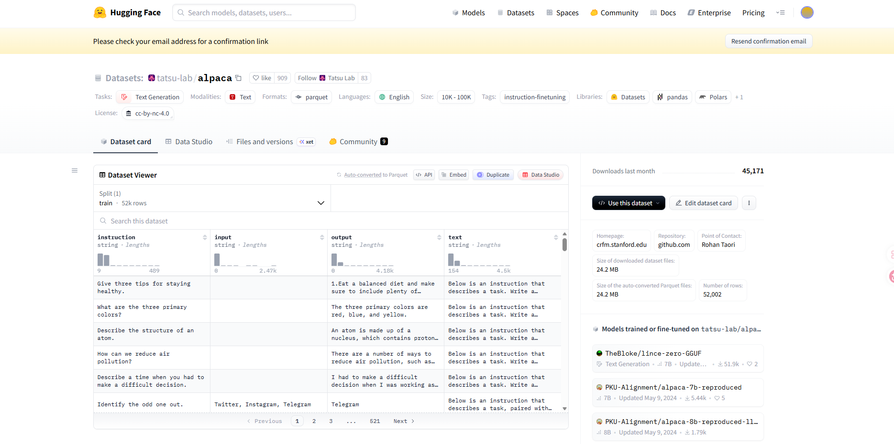
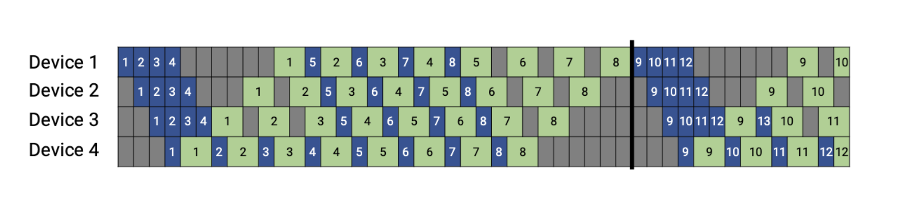
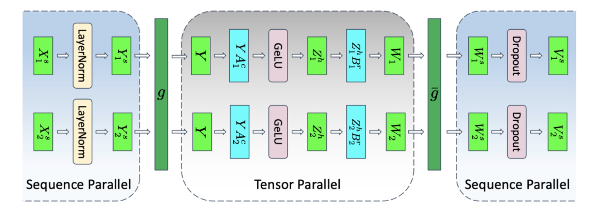

# 大语言模型训练

## LoRA

LoRA (Low-Rank Adaptation) 是一种**参数高效微调 (PEFT, Parameter-Efficient Fine-Tuning)** 技术。简单来说，在base model（处于预训练状态的模型，其训练样本为整个互联网）的基础上针对特定样本进行训练与微调。

**核心思想**：大模型虽然参数巨大，但在适应特定任务时，其权重矩阵的改变量（$\Delta W$）其实具有很低的“内在秩”（Low Intrinsic Rank）。也就是说，我们不需要调整所有的参数，只需要在一个低维空间中优化，就能达到类似全量微调的效果。

LoRA 并不直接更新预训练模型的权重 $W$，而是在这旁路学习两个低秩（low rank）矩阵 $A$ 和 $B$。

### 数学原理
假设预训练权重矩阵为 $W_0 \in \mathbb{R}^{d \times k}$，微调后的权重为 $W_0 + \alpha \Delta W$，其中$\alpha$为scaling factor。

LoRA 将 $\Delta W$ 分解为两个矩阵的乘积：
$$ \Delta W = B A $$
其中：
*   $B \in \mathbb{R}^{d \times r}$
*   $A \in \mathbb{R}^{r \times k}$
*   $r \ll \min(d, k)$（$r$ 是秩，通常很小，如 8, 16, 64）

### 初始化策略
为了保证训练开始时，模型等价于原始预训练模型（即 $\Delta W = 0$）：
*   矩阵 $A$ 使用高斯分布初始化（Random Gaussian）。
*   矩阵 $B$ 初始化为全 0（Zeros）。
这样初始状态 $BA=0$。

### LoRA的优点

1.  **极大降低显存占用**：我们锁定了主模型参数 $W_0$（不需要算梯度），只训练 $A$ 和 $B$（参数量通常不到原模型的 1%）。
2.  **便于存储与分享**：只需要保存几 MB 的 LoRA 权重，而不是几百 GB 的大模型文件。
3.  **推理无延迟（Zero Latency）**：在推理阶段，可以将 $BA$ 预先加回到 $W_0$ 中（Merge操作），即 $W_{new} = W_0 + BA$，这样推理架构与原模型完全一致，不增加任何计算耗时。
4.  **快速切换**：针对不同任务训练即使不同的 LoRA，使用时只需动态替换 Adapter 即可。

### LoRA代码实现结构示意

```python
import torch
import torch.nn as nn

class LoRALayer(nn.Module):
    def __init__(self, in_dim, out_dim, rank, alpha):
        super().__init__()
        std_dev = 1 / torch.sqrt(torch.tensor(rank).float())
        self.A = nn.Parameter(torch.randn(in_dim, rank) * std_dev)
        self.B = nn.Parameter(torch.zeros(rank, out_dim))
        self.alpha = alpha

    def forward(self, x):
        x = self.alpha * (x @ self.A @ self.B)
        return x
```

### HuggingFace中的LoRA

HuggingFace中提供了“PEFT”（Parameter-Efficient Fine-Tuning，参数高效微调库，用于高效地微调大型预训练模型。

LoRA是建立在一个已有的base model之上的，LoRA中的参数是base model的参数的一部分。

```python
import transformers
from peft import get_peft_model, LoraConfig, TaskType

model_id = ''
llama = transformers.LlamaForCausalLM.from_pretrained(model_id)

peft_config = LoraConfig(task_type=TaskType.CAUSAL_LM,
    inference_mode=False, r=8, lora_alpha=32, lora_dropout=0.1)

peft_model = get_peft_model(llama, peft_config)
```

#### PEFT的PeftModelForCausalLM结构

```python
PeftModelForCausalLM(
  (base_model): LoraModel(
    (model): LlamaForCausalLM(
      (model): LlamaModel(
        (embed_tokens): Embedding(128256, 4096)
        (layers): ModuleList(
          (0-31): 32 x LlamaDecoderLayer(
            (self_attn): LlamaSdpaAttention(
              (q_proj): lora.Linear(
                (base_layer): Linear(in_features=4096, out_features=4096, bias=False)
                (lora_dropout): ModuleDict(
                  (default): Dropout(p=0.1, inplace=False)
                )
                (lora_A): ModuleDict(
                  (default): Linear(in_features=4096, out_features=8, bias=False)
                )
                (lora_B): ModuleDict(
                  (default): Linear(in_features=8, out_features=4096, bias=False)
                )
```

## 训练内容

## 数据集

数据集有其自身格式，一般地，包含'train', 'validation', 'test'部分，通过`load_dataset`函数加载后可以获取数据集字典。数据集可以从存储在本地文件或远程文件加载，以 csv、json、txt 或 parquet 文件的形式存储。

```python
from datasets import load_dataset

ds = load_dataset("yahma/alpaca-cleaned")
print(ds)
ds_train = ds["train"]
print(ds_train)
```

```python
def tokenize_function(dataset):
    ...
    return ...

ds = load_dataset("yahma/alpaca-cleaned", split='train[:100]')
ds = ds.map(tokenize_function, batched=True)
```

数据集划分：train/validation/test数据集

## LLM封装和参数装载

```python
import torch
from torch import Tensor
from torch.nn import Module, Parameter
import torch.nn.init as init
import torch.nn.functional as F
import math

class MyNetwork(Module):
    def __init__(self):
        super(MyNetwork, self).__init__()
        self.conv1 = torch.nn.Conv2d(3, 6, 5)
        self.pool = torch.nn.MaxPool2d(2, 2)
        self.conv2 = torch.nn.Conv2d(6, 16, 5)
        self.fc1 = torch.nn.Linear(16 * 5 * 5, 120)
    def forward(self, x):
        x = self.pool(torch.relu(self.conv1(x)))
        x = self.pool(torch.relu(self.conv2(x)))
        x = x.view(-1, 16 * 5 * 5)
        x = torch.relu(self.fc1(x))
        return x

model = MyNetwork()
```

### nn.linear

`nn.linear`是LLM的核心模块。

```python
class Linear(Module):
    __constants__ = ["in_features", "out_features"]
    in_features: int
    out_features: int
    weight: Tensor

    def __init__(
        self, in_features: int, out_features: int, bias: bool = True, device=None, dtype=None,) -> None:
        factory_kwargs = {"device": device, "dtype": dtype}
        super().__init__()
        self.in_features = in_features
        self.out_features = out_features
        # Parameter()初始化会自动注册到model.parameters()中，并使用reset_parameters方法进行初始化weight
        self.weight = Parameter(
            torch.empty((out_features, in_features), **factory_kwargs)
        )
        if bias:
            self.bias = Parameter(torch.empty(out_features, **factory_kwargs))
        else:
            self.register_parameter("bias", None)
        self.reset_parameters()

    # reset_parameters方法，进行初始化
    def reset_parameters(self) -> None:
        # Setting a=sqrt(5) in kaiming_uniform is the same as initializing with
        # uniform(-1/sqrt(in_features), 1/sqrt(in_features)). For details, see
        # https://github.com/pytorch/pytorch/issues/57109
        init.kaiming_uniform_(self.weight, a=math.sqrt(5))
        if self.bias is not None:
            fan_in, _ = init._calculate_fan_in_and_fan_out(self.weight)
            bound = 1 / math.sqrt(fan_in) if fan_in > 0 else 0
            init.uniform_(self.bias, -bound, bound)

    # forward方法，进行前向传播
    def forward(self, input: Tensor) -> Tensor:
        return F.linear(input, self.weight, self.bias)
```

### Model的存储和装载

使用`print(model)`查看model中的内容

```python
print(model)
print(model.state_dict())
```

使用`torch.save("model_weights.pt")`将模型存储为`.pt`文件至磁盘，该情况针对模型参数；也可以直接存储模型结构+模型参数

```python
torch.save(model.state_dict(), "model_weights.pt")
torch.save(model, "model.pt")
```

使用`torch.load`加载模型

```python
model.load_state_dict(torch.load('model_weights.pt', weights_only=True))
model.load_state_dict(torch.load('model.pt', weights_only=False))
```

### 流程概览

1. 从公开数据集中载入
2. 规则过滤并清洗文本
3. 统一字段/模板便于拼接
4. 拆分训练与验证集
5. Tokenizer对齐

#### 1.从公开数据集中载入（以Alpaca为例）

```python
from datasets import load_dataset

# 直接使用HF镜像
raw_ds = load_dataset("tatsu-lab/alpaca")
train_raw = raw_ds["train"]
```

Alpaca只有train dataset，没有validation和test dataset，并且需要手动拆分。

#### 2.规则过滤并清洗文本

数据准备：从语料到可训练样本

* 数据来源：开源语料、业务日志、合成数据
* 质量控制：清洗噪声、去重复、敏感信息脱敏
* 样本结构：明确字段（instruction/input/output/messages）
* 划分策略：train/validation/test避免数据泄漏
* Tokenizer对齐：确保训练与推理共享词表及预处理

```python
# 过滤示例：只保留output中长度大于5的部分
def keep_example(example):
    answer = example["output"].strip()
    return len(answer) > 5

filtered = train_raw.filter(keep_example) # 自动并行处理，返回过滤后的数据集
```

#### 3.统一字段/模板便于拼接

以Alpaca数据集为例，其结构包含'instruction', 'input', 'output'，'text'，如图所示：

<p align="center">
  
  </p>

```python
def build_messages(example):
    user_prompt = example["instruction"].strip() # strip()去除开头与结尾的空格
    if example["input"]:
        user_prompt += "\n" + example["input"].strip() # 若有input，则拼接到instruction后面
    return {
        "messages": [
            {"role": "user", "content": user_prompt},
            {"role": "assistant", "content": example["output"].strip()},
        ] # 返回message字典，role区分用户和助手，content为具体内容
    }
structured = filtered.map(build_messages)
# map函数会将build_messages函数应用到数据集的每个样本上，返回新的数据集
```

#### 4.划分训练/验证
```python
split_data = structured.train_test_split(test_size=0.02, seed=42)
train_data = split_data["train"]
val_data = split_data["test"]

# 按任务标签分层
train_test_split(..., stratify_by_column="category")
```

按长度分桶，先增加分桶字段，再使用`stratify_by_column`保持长短样本分布一致
```python
def add_length_bucket(example):
    length = len(example["messages"][0]["content"].split())
    bucket = min(length // 200, 4)  # 0-4 共5档
    example["len_bucket"] = bucket
    return example
bucketed = structured.map(add_length_bucket)
split_bucketed = bucketed.train_test_split(
    test_size=0.02,
    seed=42,
    stratify_by_column="len_bucket",
)
```
labels具体是指什么？train set 和 test set

对dateset进行结构上的处理：`strip()`、`map()`

label的作用，对于某个样本任何tokn都可以作为input，将其后续的部分作为output训练

`collate()`函数做批量补全padding

## Megatron中运用的并行化技术

Megatron 作为 NVIDIA 提出的高性能大规模模型训练框架，巧妙地结合了多种并行化技术：

+ 张量并行（Tensor Parallelism）：将模型中的大型权重张量沿特定维度切分，在不同 GPU 上分别计算，最后汇总
+ 数据并行（Data Parallelism）：将数据集划分成多个子集，每个子集交给一个模型副本进行计算，最后同步参数；
+ 流水线并行（Pipeline Parallelism）：模型划分为多个连续的阶段；
+ 序列并行（Sequence Parallelism）：将长序列输入划分并在多个 GPU 上并行处理，虽然可以缓解激活值占用显存的问题，但会导致模型的其他参数需要复制到所有模型副本中，因此不适用于大型模型的训练。

### TP

#### TP on MLP

回忆MLP中tensor的升维与降维操作：

$$[\dots, 𝐻]∗[𝐻, 4𝐻]=[\dots, 4𝐻]$$
$$[\dots, 4𝐻]∗[4𝐻, 𝐻]=[\dots, 𝐻]$$

需要作并行化处理的正是权重矩阵 $𝐴:[𝐻, 4𝐻]$, $𝐵:[4𝐻, 𝐻]$

+ 对矩阵 $𝐴$ 及后续 $𝐺𝑒𝐿𝑈$ 作切分：
  将 $𝐴$ 沿着列方向切分为 $𝐴=[𝐴_1,𝐴_2]$，于是有：$[𝑌_1,𝑌_2 ]=[𝐺𝑒𝐿𝑈(𝑋𝐴_1 ), 𝐺𝑒𝐿𝑈(𝑋𝐴_2 )]$

+ 对矩阵 $𝐵$ 作切分：
  由于前一步的切分导致中间结果 $𝑌$ 也被沿着列方向切开，因此在这一步中需要将 $𝐵$ 沿行方向切开，即 $𝐵=[𝐵_1;𝐵_2]$，于是有：$YB=[𝑌_1,𝑌_2 ][𝐵_1;𝐵_2]=[𝑌_1 𝐵_1+𝑌_2 𝐵_2]$

<p align="center">
  
</p>

+ 需要在输入时复制 $𝑋$ ，并在输出前合并 $𝑌𝐵$ 的计算结果
+ 分别引入了两个共轭的操作 $𝑓$ 和 $𝑔$；
  + $𝑓$ 在前向传播时复制 $𝑋$，在反向传播时通过 `all-reduce` 合并计算结果；
  + $𝑔$ 与之相反。

All-reduce操作(对比broadcast操作)：

<p align="center">
  
</p>

#### TP on Attention

对 Self-Attention 部分的并行化设计利用了 Multihead Attention 本身的并行性，从列方向切分权重矩阵，并保持了与每个头的对应:

+ 在每个头中，仍然保持了原本的计算逻辑，即：$O=𝐷𝑟𝑜𝑝𝑜𝑢𝑡(𝑆𝑜𝑓𝑡𝑚𝑎𝑥(\frac{𝑄𝐾^𝑇}{\sqrt{𝑑}}))𝑉$
+ 并行化后的中间结果为 $𝑌=[𝑌_1, 𝑌_2 ]$；

Dropout 的部分和之前 MLP 部分基本一致，将权重矩阵 $𝐵$ 沿行方向切开，因此同样需要在 Dropout 之前将 $𝑌_1 𝐵_1,𝑌_2 𝐵_2$ 合并；

总体来看，对 Attention 部分的并行化操作仍然需要在首尾分别添加 $𝑓$, $𝑔$ 。

### PP

#### Default pipeline in GPipe

流水线并行（Pipeline Parallelism）：[GPipe](https://arxiv.org/pdf/1811.06965)将模型划分为多个连续的阶段，每个阶段包含若干的层，再把这些阶段分配到不同的 GPU 上，使得各个 GPU 能在时间上错开地处理不同的数据。

存在问题：

  * Bubble time size：流水线会在一个批次全部计算完成后统一更新权重，灰色区域就是 GPU 需要等待的时间，比例约为 $\frac{𝑝 − 1}{𝑚}$
  * Memory：反向传播完成前需保存所有微批次在前向中的激活值

<p align="center">
  
</p>

#### 1F1B in PipeDream-Flush

[PipeDream-Flush](https://arxiv.org/pdf/2006.09503) 把一个迭代分成三个阶段:

* 预热前向传播阶段：每个 worker 会做前向计算，并且向其下游发送激活，一直到最后一个 stage 被激发。该调度将执行中的微批次数量限制在流水线深度之内，而不是一个批次中的微批次数量；
* 稳定 1F1B 阶段：进入稳定状态之后，每个 worker 都进行1F1B 操作。
* 冷却反向传播阶段：此阶段会把执行中的的微批次执行完毕，只执行反向计算和向反向计算下游发送梯度。

尽管 PipeDream-Flush 与 GPipe 的 bubble time size 相同，但是由于 PipeDream-Flush 限制了执行中的微批次数量，因此相较于 GPipe，更加节省显存：

* Bubble time size: $\frac{𝑝 − 1}{𝑚}$；
* PipeDream-Flush 中最大执行微批次数量 $𝑝$；
* GPipe 中最大执行微批次数量 $𝑚$；

<p align="center">
  
</p>

####  PP in Megatron

通过划分更细粒度的阶段，将 bubble time size 降低到了 $\frac{1}{𝑣} \times \frac{𝑝 − 1}{𝑚}$；需要付出更多的通信代价。

以 MLP 部分的 TP 为例：在 $𝑔$ 之前的 $𝑍_1,𝑍_2$ 分布在两个 GPU 上，经过 $𝑔$ 合并之后，每个 GPU 上的输出 $𝑍$ 是相同的，由此导致相邻的两个流水线阶段发送和接收的数据是重复的；因此，可以将输出 $𝑍$ 划分为多个相同大小的部分，每个 GPU 只将自己保存的部分发送给对应的 GPU，再在下一个阶段中合并，得到完整的数据。

<p align="center">
  
</p>

### TP+SP

基于 LayerNorm 和 Dropout 是与序列顺序无关的(激活值过多的元凶其实是过大的$s$)，因此对这两部分采用序列并行，从 $𝑠𝑒𝑞𝑢𝑒𝑛𝑐𝑒$ 维度切分，从而减少了激活值占用的显存；由此带来新的共轭通信操作 $𝑔$, $\bar{𝑔}$。

$𝑔$ 在前向传播时作 `all-gather`，反向传播时作 `reduce-scatter`； $\bar{𝑔}$ 与之相反。

<p align="center">
  
</p>

<p align="center">
  
</p>